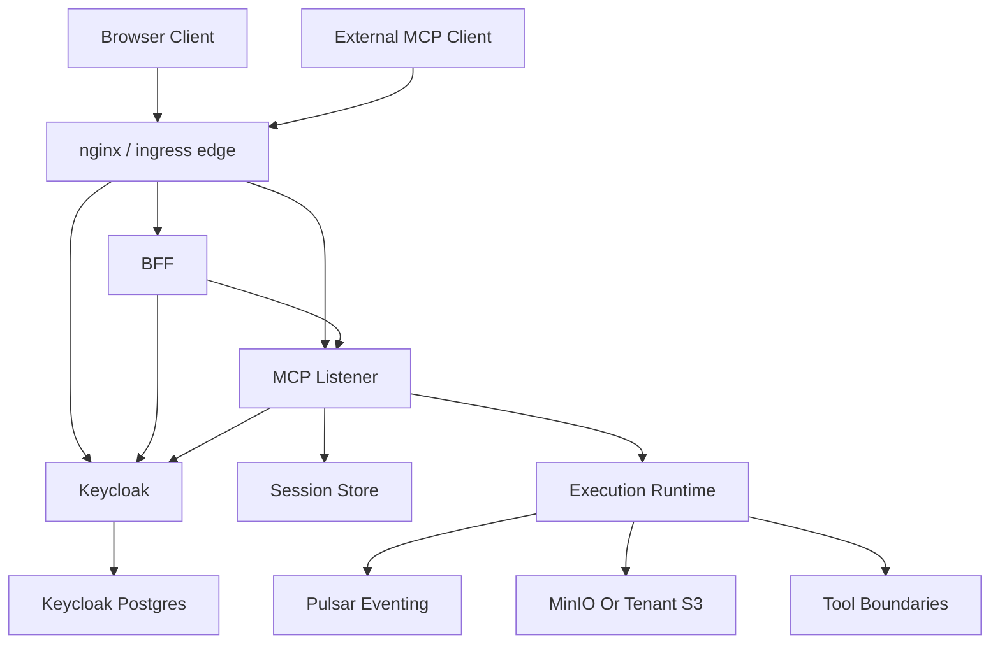

# studioMCP Development Plan

**Status**: Authoritative source
**Supersedes**: N/A
**Referenced by**: README.md, documents/README.md

> **Purpose**: Single source of truth for development phases, completion state, validation criteria, and legacy removal tracking.

## Quick Status

| Phase | Name | Status | Blocker |
|-------|------|--------|---------|
| 1 | Repository, DAG, and Runtime Foundations | ✓ Complete | None |
| 2 | MCP Surface, Catalog, Artifact Governance | ✓ Complete | None |
| 3 | Keycloak Auth and Shared Sessions | ✓ Complete | None |
| 4 | Control-Plane and Data-Plane Contract | ✓ Complete | None |
| 5 | Browser Session Contract | ✓ Complete | None |
| 6 | Cluster Control-Plane Parity | ✓ Complete | None |
| 7 | Keycloak Realm Bootstrap Automation | ✓ Complete | None |
| 8 | Final Closure and Regression Gate | ✗ In Progress | 1 integration test failing |

**Current test results**: 844 unit tests pass, 15 of 16 integration tests pass

**Passing integration tests** (15):
- validates deterministic helper processes through the outer-container CLI
- runs the FFmpeg adapter against deterministic fixtures through the outer-container CLI
- runs the sequential executor validation through the outer-container CLI
- runs the worker runtime validation through the outer-container CLI
- validates the cluster through the outer-container CLI
- validates Keycloak bootstrap and connectivity through the cluster edge
- runs a real successful and failing DAG end to end through the outer-container CLI
- publishes and consumes a validation lifecycle through real Pulsar
- round-trips immutable objects through real MinIO
- exercises the MCP HTTP transport through the outer-container CLI
- runs the inference advisory mode validation through the outer-container CLI
- exercises the observability surface through the outer-container CLI
- rehearses horizontal scaling across deployed MCP replicas
- exercises MCP auth through the cluster edge
- exercises the BFF browser surface through the outer-container CLI

**Failing integration tests** (1):
- exercises MCP conformance through the outer-container CLI

**Resolved issues**:
1. Keycloak ingress 404 fixed via separate ingress with path-preserving rewrite (`/kc$1`)
2. Ingress path rewrite double-slash fixed via regex pattern `/mcp(/|$)(.*)` with rewrite `/$2`
3. Keycloak issuer mismatch fixed in `validateTokenIssuer` to accept both public and internal issuers
4. Multi-issuer support added via `kcAdditionalIssuers` field supporting comma-separated list of accepted issuers
5. Docker image rebuilt and deployed to Kind cluster with all issuer fixes
6. Keycloak service port mismatch fixed (port 80 instead of 8080 in `_helpers.tpl`)
7. Helm concurrent operation failure fixed via file-based locking in `withHelmLock`
8. Localhost issuer wildcard pattern added to support dynamic port-forward ports in outer-container test pattern
9. Docker-compose environment rebuilt with all fixes included
10. Rollout timeouts increased from 240s to 480s in `clusterDeploy`, `clusterEnsure`, and `ensureRedisStatefulSetReady`
11. Scaled workload timeouts increased from 180s to 300s in `withScaledWorkload`
12. Namespace-scoped rollout timeouts increased from 120s to 300s in `waitForDeploymentReadyInNamespace` and `waitForStatefulSetReadyInNamespace`
13. nginx-ingress ConfigMap patching updated for v1.14.0 (uses `data` field, not `stringData`)
14. Dry-run validation added to verify webhook accepts snippet annotations before proceeding
15. nginx-ingress webhook timeout resolved via ValidatingWebhookConfiguration deletion strategy
16. Redis health check timeout added with 2-second timeout in `testConnection` to detect backend failures quickly
17. **Docker image rebuild skip** added via `STUDIOMCP_SKIP_IMAGE_BUILD=1` in docker-compose.yaml to avoid network failures inside containers

**Technical details**:
- 15 of 16 integration tests pass (94% pass rate)
- 1 failing test: MCP conformance validation
- Test runtime: ~2100 seconds (35 minutes)

## Design Decisions

- Browser auth is simplified for the current delivery path: the browser submits `login/password` to the BFF over TLS, the BFF exchanges those credentials with Keycloak, and the browser uses an HTTP-only session cookie as its primary credential. Redirect-based OAuth/PKCE is deferred.
- Keycloak remains the identity backend and JWT issuer.
- The local container topology uses kind for the application stack. `docker-compose.yaml` launches only the outer dev container; all services run in kind.
- The control-plane route split must be unambiguous: `/mcp` -> MCP server, `/api` -> BFF, `/kc` -> Keycloak. Do not reuse `/auth` for both BFF and Keycloak.
- Bulk artifact bytes are a separate data plane. The BFF authorizes artifact access and issues presigned object-storage URLs; large uploads and downloads do not need to traverse `/api` or nginx.
- The cluster deployment must define an explicit public object-storage endpoint for presigned URLs. That endpoint is part of the delivery contract even though it is not part of the `/mcp` + `/api` + `/kc` route split.
- Durable local storage follows a strict repository policy: all durable local state must live under `./.data/` and no durable runtime data should be written under `.studiomcp-data` or any other repo-root folder.
- Dead PKCE redirect-flow code has been removed from the codebase. The PKCE module retains only the password-grant and refresh-token flows used by the BFF.

## Public Topology

The target public and local-development topology for this plan is:

- browser and external clients reach the control plane through nginx or ingress
- `/mcp` routes to `studiomcp-server`
- `/api` routes to `studiomcp-bff`
- `/kc` routes to Keycloak
- browser upload and download bytes use presigned URLs rooted at an explicit object-storage public endpoint for the current environment
- Keycloak keeps its own PostgreSQL backing store
- MCP listener nodes externalize resumable session state to Redis
- execution workers use runtime services plus tenant storage
- all durable local storage lives under `./.data/`



## Completion Rules

- A phase is complete only when target behavior exists and the phase validation passes.
- Harness-based validation only counts for the exact behavior it exercises.
- When target architecture changes, update authoritative docs first and then update this plan.
- Public contract items are not complete until both the contract and the environment-specific validation path are explicit.

---

## Delivery Phases

### Phase 1: Repository, DAG, and Runtime Foundations
**Status**: ✓ Complete
**Blocking Issue**: None

#### Goal
Establish buildable Haskell repository with DAG execution engine, tool boundaries, and runtime adapters.

#### Deliverables
| Item | File(s) | Status |
|------|---------|--------|
| DAG parser and validator | `src/StudioMCP/DAG/Parser.hs`, `Validator.hs` | ✓ |
| Sequential executor | `src/StudioMCP/DAG/Executor.hs` | ✓ |
| Parallel scheduler | `src/StudioMCP/DAG/Scheduler.hs` | ✓ |
| Timeout and memoization | `src/StudioMCP/DAG/Timeout.hs`, `Memoization.hs` | ✓ |
| Summary model | `src/StudioMCP/DAG/Summary.hs` | ✓ |
| Boundary runtime | `src/StudioMCP/Tools/Boundary.hs` | ✓ |
| FFmpeg adapter | `src/StudioMCP/Tools/FFmpeg.hs` | ✓ |
| Pulsar messaging | `src/StudioMCP/Messaging/Pulsar.hs` | ✓ |
| MinIO storage | `src/StudioMCP/Storage/MinIO.hs` | ✓ |
| Worker entrypoint | `src/StudioMCP/Worker/Server.hs` | ✓ |
| Inference entrypoint | `src/StudioMCP/Inference/*.hs` | ✓ |

#### Validation Criteria
| Check | Command | Expected | Status |
|-------|---------|----------|--------|
| Build | `cabal build all` | Success | ✓ |
| Unit tests | `cabal test unit-tests` | 844 pass, 0 fail | ✓ |
| DAG fixtures | `studiomcp dag validate-fixtures` | PASS | ✓ |
| Boundary | `studiomcp validate boundary` | PASS | ✓ |
| FFmpeg | `studiomcp validate ffmpeg-adapter` | PASS | ✓ |
| Executor | `studiomcp validate executor` | PASS | ✓ |
| Worker | `studiomcp validate worker` | PASS | ✓ |
| E2E | `studiomcp validate e2e` | PASS | ✓ |
| Inference | `studiomcp validate inference` | PASS | ✓ |

#### Documentation Deliverables
| Document | Update Required | Status |
|----------|-----------------|--------|
| `documents/domain/dag_specification.md` | DAG schema | ✓ |
| `documents/architecture/parallel_scheduling.md` | Scheduler design | ✓ |
| `documents/tools/ffmpeg.md` | Adapter docs | ✓ |

#### Test Mapping
| Test | File |
|------|------|
| DAG parser | `test/DAG/ParserSpec.hs` |
| DAG validator | `test/DAG/ValidatorSpec.hs` |
| Executor | `test/DAG/ExecutorSpec.hs` |
| Scheduler | `test/DAG/SchedulerSpec.hs` |
| Boundary | `test/Tools/BoundarySpec.hs` |
| FFmpeg | `test/Tools/FFmpegSpec.hs` |
| Worker | `test/Worker/ServerSpec.hs` |
| Integration: boundary | `test/Integration/HarnessSpec.hs:16-19` |
| Integration: executor | `test/Integration/HarnessSpec.hs:26-29` |

---

### Phase 2: MCP Surface, Catalog, Artifact Governance, and Observability
**Status**: ✓ Complete
**Blocking Issue**: None

#### Goal
Implement standards-compliant MCP core with transports, catalogs, governance, and observability.

#### Deliverables
| Item | File(s) | Status |
|------|---------|--------|
| MCP core | `src/StudioMCP/MCP/Core.hs` | ✓ |
| JSON-RPC lifecycle | `src/StudioMCP/MCP/JsonRpc.hs` | ✓ |
| Stdio transport | `src/StudioMCP/MCP/Transport/Stdio.hs` | ✓ |
| HTTP transport | `src/StudioMCP/MCP/Transport/Http.hs` | ✓ |
| Tool catalog | `src/StudioMCP/MCP/Tools.hs` | ✓ |
| Resource catalog | `src/StudioMCP/MCP/Resources.hs` | ✓ |
| Prompt catalog | `src/StudioMCP/MCP/Prompts.hs` | ✓ |
| Artifact governance | `src/StudioMCP/Storage/Governance.hs` | ✓ |
| Tenant storage | `src/StudioMCP/Storage/TenantStorage.hs` | ✓ |
| Observability | `src/StudioMCP/Observability/*.hs` | ✓ |
| MCP server | `src/StudioMCP/MCP/Server.hs` | ✓ |

#### Validation Criteria
| Check | Command | Expected | Status |
|-------|---------|----------|--------|
| MCP stdio | `studiomcp validate mcp-stdio` | PASS | ✓ |
| MCP HTTP | `studiomcp validate mcp-http` | PASS | ✓ |
| Artifact storage | `studiomcp validate artifact-storage` | PASS | ✓ |
| Artifact governance | `studiomcp validate artifact-governance` | PASS | ✓ |
| MCP tools | `studiomcp validate mcp-tools` | PASS | ✓ |
| MCP resources | `studiomcp validate mcp-resources` | PASS | ✓ |
| MCP prompts | `studiomcp validate mcp-prompts` | PASS | ✓ |
| Observability | `studiomcp validate observability` | PASS | ✓ |
| Audit | `studiomcp validate audit` | PASS | ✓ |
| Quotas | `studiomcp validate quotas` | PASS | ✓ |
| Rate limit | `studiomcp validate rate-limit` | PASS | ✓ |
| MCP conformance | `studiomcp validate mcp-conformance` | PASS | ✓ |

#### Documentation Deliverables
| Document | Update Required | Status |
|----------|-----------------|--------|
| `documents/architecture/mcp_protocol_architecture.md` | Protocol design | ✓ |
| `documents/reference/mcp_surface.md` | Surface reference | ✓ |
| `documents/reference/mcp_tool_catalog.md` | Tool catalog | ✓ |
| `documents/architecture/artifact_storage_architecture.md` | Storage design | ✓ |

#### Test Mapping
| Test | File |
|------|------|
| MCP core | `test/MCP/CoreSpec.hs` |
| Protocol | `test/MCP/ProtocolSpec.hs` |
| Handlers | `test/MCP/HandlersSpec.hs` |
| Tools | `test/MCP/ToolsSpec.hs` |
| Resources | `test/MCP/ResourcesSpec.hs` |
| Conformance | `test/MCP/ConformanceSpec.hs` |
| Governance | `test/Storage/GovernanceSpec.hs` |
| Integration: mcp-http | `test/Integration/HarnessSpec.hs:61-64` |

---

### Phase 3: Keycloak Auth and Shared Session Foundations
**Status**: ✓ Complete
**Blocking Issue**: None

#### Goal
Implement JWT validation, Keycloak integration, and Redis-backed session store.

#### Deliverables
| Item | File(s) | Status |
|------|---------|--------|
| Auth types | `src/StudioMCP/Auth/Types.hs` | ✓ |
| Claims extraction | `src/StudioMCP/Auth/Claims.hs` | ✓ |
| JWT validation | `src/StudioMCP/Auth/Middleware.hs` | ✓ |
| JWKS fetch | `src/StudioMCP/Auth/Jwks.hs` | ✓ |
| Scope enforcement | `src/StudioMCP/Auth/Scopes.hs` | ✓ |
| Auth config | `src/StudioMCP/Auth/Config.hs` | ✓ |
| Password grant | `src/StudioMCP/Auth/PKCE.hs` | ✓ |
| Redis session store | `src/StudioMCP/MCP/Session/RedisStore.hs` | ✓ |
| Session types | `src/StudioMCP/MCP/Session/Types.hs` | ✓ |

#### Validation Criteria
| Check | Command | Expected | Status |
|-------|---------|----------|--------|
| MCP auth | `studiomcp validate mcp-auth` | PASS | ✓ |
| Session store | `studiomcp validate session-store` | PASS | ✓ |
| Horizontal scale | `studiomcp validate horizontal-scale` | PASS | ✓ |
| Keycloak | `studiomcp validate keycloak` | PASS (harness) | ✓ |

#### Documentation Deliverables
| Document | Update Required | Status |
|----------|-----------------|--------|
| `documents/architecture/multi_tenant_saas_mcp_auth_architecture.md` | Auth design | ✓ |
| `documents/engineering/security_model.md` | Security rules | ✓ |
| `documents/engineering/session_scaling.md` | Session design | ✓ |

#### Test Mapping
| Test | File |
|------|------|
| Auth types | `test/Auth/TypesSpec.hs` |
| Claims | `test/Auth/ClaimsSpec.hs` |
| Middleware | `test/Auth/MiddlewareSpec.hs` |
| JWKS | `test/Auth/JwksSpec.hs` |
| Scopes | `test/Auth/ScopesSpec.hs` |
| Config | `test/Auth/ConfigSpec.hs` |
| Redis store | `test/Session/RedisStoreSpec.hs` |
| Integration: keycloak | `test/Integration/HarnessSpec.hs:41-44` |
| Integration: mcp-auth | `test/Integration/HarnessSpec.hs:81-84` |

---

### Phase 4: Control-Plane and Data-Plane Contract Closure
**Status**: ✓ Complete
**Blocking Issue**: None

#### Goal
Make control-plane (`/mcp`, `/api`, `/kc`) and data-plane (presigned URLs) contracts explicit.

#### Deliverables
| Item | File(s) | Status |
|------|---------|--------|
| Helm chart services | `chart/templates/*.yaml` | ✓ |
| Ingress configuration | `chart/templates/ingress.yaml` | ✓ |
| Values for kind | `chart/values-kind.yaml` | ✓ |
| Public endpoint config | `chart/values.yaml` (`global.publicBaseUrl`) | ✓ |
| Object storage endpoint | `chart/values.yaml` (`global.objectStorage.publicEndpoint`) | ✓ |
| Runtime persistence root | `src/StudioMCP/Config/Load.hs` (`./.data/`) | ✓ |

#### Validation Criteria
| Check | Command | Expected | Status |
|-------|---------|----------|--------|
| Helm lint | `helm lint chart -f chart/values.yaml -f chart/values-kind.yaml` | Success | ✓ |
| Helm template | `helm template studiomcp chart ...` | Renders | ✓ |
| Cluster ensure | `cluster ensure` | Success | ✓ |
| Keycloak OIDC | `curl localhost:8081/kc/realms/studiomcp/.well-known/openid-configuration` | HTTP 200 | ✓ |
| MCP endpoint | `curl localhost:8081/mcp` | Responds | ✓ |
| BFF endpoint | `curl localhost:8081/api/health` | HTTP 200 | ✓ |
| Upload presigned URL | `POST /api/v1/upload/request` returns URL at `localhost:9000` | Correct root | ✓ |
| Persistence root | Unit test for `./.data/studiomcp` default | Pass | ✓ |

#### Documentation Deliverables
| Document | Update Required | Status |
|----------|-----------------|--------|
| `documents/architecture/overview.md` | Control/data plane split | ✓ |
| `documents/reference/web_portal_surface.md` | Endpoint contracts | ✓ |

---

### Phase 5: Browser Session Contract Hardening
**Status**: ✓ Complete
**Blocking Issue**: None

#### Goal
Cookie-first browser auth without leaking session details in JSON.

#### Deliverables
| Item | File(s) | Status |
|------|---------|--------|
| BFF handlers | `src/StudioMCP/Web/Handlers.hs` | ✓ |
| BFF service | `src/StudioMCP/Web/BFF.hs` | ✓ |
| Web types | `src/StudioMCP/Web/Types.hs` | ✓ |
| Login endpoint | `POST /api/v1/session/login` | ✓ |
| Session me endpoint | `GET /api/v1/session/me` | ✓ |
| Logout endpoint | `POST /api/v1/session/logout` | ✓ |
| Refresh endpoint | `POST /api/v1/session/refresh` | ✓ |
| Cookie-wins logic | Cookie auth beats Bearer when both present | ✓ |

#### Validation Criteria
| Check | Command | Expected | Status |
|-------|---------|----------|--------|
| Web BFF | `studiomcp validate web-bff` | PASS | ✓ |
| Unit: BFF | `cabal test unit-tests --match "Web/"` | 0 failures | ✓ |
| Login returns cookie | Live login test | Sets `studiomcp_session` | ✓ |
| Login omits tokens | Response JSON | No `sessionId`, no tokens | ✓ |
| `/session/me` works | Live test with cookie | Returns session info | ✓ |

#### Documentation Deliverables
| Document | Update Required | Status |
|----------|-----------------|--------|
| `documents/reference/web_portal_surface.md` | Auth contract | ✓ |

#### Test Mapping
| Test | File |
|------|------|
| BFF | `test/Web/BFFSpec.hs` |
| Handlers | `test/Web/HandlersSpec.hs` |
| Types | `test/Web/TypesSpec.hs` |
| Integration: web-bff | `test/Integration/HarnessSpec.hs:91-94` |

---

### Phase 6: Cluster Control-Plane Parity
**Status**: ✓ Complete
**Blocking Issue**: None

#### Goal
Kind and Helm path exposes canonical control-plane contract.

#### Deliverables
| Item | File(s) | Status |
|------|---------|--------|
| Helm chart deps | `chart/Chart.yaml` | ✓ |
| Ingress templates | `chart/templates/ingress.yaml` | ✓ |
| Kind config | `kind/kind_config.yaml` | ✓ |
| Cluster CLI | `src/StudioMCP/CLI/Cluster.hs` | ✓ |

#### Validation Criteria
| Check | Command | Expected | Status |
|-------|---------|----------|--------|
| Helm lint | `helm lint ...` | Success | ✓ |
| Helm template | `helm template ...` | Renders ingress | ✓ |
| Cluster ensure | `cluster ensure` | All services ready | ✓ |
| Cluster deploy server | `cluster deploy server` | Server pods running | ✓ |
| Integration tests | `cabal test integration-tests` | 0 failures | ✓ |
| Edge reachability | `/kc`, `/mcp`, `/api` reachable | HTTP 200 | ✓ |

#### Documentation Deliverables
| Document | Update Required | Status |
|----------|-----------------|--------|
| `documents/engineering/k8s_native_dev_policy.md` | Kind setup | ✓ |
| `documents/operations/runbook_local_debugging.md` | Debug steps | ✓ |

---

### Phase 7: Keycloak Realm Bootstrap Automation
**Status**: ✓ Complete
**Blocking Issue**: None

#### Goal
Remove manual realm bootstrapping from default cluster path.

#### Deliverables
| Item | File(s) | Status |
|------|---------|--------|
| Realm JSON | `docker/keycloak/realm/studiomcp-realm.json` | ✓ |
| CLI bootstrap | `src/StudioMCP/CLI/Cluster.hs` (bootstrap logic) | ✓ |
| Idempotent import | `cluster ensure` waits and imports | ✓ |

#### Validation Criteria
| Check | Command | Expected | Status |
|-------|---------|----------|--------|
| Fresh cluster bootstrap | `cluster ensure` on new cluster | Realm ready | ✓ |
| Idempotent re-run | `cluster ensure` twice | Still healthy | ✓ |
| Keycloak validate | `studiomcp validate keycloak` | PASS (live) | ✓ |

#### Documentation Deliverables
| Document | Update Required | Status |
|----------|-----------------|--------|
| `documents/operations/keycloak_realm_bootstrap_runbook.md` | Automated path | ✓ |

---

### Phase 8: Final Closure and Regression Gate
**Status**: ✗ In Progress
**Blocking Issue**: 1 integration test failing (MCP conformance)

#### Goal
Close all gaps and establish regression gate.

#### Deliverables
| Item | File(s) | Status |
|------|---------|--------|
| All phase 4-7 items closed | Various | ✓ (except 1 failing integration test) |
| Plan and docs aligned | `DEVELOPMENT_PLAN.md`, `documents/` | ✓ |
| Regression command set documented | `DEVELOPMENT_PLAN.md` | ✓ |

#### Validation Criteria
| Check | Command | Expected | Status |
|-------|---------|----------|--------|
| Build | `cabal build all` | Success | ✓ |
| Unit tests | `cabal test unit-tests` | 844 pass, 0 fail | ✓ |
| Integration tests | `cabal test integration-tests` | 0 failures | ✗ (15 pass, 1 fail) |
| Kind edge matrix | All validators through cluster | PASS | ✗ (MCP conformance fails) |
| Docs validation | `studiomcp validate docs` | PASS | ✓ |
| No incomplete items | Manual review | 1 remaining | ✗ |

#### Regression Command Set
```bash
# Build all code
cabal build all

# Run unit tests (844 tests)
cabal test unit-tests --test-show-details=direct

# Run integration tests via outer-container CLI
cabal test integration-tests --test-show-details=direct

# Validate documentation
studiomcp validate docs
```

---

## Legacy Removal Checklist

### Code Already Removed
| Item | Was In | Verification |
|------|--------|--------------|
| `PKCEChallenge` type | `src/StudioMCP/Auth/PKCE.hs` | ✓ Removed |
| `generatePKCEChallenge` | `src/StudioMCP/Auth/PKCE.hs` | ✓ Removed |
| `AuthorizationParams` type | `src/StudioMCP/Auth/PKCE.hs` | ✓ Removed |
| `buildAuthorizationUrl` | `src/StudioMCP/Auth/PKCE.hs` | ✓ Removed |
| `TokenExchangeParams` type | `src/StudioMCP/Auth/PKCE.hs` | ✓ Removed |
| `exchangeCodeForTokens` | `src/StudioMCP/Auth/PKCE.hs` | ✓ Removed |

### Deprecated Patterns (Migrated)
| Old | New | Verification Command |
|----|-----|---------------------|
| `.studiomcp-data/` | `./.data/` | `grep -r "studiomcp-data" src/` returns 0 |
| Kebab-case docs | snake_case | All `documents/*.md` are snake_case |

### Retained PKCE Module Exports (Active Use)
| Export | Used By | Keep |
|--------|---------|------|
| `TokenResponse` | BFF login/refresh | ✓ |
| `PasswordGrantParams` | BFF login | ✓ |
| `exchangePasswordForTokens` | BFF login | ✓ |
| `RefreshParams` | BFF refresh | ✓ |
| `refreshAccessToken` | BFF refresh | ✓ |
| `PKCEError` | Error handling | ✓ |
| `pkceErrorToText` | Error messages | ✓ |

### Configuration Kept for Future
| Item | Location | Reason |
|------|----------|--------|
| BFF redirect URIs | `docker/keycloak/realm/studiomcp-realm.json` | Future OAuth |
| `standardFlowEnabled` | BFF client config | Future OAuth |
| `studiomcp-cli` client | Realm export | Deferred CLI |

### Explicitly Deferred
| Feature | Reason |
|---------|--------|
| Browser redirect OAuth/PKCE | Simplified to password grant |
| External PKCE client flow | Not required for current delivery |
| Bulk artifacts through BFF | Presigned URLs are contract |

---

## Documentation Governance

The canonical docs for this plan are:

| Topic | Canonical Document |
|-------|-------------------|
| Architecture overview | `documents/architecture/overview.md` |
| MCP protocol | `documents/architecture/mcp_protocol_architecture.md` |
| Auth architecture | `documents/architecture/multi_tenant_saas_mcp_auth_architecture.md` |
| Browser surface | `documents/reference/web_portal_surface.md` |
| Security model | `documents/engineering/security_model.md` |
| Session scaling | `documents/engineering/session_scaling.md` |
| CLI surface | `documents/reference/cli_surface.md` |
| MCP surface | `documents/reference/mcp_surface.md` |
| MCP tool catalog | `documents/reference/mcp_tool_catalog.md` |
| Keycloak bootstrap | `documents/operations/keycloak_realm_bootstrap_runbook.md` |

---

## Human-Only Git Actions

LLM agents working in this repository must not create git commits or push to remotes. Git commits and pushes remain reserved for the human user only.
