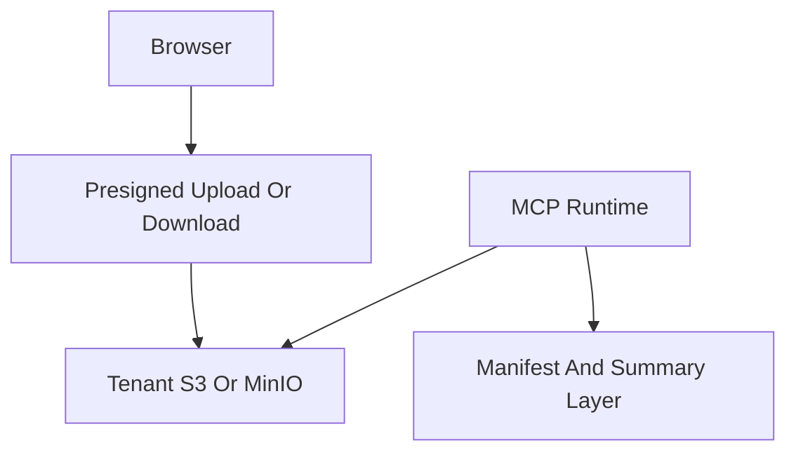

# File: documents/architecture/artifact_storage_architecture.md
# Artifact Storage Architecture

**Status**: Authoritative source
**Supersedes**: N/A
**Referenced by**: [overview.md](overview.md#canonical-follow-on-documents), [server_mode.md](server_mode.md#cross-references), [../engineering/security_model.md](../engineering/security_model.md#cross-references), [../reference/mcp_tool_catalog.md](../reference/mcp_tool_catalog.md#cross-references), [../../DEVELOPMENT_PLAN/README.md](../../DEVELOPMENT_PLAN/README.md#standards)

> **Purpose**: Canonical architecture for durable media artifacts, manifests, summaries, tenant-controlled object storage, and the hard no-permanent-delete rule.

## Summary

`studioMCP` creates and references durable media artifacts, but it does not own an unrestricted delete capability over them.

The artifact model is:

- immutable-by-default
- version-oriented
- tenant-scoped
- compatible with tenant-owned S3-compatible storage
- explicitly non-destructive from the MCP server’s point of view

## Current Repo Note

The current repo already uses MinIO for summaries and manifests in development flows. This document extends that storage model into the multi-tenant SaaS target where users may keep durable artifacts in their own cloud object storage.

## Artifact Classes

- raw source media
- normalized upload derivatives
- intermediate workflow artifacts
- final rendered outputs
- manifests
- summaries
- preview and thumbnail derivatives

## Storage Tiers



Supported storage patterns:

- local development via MinIO
- shared platform-managed S3-compatible storage for non-production environments
- tenant-owned S3-compatible storage for durable production artifacts

## Ownership Model

- tenants own their durable media namespace
- `studioMCP` stores references, manifests, and summaries about artifacts
- object keys should be immutable and version-oriented rather than path-overwrite oriented
- replacing an artifact means writing a new version and updating metadata, not destructive overwrite

## Tenant Storage Configuration

### Configuration Schema

```haskell
data TenantStorageConfig = TenantStorageConfig
  { tscEndpoint :: Text           -- S3-compatible endpoint
  , tscRegion :: Text             -- AWS region or "us-east-1" for MinIO
  , tscBucket :: Text             -- Bucket name
  , tscPrefix :: Text             -- Key prefix for tenant isolation
  , tscCredentials :: StorageCredentials
  }

data StorageCredentials
  = StaticCredentials
      { scAccessKey :: Text
      , scSecretKey :: Text
      }
  | AssumeRole
      { arRoleArn :: Text
      , arExternalId :: Maybe Text
      }
  | InstanceProfile
```

### Configuration Sources

| Environment | Source |
|-------------|--------|
| Development | Environment variables or config file |
| Kubernetes | Kubernetes Secret mounted as env vars |
| Production | External secrets manager (Vault, AWS Secrets Manager) |

### Example Configuration

```yaml
# Per-tenant storage configuration
tenants:
  tenant-acme:
    storage:
      endpoint: "https://s3.us-west-2.amazonaws.com"
      region: "us-west-2"
      bucket: "acme-media-prod"
      prefix: "studiomcp/"
      credentials:
        type: "assume_role"
        roleArn: "arn:aws:iam::123456789:role/studiomcp-access"
        externalId: "acme-external-id"

  tenant-globex:
    storage:
      endpoint: "https://minio.globex.internal:9000"
      region: "us-east-1"
      bucket: "media"
      prefix: "studiomcp/globex/"
      credentials:
        type: "static"
        accessKey: "${GLOBEX_ACCESS_KEY}"
        secretKey: "${GLOBEX_SECRET_KEY}"
```

## Artifact Versioning

### Version Identifiers

```
{tenant}/{artifact-type}/{artifact-id}/v{version-number}/{filename}
```

Example:
```
tenant-acme/renders/render-abc123/v1/output.mp4
tenant-acme/renders/render-abc123/v2/output.mp4
```

### Version Metadata

```haskell
data ArtifactVersion = ArtifactVersion
  { avArtifactId :: ArtifactId
  , avVersion :: Int
  , avContentHash :: Text         -- SHA-256 of content
  , avSize :: Int64
  , avContentType :: Text
  , avCreatedAt :: UTCTime
  , avCreatedBy :: SubjectId
  , avState :: ArtifactState
  , avSupersededBy :: Maybe ArtifactVersion
  }

data ArtifactState
  = Active                        -- Normal state
  | Hidden                        -- Hidden from listings, still accessible
  | Archived                      -- Archived, may be in cold storage
  | Superseded ArtifactId         -- Replaced by another version
  deriving (Eq, Show)
```

### Version Operations

| Operation | Effect | Reversible |
|-----------|--------|------------|
| Create | New version added | N/A |
| Hide | `state = Hidden` | Yes |
| Unhide | `state = Active` | Yes |
| Archive | `state = Archived` | Yes (may be slow) |
| Supersede | `state = Superseded, supersededBy = newId` | Yes |

## No Permanent Delete Rule

Hard rule:

- the MCP server must not permanently delete media artifacts

### Artifact State Summary

| State | Visible in Listings | Retrievable | Restorable |
|-------|---------------------|-------------|------------|
| Active | Yes | Yes | N/A |
| Hidden | No | Yes | Yes |
| Archived | No | Yes (may be delayed) | Yes |
| Superseded | No | Yes | Yes |

### Policy Rationale

The non-destructive artifact policy was adopted for the following reasons:

- **Data protection**: Prevents accidental loss of valuable media artifacts
- **Audit compliance**: All artifacts remain auditable throughout their lifecycle
- **Recovery capability**: Mistakes can be reversed without data loss
- **Security boundary**: Limits blast radius of compromised credentials

This policy implies that storage costs accumulate without automatic purge, admin processes are required for permanent cleanup outside MCP, quota enforcement must track hidden/archived artifacts, and audit logs must record all state transitions.

Implications:

- no public MCP tool exposes hard delete for media
- no internal convenience path may silently bypass that rule
- cleanup semantics must prefer hide, archive, supersede, retention-policy handoff, or credential revocation
- storage retention and storage growth controls are handled outside the MCP delete surface

This rule applies to:

- raw footage
- intermediates the tenant may still care about
- final renders

## Allowed Mutations

Allowed:

- create new objects
- create new immutable versions
- attach metadata
- mark hidden
- mark archived
- mark superseded
- revoke access
- expire temporary presigned URLs

Forbidden:

- hard delete through MCP tools
- automated garbage collection that permanently removes tenant media without an explicit tenant-side storage policy outside MCP

## Governance Implementation

### Module Structure

```haskell
-- src/StudioMCP/Storage/Governance.hs
-- This module INTENTIONALLY does not export any delete functions

module StudioMCP.Storage.Governance
  ( -- State transitions (all metadata-only)
    hideArtifact
  , unhideArtifact
  , archiveArtifact
  , unarchiveArtifact
  , supersedeArtifact
    -- Queries
  , getArtifactState
  , listVersions
  , isAccessible
    -- NO DELETE OPERATIONS EXPORTED
  ) where
```

### Hide Operation

```haskell
hideArtifact :: TenantId -> ArtifactId -> IO (Either GovernanceError ())
hideArtifact tenantId artifactId = do
  -- 1. Verify tenant owns artifact
  -- 2. Update metadata: state = Hidden
  -- 3. Record audit event
  -- Object remains in storage, just hidden from listings
```

### Archive Operation

```haskell
archiveArtifact :: TenantId -> ArtifactId -> IO (Either GovernanceError ())
archiveArtifact tenantId artifactId = do
  -- 1. Verify tenant owns artifact
  -- 2. Update metadata: state = Archived
  -- 3. Record audit event
  -- 4. Optionally trigger storage class transition (e.g., S3 Glacier)
  -- Object remains in storage, may be moved to cold tier
```

### Supersede Operation

```haskell
supersedeArtifact :: TenantId -> ArtifactId -> ArtifactId -> IO (Either GovernanceError ())
supersedeArtifact tenantId oldId newId = do
  -- 1. Verify tenant owns both artifacts
  -- 2. Update old artifact: state = Superseded, supersededBy = newId
  -- 3. Record audit event with lineage
  -- Old object remains accessible but marked as superseded
```

### Audit Trail

All governance operations are logged:

```haskell
data GovernanceAuditEvent = GovernanceAuditEvent
  { gaeTimestamp :: UTCTime
  , gaeTenantId :: TenantId
  , gaeSubjectId :: SubjectId
  , gaeArtifactId :: ArtifactId
  , gaeOperation :: GovernanceOperation
  , gaePreviousState :: ArtifactState
  , gaeNewState :: ArtifactState
  , gaeCorrelationId :: CorrelationId
  }

data GovernanceOperation
  = OpHide
  | OpUnhide
  | OpArchive
  | OpUnarchive
  | OpSupersede ArtifactId
```

### Type-Level Delete Prevention

The storage module uses the type system to prevent accidental delete operations:

```haskell
-- The storage interface does NOT include delete
class ArtifactStorage s where
  createArtifact :: s -> TenantId -> ArtifactSpec -> IO ArtifactId
  readArtifact :: s -> TenantId -> ArtifactId -> IO (Maybe Artifact)
  listArtifacts :: s -> TenantId -> ListOptions -> IO [ArtifactSummary]
  updateMetadata :: s -> TenantId -> ArtifactId -> MetadataUpdate -> IO ()
  generatePresignedUrl :: s -> TenantId -> ArtifactId -> PresignOptions -> IO PresignedUrl
  -- NO deleteArtifact method

-- If delete is ever needed for platform operations (NOT MCP):
-- It would live in a separate, privileged module with explicit authorization
```

### Validation Tests

```haskell
-- test/Storage/GovernanceSpec.hs

spec :: Spec
spec = describe "Artifact Governance" $ do
  it "hides artifact successfully" $ do
    -- ...

  it "archives artifact successfully" $ do
    -- ...

  it "supersedes artifact with lineage" $ do
    -- ...

  it "does not expose delete operation" $ do
    -- Compile-time verification: no delete function in public API
    -- Runtime verification: no MCP tool for delete
    shouldNotCompile "deleteArtifact"

  it "audit trail records all operations" $ do
    -- ...
```

## Retention Boundary

Retention, lifecycle expiration, and storage-capacity management belong to tenant storage governance or explicit platform retention policy outside MCP.

Clients and operators must treat archive, hide, supersede, and access-revocation semantics as the supported non-destructive governance model inside `studioMCP`.

## Data Written By `studioMCP`

`studioMCP` may durably write:

- run manifests
- run summaries
- artifact version references
- execution lineage
- storage metadata needed to retrieve or understand outputs

It should avoid storing unnecessary duplicate blobs when the tenant object store is already the durable source of truth.

## Transfer Model

Large media transfer should prefer presigned URL flows:

- browser uploads directly to object storage using short-lived presigned authorization
- browser downloads directly from object storage using short-lived presigned authorization
- the BFF and MCP server authorize and record the operation, but do not proxy large media bodies unless a product requirement makes that unavoidable

## Security Implications

- storage credentials must be tenant-scoped
- presigned URLs must be short-lived
- manifests and summaries must not leak credentials
- metadata operations must honor tenant boundaries

## Cross-References

- [Architecture Overview](overview.md#architecture-overview)
- [Server Mode](server_mode.md#server-mode)
- [Security Model](../engineering/security_model.md#security-model)
- [Web Portal Surface](../reference/web_portal_surface.md#web-portal-surface)
