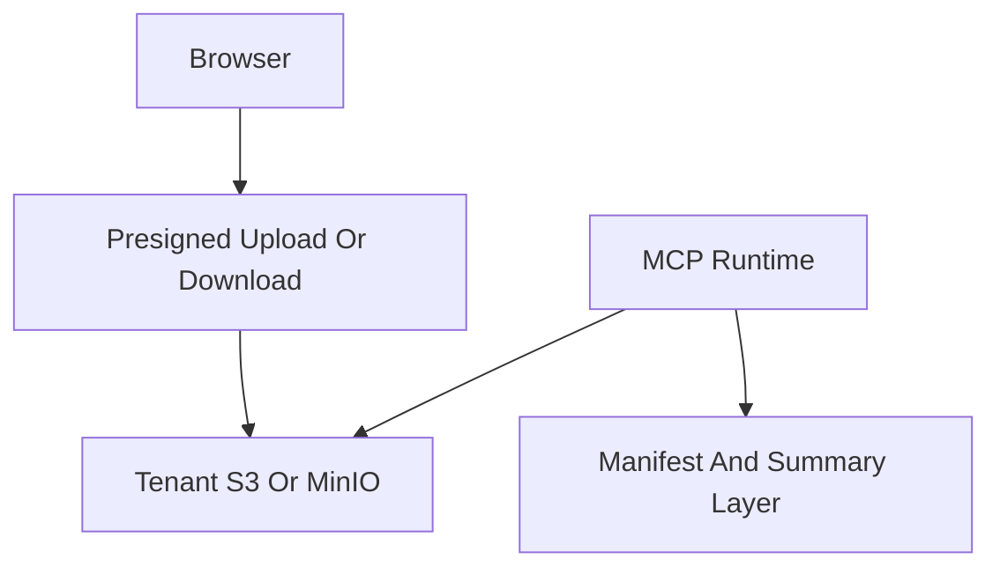

# File: documents/architecture/artifact_storage_architecture.md
# Artifact Storage Architecture

**Status**: Authoritative source
**Supersedes**: N/A
**Referenced by**: [overview.md](overview.md#canonical-follow-on-documents), [server_mode.md](server_mode.md#cross-references), [../engineering/security_model.md](../engineering/security_model.md#cross-references), [../reference/mcp_tool_catalog.md](../reference/mcp_tool_catalog.md#cross-references), [../../STUDIOMCP_DEVELOPMENT_PLAN.md](../../STUDIOMCP_DEVELOPMENT_PLAN.md#documentation-governance)

> **Purpose**: Canonical architecture for durable media artifacts, manifests, summaries, tenant-controlled object storage, and the hard no-permanent-delete rule.

## Summary

`studioMCP` creates and references durable media artifacts, but it does not own an unrestricted delete capability over them.

The artifact model is:

- immutable-by-default
- version-oriented
- tenant-scoped
- compatible with tenant-owned S3-compatible storage
- explicitly non-destructive from the MCP server’s point of view

## Current Repo Note

The current repo already uses MinIO for summaries and manifests in development flows. This document extends that storage model into the multi-tenant SaaS target where users may keep durable artifacts in their own cloud object storage.

## Artifact Classes

- raw source media
- normalized upload derivatives
- intermediate workflow artifacts
- final rendered outputs
- manifests
- summaries
- preview and thumbnail derivatives

## Storage Tiers

Supported storage patterns:

- local development via MinIO
- shared platform-managed S3-compatible storage for non-production environments
- tenant-owned S3-compatible storage for durable production artifacts

## Ownership Model

- tenants own their durable media namespace
- `studioMCP` stores references, manifests, and summaries about artifacts
- object keys should be immutable and version-oriented rather than path-overwrite oriented
- replacing an artifact means writing a new version and updating metadata, not destructive overwrite

## No Permanent Delete Rule

Hard rule:

- the MCP server must not permanently delete media artifacts

Implications:

- no public MCP tool exposes hard delete for media
- no internal convenience path may silently bypass that rule
- cleanup semantics must prefer hide, archive, supersede, retention-policy handoff, or credential revocation
- storage retention and storage growth controls are handled outside the MCP delete surface

This rule applies to:

- raw footage
- intermediates the tenant may still care about
- final renders

## Allowed Mutations

Allowed:

- create new objects
- create new immutable versions
- attach metadata
- mark hidden
- mark archived
- mark superseded
- revoke access
- expire temporary presigned URLs

Forbidden:

- hard delete through MCP tools
- automated garbage collection that permanently removes tenant media without an explicit tenant-side storage policy outside MCP

## Retention Boundary

Retention, lifecycle expiration, and storage-capacity management belong to tenant storage governance or explicit platform retention policy outside MCP.

Clients and operators must treat archive, hide, supersede, and access-revocation semantics as the supported non-destructive governance model inside `studioMCP`.

## Data Written By `studioMCP`

`studioMCP` may durably write:

- run manifests
- run summaries
- artifact version references
- execution lineage
- storage metadata needed to retrieve or understand outputs

It should avoid storing unnecessary duplicate blobs when the tenant object store is already the durable source of truth.

## Transfer Model

Large media transfer should prefer presigned URL flows:

- browser uploads directly to object storage using short-lived presigned authorization
- browser downloads directly from object storage using short-lived presigned authorization
- the BFF and MCP server authorize and record the operation, but do not proxy large media bodies unless a product requirement makes that unavoidable

## Security Implications

- storage credentials must be tenant-scoped
- presigned URLs must be short-lived
- manifests and summaries must not leak credentials
- metadata operations must honor tenant boundaries

## Cross-References

- [Architecture Overview](overview.md#architecture-overview)
- [Server Mode](server_mode.md#server-mode)
- [Security Model](../engineering/security_model.md#security-model)
- [Web Portal Surface](../reference/web_portal_surface.md#web-portal-surface)
