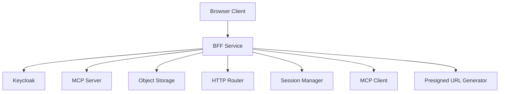

# File: documents/architecture/bff_architecture.md
# BFF Architecture

**Status**: Authoritative source
**Supersedes**: N/A
**Referenced by**: [overview.md](overview.md#canonical-follow-on-documents), [multi_tenant_saas_mcp_auth_architecture.md](multi_tenant_saas_mcp_auth_architecture.md#bff-role), [../reference/web_portal_surface.md](../reference/web_portal_surface.md#bff-responsibilities), [../../DEVELOPMENT_PLAN.md](../../DEVELOPMENT_PLAN.md#documentation-governance)

> **Purpose**: Canonical architecture for the studioMCP Backend-for-Frontend (BFF) service, including technology choice, session management, MCP client integration, and deployment topology.

## Summary

The BFF (Backend-for-Frontend) is a Haskell service that mediates between browser clients and the MCP server. It provides browser-optimized APIs for upload, download, workflow management, and chat while enforcing authentication and authorization.

## Technology Decision

**Choice**: Haskell BFF in the same repository and binary as the MCP server.

**Rationale**:
- Single deployment artifact simplifies operations
- Type safety across BFF and MCP boundaries
- Code reuse for common types (tenant, auth context, artifacts)
- Consistent error handling patterns
- Unified observability stack

## Architecture Overview



## BFF Responsibilities

| Responsibility | Description |
|---------------|-------------|
| Browser Session Management | Cookie-based sessions for authenticated users |
| Auth Flow Mediation | Keycloak redirect flows, token refresh |
| MCP Client | Calls MCP tools on behalf of authenticated users |
| Presigned URL Generation | Short-lived S3 URLs for upload/download |
| API Composition | Browser-friendly JSON responses |
| Rate Limiting | Per-user request throttling |

## Module Structure

```
src/StudioMCP/BFF/
├── Server.hs           -- BFF HTTP server (Servant-based)
├── Routes.hs           -- Route definitions
├── Session.hs          -- Browser session management
├── McpClient.hs        -- MCP client for tool invocation
├── Auth.hs             -- Keycloak auth flow handling
├── Presign.hs          -- Presigned URL generation
├── Chat.hs             -- Chat endpoint with SSE streaming
└── Types.hs            -- BFF-specific types
```

## Session Management

### Browser Sessions vs MCP Sessions

| Aspect | Browser Session | MCP Session |
|--------|----------------|-------------|
| Purpose | User authentication state | Protocol state |
| Storage | Server-side (Redis or memory) | Redis (externalized) |
| Identifier | Session cookie | Mcp-Session-Id header |
| Lifetime | 24 hours (configurable) | 30 minutes idle |
| Refresh | Sliding window | Per-request touch |

### Browser Session Data

```haskell
data BrowserSession = BrowserSession
  { bsSessionId :: SessionId
  , bsUserId :: Text
  , bsTenantId :: TenantId
  , bsAccessToken :: Text           -- Keycloak access token
  , bsRefreshToken :: Text          -- Keycloak refresh token
  , bsTokenExpiresAt :: UTCTime
  , bsCreatedAt :: UTCTime
  , bsLastActiveAt :: UTCTime
  }
```

### Session Cookie

```http
Set-Cookie: session=<session_id>; HttpOnly; Secure; SameSite=Strict; Path=/; Max-Age=86400
```

## MCP Client Integration

The BFF maintains an MCP client connection to the MCP server:

```haskell
data McpClientConfig = McpClientConfig
  { mccMcpUrl :: Text              -- e.g., "http://localhost:3000/mcp"
  , mccServiceAccount :: Text      -- BFF's service account client_id
  , mccServiceSecret :: Text       -- BFF's service account secret
  , mccConnectionPool :: Int       -- Connection pool size
  }

-- MCP client interface
data McpClient = McpClient
  { mcInitialize :: IO McpSession
  , mcCallTool :: McpSession -> ToolName -> Value -> IO (Either McpError Value)
  , mcReadResource :: McpSession -> ResourceUri -> IO (Either McpError Value)
  , mcClose :: McpSession -> IO ()
  }
```

### On-Behalf-Of Flow

When the BFF calls MCP tools for a user:

1. BFF authenticates with its own service account credentials
2. BFF includes user context in tool parameters
3. MCP server enforces tenant scoping based on user context
4. Tool execution respects user's permissions

```haskell
-- Example: Submit DAG on behalf of user
submitDagForUser :: McpClient -> BrowserSession -> DagSpec -> IO (Either Error RunId)
submitDagForUser client session dag = do
  let params = object
        [ "dag" .= dag
        , "onBehalfOf" .= object
            [ "userId" .= bsUserId session
            , "tenantId" .= bsTenantId session
            ]
        ]
  mcCallTool client mcpSession "workflow.submit_dag" params
```

## Presigned URL Generation

### Direct Storage Access

For large file transfers, the BFF generates presigned URLs for direct browser-to-storage communication:

```haskell
data PresignConfig = PresignConfig
  { pcStorageEndpoint :: Text
  , pcAccessKey :: Text
  , pcSecretKey :: Text
  , pcDefaultBucket :: Text
  , pcUploadTtl :: Int         -- seconds
  , pcDownloadTtl :: Int       -- seconds
  }

generateUploadUrl :: PresignConfig -> TenantId -> UploadRequest -> IO PresignedUpload
generateDownloadUrl :: PresignConfig -> TenantId -> ArtifactRef -> IO PresignedDownload
```

### Security Constraints

- Presigned URLs are tenant-scoped (key prefix)
- URLs expire after configured TTL
- No storage credentials exposed to browser
- Audit log records presign requests

## Server Configuration

### Entry Point

```haskell
-- app/Main.hs addition
runBffMode :: AppConfig -> IO ()
runBffMode config = do
  sessionStore <- initSessionStore (configSessionStore config)
  mcpClient <- initMcpClient (configMcpClient config)
  let bffEnv = BffEnv
        { bffSessionStore = sessionStore
        , bffMcpClient = mcpClient
        , bffPresignConfig = configPresign config
        , bffKeycloakConfig = configKeycloak config
        }
  runBffServer (configBffPort config) bffEnv
```

### CLI Command

```bash
studiomcp bff                    # Start BFF server
studiomcp bff --port 3001        # Custom port
studiomcp validate web-bff       # Validate BFF configuration
```

### Environment Variables

```bash
STUDIOMCP_BFF_PORT=3001
STUDIOMCP_BFF_SESSION_TTL=86400
STUDIOMCP_BFF_MCP_URL=http://localhost:3000/mcp
STUDIOMCP_BFF_KEYCLOAK_URL=http://localhost:8080
STUDIOMCP_BFF_KEYCLOAK_REALM=studiomcp
STUDIOMCP_BFF_KEYCLOAK_CLIENT_ID=studiomcp-bff
STUDIOMCP_BFF_KEYCLOAK_CLIENT_SECRET=***
```

## Deployment Topology

### Single Binary Deployment

The BFF runs as part of the same binary with a separate mode:

```yaml
# Kubernetes deployment
apiVersion: apps/v1
kind: Deployment
metadata:
  name: studiomcp-bff
spec:
  replicas: 2
  template:
    spec:
      containers:
      - name: bff
        image: studiomcp:latest
        command: ["studiomcp", "bff"]
        ports:
        - containerPort: 3001
        env:
        - name: STUDIOMCP_BFF_MCP_URL
          value: "http://studiomcp-mcp:3000/mcp"
```

### Ingress Configuration

```yaml
apiVersion: networking.k8s.io/v1
kind: Ingress
metadata:
  name: studiomcp-ingress
spec:
  rules:
  - host: app.example.com
    http:
      paths:
      - path: /api
        pathType: Prefix
        backend:
          service:
            name: studiomcp-bff
            port:
              number: 3001
      - path: /mcp
        pathType: Prefix
        backend:
          service:
            name: studiomcp-mcp
            port:
              number: 3000
```

## Security Considerations

### CORS Configuration

```haskell
corsPolicy :: CorsResourcePolicy
corsPolicy = CorsResourcePolicy
  { corsOrigins = Just (["https://app.example.com"], True)
  , corsMethods = ["GET", "POST", "PUT", "DELETE", "OPTIONS"]
  , corsRequestHeaders = ["Authorization", "Content-Type"]
  , corsExposedHeaders = Nothing
  , corsMaxAge = Just 86400
  , corsVaryOrigin = True
  , corsRequireOrigin = True
  , corsIgnoreFailures = False
  }
```

### CSRF Protection

- SameSite=Strict cookies
- CSRF token in forms (for non-API requests)
- Origin header validation

### Content Security Policy

```http
Content-Security-Policy: default-src 'self'; script-src 'self'; style-src 'self' 'unsafe-inline'; img-src 'self' data: https:; connect-src 'self' https://storage.example.com
```

## Error Handling

### BFF to Browser Errors

```haskell
data BffError
  = BffAuthRequired
  | BffAuthExpired
  | BffForbidden Text
  | BffNotFound Text
  | BffMcpError McpError
  | BffStorageError StorageError
  | BffRateLimited
  | BffInternalError Text

toBffResponse :: BffError -> Response
toBffResponse = \case
  BffAuthRequired -> status401 "Authentication required"
  BffAuthExpired -> status401 "Session expired"
  BffForbidden msg -> status403 msg
  BffNotFound msg -> status404 msg
  BffMcpError err -> mapMcpError err
  BffStorageError err -> status500 "Storage error"
  BffRateLimited -> status429 "Rate limit exceeded"
  BffInternalError msg -> status500 msg
```

## Observability

### Metrics

| Metric | Type | Description |
|--------|------|-------------|
| `bff_requests_total` | Counter | Total BFF requests by endpoint |
| `bff_request_duration_seconds` | Histogram | Request latency |
| `bff_sessions_active` | Gauge | Active browser sessions |
| `bff_mcp_calls_total` | Counter | MCP calls by tool |
| `bff_presign_requests_total` | Counter | Presigned URL requests |

### Logging

All BFF requests include:
- Correlation ID
- Session ID (if authenticated)
- User ID and Tenant ID
- Request path and method
- Response status and duration

## Cross-References

- [Web Portal Surface](../reference/web_portal_surface.md)
- [Multi-Tenant SaaS MCP Auth Architecture](multi_tenant_saas_mcp_auth_architecture.md)
- [MCP Protocol Architecture](mcp_protocol_architecture.md)
- [Security Model](../engineering/security_model.md)
