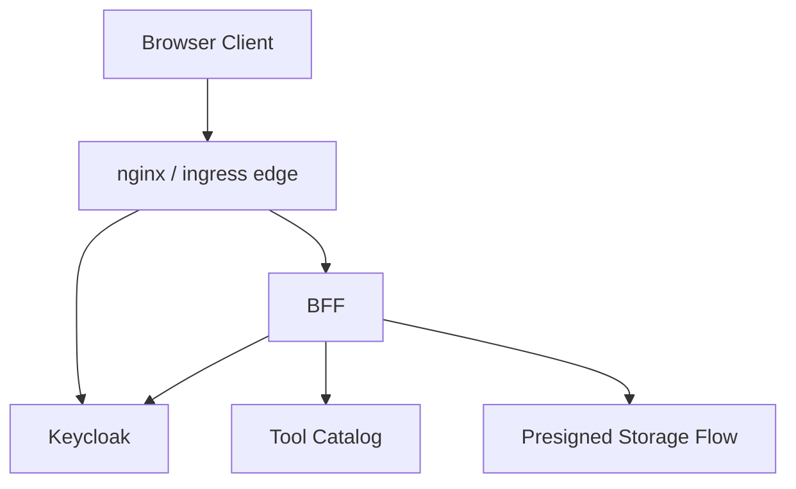

# File: documents/architecture/bff_architecture.md
# BFF Architecture

**Status**: Authoritative source
**Supersedes**: N/A
**Referenced by**: [overview.md](overview.md#canonical-follow-on-documents), [multi_tenant_saas_mcp_auth_architecture.md](multi_tenant_saas_mcp_auth_architecture.md#bff-role), [../reference/web_portal_surface.md](../reference/web_portal_surface.md#bff-responsibilities), [../../DEVELOPMENT_PLAN/README.md](../../DEVELOPMENT_PLAN/README.md#standards)

> **Purpose**: Canonical architecture for the `studioMCP` Backend-for-Frontend (BFF) service, including browser-session handling, Keycloak mediation, tool-catalog integration, and deployment topology.

## Summary

The BFF is the browser-facing HTTP surface under `/api`. It is implemented in Haskell and ships in
the same repository and binary as the rest of the system.

The current BFF contract is intentionally cookie-first:

- browser login uses username/password only on `POST /api/v1/session/login`
- the BFF exchanges those credentials with Keycloak
- the BFF stores Keycloak tokens server-side in the web session
- the browser receives an HTTP-only `studiomcp_session` cookie plus summary-only JSON
- uploads and downloads use short-lived presigned URLs rather than proxying bulk bytes through the BFF

## Current Repo Note

The implemented BFF lives in:

- `src/StudioMCP/Web/BFF.hs`
- `src/StudioMCP/Web/Handlers.hs`
- `src/StudioMCP/Web/Types.hs`

It is validated through `studiomcp validate web-bff` and the shared integration harness.

## Architecture Overview



## BFF Responsibilities

| Responsibility | Description |
|---------------|-------------|
| Browser Session Management | Server-side web sessions keyed by the browser cookie |
| Auth Flow Mediation | Login/password exchange, refresh, and logout against Keycloak |
| Tool Mediation | Invoke the stable MCP tool catalog with authenticated tenant and subject context |
| Presigned URL Generation | Issue short-lived upload and download URLs for direct browser-to-storage transfer |
| API Composition | Return browser-safe JSON for session, run, upload, download, and chat flows |
| Compatibility Handling | Accept Bearer session identifiers only as a secondary debug/compatibility path; the cookie wins when both are present |

## Implementation Footprint

| File | Responsibility |
|------|----------------|
| `src/StudioMCP/Web/BFF.hs` | BFF service state, config loading, session lifecycle, upload/download/chat/run behavior |
| `src/StudioMCP/Web/Handlers.hs` | WAI routing, session extraction, cookie-vs-bearer handling, JSON/SSE endpoints |
| `src/StudioMCP/Web/Types.hs` | Browser-facing request/response and session types |

## Session Management

### Browser Sessions vs MCP Sessions

| Aspect | Browser Session | MCP Session |
|--------|----------------|-------------|
| Purpose | Browser auth and product workflow state | MCP protocol state |
| Owner | BFF | MCP listener |
| Identifier | `studiomcp_session` cookie or compatibility Bearer session id | `Mcp-Session-Id` header |
| Stored State | subject, tenant, Keycloak tokens, expiry, timestamps | protocol version, capabilities, resumable cursor/subscription metadata |
| Lifetime | BFF-configured web-session TTL | Redis-backed idle TTL for MCP sessions |

### Browser Session Data

The current web-session model stores:

- session identifier
- subject id
- tenant id
- Keycloak access token
- optional refresh token
- expiry
- created-at and last-active timestamps

Only browser-safe summary fields are serialized back to the client. Session identifiers and tokens
are intentionally omitted from the primary JSON responses.

### Session Cookie

The supported cookie contract is:

```http
Set-Cookie: studiomcp_session=<session_id>; HttpOnly; SameSite=Strict; Path=/
```

`Secure` is configuration-controlled and should be enabled whenever the published edge uses TLS.

## Tool Integration

The browser does not call `/mcp` directly for product workflows. The BFF resolves the authenticated
browser session and then invokes the stable MCP tool catalog with explicit tenant and subject
context.

The browser-facing `/api/v1/runs` route accepts a `RunSubmitRequest` whose `dagSpec` field uses the
canonical DAG schema and whose `inputArtifacts` field maps browser-uploaded artifacts onto workflow
inputs. The BFF then invokes the stable `workflow.submit` MCP tool using the submitted DAG spec.

Companion browser flows use:

- `workflow.status`
- `artifact.upload_url`
- `artifact.download_url`

The stable public tool catalog is documented in
[../reference/mcp_tool_catalog.md](../reference/mcp_tool_catalog.md#mcp-tool-catalog).

## Upload And Download Mediation

The BFF authorizes upload and download intent, then returns short-lived presigned URLs so the
browser transfers artifact bytes directly against object storage.

Key rules:

- upload and download URLs are tenant-scoped
- TTLs are controlled by BFF config
- storage credentials never reach the browser
- local development still roots public object-storage URLs at the explicit public endpoint rather
  than through the BFF

## Configuration And Runtime

### Direct Process Entry Point

```bash
docker compose run --rm studiomcp studiomcp bff
docker compose run --rm studiomcp studiomcp validate web-bff
```

The direct `studiomcp bff` invocation is useful for focused process-level debugging, but it is not
the supported long-lived deployment model. The shared ingress-backed BFF runtime remains
Helm-managed through `cluster deploy server`. A dedicated `studiomcp-bff` executable may still be
present for focused process entry, but `studiomcp` remains the canonical supported CLI surface.

### Current Configuration Surface

`src/StudioMCP/Web/BFF.hs` loads the BFF surface from explicit environment variables such as:

- `STUDIO_MCP_BFF_MCP_ENDPOINT`
- `STUDIO_MCP_BFF_SESSION_TTL_SECONDS`
- `STUDIO_MCP_BFF_UPLOAD_TTL_SECONDS`
- `STUDIO_MCP_BFF_DOWNLOAD_TTL_SECONDS`
- `STUDIO_MCP_BFF_PUBLIC_BASE_URL`
- `STUDIO_MCP_BFF_SESSION_COOKIE_NAME`
- `STUDIO_MCP_BFF_SESSION_COOKIE_PATH`
- `STUDIO_MCP_BFF_SESSION_COOKIE_SECURE`
- `STUDIO_MCP_BFF_AUTH_SCOPES`

Keycloak issuer, client, and secret settings are loaded through the shared auth configuration.

## Deployment Topology

The BFF is a first-class Kubernetes workload published behind the shared ingress edge:

- `/api` routes to the BFF
- `/mcp` routes to the MCP listener
- `/kc` routes to Keycloak

The development container does not own long-lived BFF startup. Helm manifests own the in-cluster
runtime command and rollout behavior.

## Startup And Readiness Contract

The BFF reports ready only when browser traffic can complete real authenticated and workflow-backed
operations.

The implemented readiness contract checks:

- workflow runtime and tool catalog wiring are present
- the configured auth JWKS endpoint is reachable when auth is enabled
- the advisory reference model is reachable through one of its supported health endpoints
- Pulsar and MinIO are reachable through the shared runtime configuration used by BFF-backed flows

Operational endpoints are available at both root and ingress-prefixed paths:

- `/health/live` and `/api/health/live`
- `/health/ready` and `/api/health/ready`
- `/healthz` and `/api/healthz`

`studiomcp cluster deploy server` now waits for the `/api/health/ready` contract to close before
the live BFF validator starts session, upload, run, or logout traffic.

## Validation

The supported validation path is:

- `docker compose run --rm studiomcp studiomcp cluster ensure`
- `docker compose run --rm studiomcp studiomcp cluster deploy server`
- `docker compose run --rm studiomcp studiomcp validate web-bff`

`validate web-bff` covers login, cookie issuance, browser-safe session summaries, cookie-over-bearer
precedence, upload/download mediation, chat, run submission, run status, run-event streaming,
refresh, and logout after the shared deploy-time readiness gate has already closed.

## Cross-References

- [Web Portal Surface](../reference/web_portal_surface.md#web-portal-surface)
- [Multi-Tenant SaaS MCP Auth Architecture](multi_tenant_saas_mcp_auth_architecture.md#multi-tenant-saas-mcp-auth-architecture)
- [MCP Tool Catalog](../reference/mcp_tool_catalog.md#mcp-tool-catalog)
- [Security Model](../engineering/security_model.md#security-model)

## Security Considerations

### CORS Configuration

```haskell
corsPolicy :: CorsResourcePolicy
corsPolicy = CorsResourcePolicy
  { corsOrigins = Just (["https://app.example.com"], True)
  , corsMethods = ["GET", "POST", "PUT", "DELETE", "OPTIONS"]
  , corsRequestHeaders = ["Authorization", "Content-Type"]
  , corsExposedHeaders = Nothing
  , corsMaxAge = Just 86400
  , corsVaryOrigin = True
  , corsRequireOrigin = True
  , corsIgnoreFailures = False
  }
```

### CSRF Protection

- SameSite=Strict cookies
- CSRF token in forms (for non-API requests)
- Origin header validation

### Content Security Policy

```http
Content-Security-Policy: default-src 'self'; script-src 'self'; style-src 'self' 'unsafe-inline'; img-src 'self' data: https:; connect-src 'self' https://storage.example.com
```

## Error Handling

### BFF to Browser Errors

```haskell
data BffError
  = BffAuthRequired
  | BffAuthExpired
  | BffForbidden Text
  | BffNotFound Text
  | BffMcpError McpError
  | BffStorageError StorageError
  | BffRateLimited
  | BffInternalError Text

toBffResponse :: BffError -> Response
toBffResponse = \case
  BffAuthRequired -> status401 "Authentication required"
  BffAuthExpired -> status401 "Session expired"
  BffForbidden msg -> status403 msg
  BffNotFound msg -> status404 msg
  BffMcpError err -> mapMcpError err
  BffStorageError err -> status500 "Storage error"
  BffRateLimited -> status429 "Rate limit exceeded"
  BffInternalError msg -> status500 msg
```

## Observability

### Metrics

| Metric | Type | Description |
|--------|------|-------------|
| `bff_requests_total` | Counter | Total BFF requests by endpoint |
| `bff_request_duration_seconds` | Histogram | Request latency |
| `bff_sessions_active` | Gauge | Active browser sessions |
| `bff_mcp_calls_total` | Counter | MCP calls by tool |
| `bff_presign_requests_total` | Counter | Presigned URL requests |

### Logging

All BFF requests include:
- Correlation ID
- Session ID (if authenticated)
- User ID and Tenant ID
- Request path and method
- Response status and duration

## Cross-References

- [Web Portal Surface](../reference/web_portal_surface.md)
- [Multi-Tenant SaaS MCP Auth Architecture](multi_tenant_saas_mcp_auth_architecture.md)
- [MCP Protocol Architecture](mcp_protocol_architecture.md)
- [Security Model](../engineering/security_model.md)
