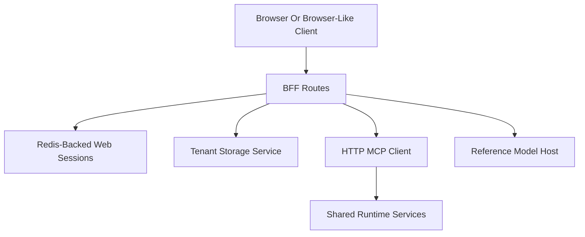

# File: documents/architecture/bff_architecture.md
# BFF Architecture

**Status**: Authoritative source
**Supersedes**: N/A
**Referenced by**: [overview.md](overview.md#canonical-follow-on-documents), [multi_tenant_saas_mcp_auth_architecture.md](multi_tenant_saas_mcp_auth_architecture.md#bff-role), [../reference/web_portal_surface.md](../reference/web_portal_surface.md#bff-responsibilities), [../../STUDIOMCP_DEVELOPMENT_PLAN.md](../../STUDIOMCP_DEVELOPMENT_PLAN.md#documentation-governance)

> **Purpose**: Canonical architecture for the current `studioMCP` Backend-for-Frontend (BFF) service, including its implemented route surface, session model, and MCP integration shape.

## Summary

The BFF is a Haskell service in the same repository and codebase as the MCP server. It exposes a same-origin browser shell plus browser-oriented HTTP routes for login, logout, profile, upload, download, chat, run submission/list/status/cancel, run-progress SSE, and artifact-governance actions.

Workflow and artifact-governance operations are mediated through a real HTTP MCP client path. Upload and download intent generation remain direct tenant-storage operations because the browser-facing contract is presigned-storage oriented.

## Current Repo Note

Implemented today:

- `studiomcp bff` in the main CLI
- `studiomcp-bff` as a dedicated executable
- WAI-based handlers in `src/StudioMCP/Web/BFF.hs` and `src/StudioMCP/Web/Handlers.hs`
- built-in browser shell routes at `/` and `/app`
- browser login, logout, profile, and cookie-backed session handling
- Redis-backed browser-session persistence for multi-instance BFF deployment
- upload and download presigning through tenant storage
- chat responses through the advisory inference path
- SSE-framed chat responses at `POST /api/v1/chat/stream`
- run submission, list, status, and cancel through MCP
- SSE-framed run progress windows at `GET /api/v1/runs/{runId}/events`
- artifact hide and archive through MCP

Still intentionally bounded:
- advanced editing or timeline UI
- collaborative multi-user browser editing
- token-level model streaming from the advisory reference model

## Runtime Shape

## Code Ownership

The implemented BFF lives in these modules:

- `app/BFFMain.hs`
- `app/BFFMode.hs`
- `src/StudioMCP/Web/BFF.hs`
- `src/StudioMCP/Web/Handlers.hs`
- `src/StudioMCP/Web/Types.hs`

The BFF does not currently have a separate `src/StudioMCP/BFF/` module tree.

## Responsibilities

The current BFF is responsible for:

- maintaining shared browser-session state in Redis
- serving the built-in browser control-room UI
- authorizing upload and download requests using the current session tenant
- returning tenant-scoped presigned URLs
- shaping browser-facing JSON payloads
- submitting, listing, inspecting, and canceling workflows through MCP
- framing advisory chat and run-status updates as SSE windows for the browser
- forwarding artifact hide and archive actions through MCP
- returning advisory chat responses using the inference helper path

The current BFF is not responsible for:

- implementing a second execution semantics model
- bypassing tenant scoping
- deleting tenant media artifacts
- acting as the source of truth for MCP session state

## Session Model

The current session model is cookie-backed at the browser edge and Redis-backed inside the BFF tier.

Session facts:

- session records, pending uploads, and cached MCP session ids are stored in Redis when the BFF is configured for shared state
- the route layer primarily extracts a session id from the `studiomcp_session` cookie and accepts `Authorization: Bearer <web-session-id>` as a fallback
- session records may contain access and refresh tokens plus a cached MCP session id, but those values are not serialized back to clients
- cookie-based browser sessions are part of the implemented HTTP surface

This preserves a clear boundary between browser sessions and MCP sessions while allowing browser traffic to move across BFF replicas without affinity.

## Runtime Integrations

### Tenant Storage

Upload and download routes use the tenant storage service directly for:

- artifact creation
- upload URL generation
- download URL generation
- artifact metadata lookup

### MCP Runtime

Workflow and artifact-governance routes use the MCP HTTP surface:

- `workflow.submit`
- `workflow.list`
- `workflow.status`
- `workflow.cancel`
- `artifact.hide`
- `artifact.archive`

The BFF initializes `/mcp`, caches the returned `Mcp-Session-Id` in the web session, reuses that MCP session across requests, and closes it when the browser session is refreshed or invalidated.

### Inference

Chat uses the advisory reference-model path. Responses remain guardrailed and may not mutate workflow state directly. The BFF exposes both a one-shot JSON chat route and an SSE route that emits assistant-message chunks from the completed advisory response.

## Config Shape

The current BFF config includes:

- `bffMcpEndpoint`
- session TTL
- upload TTL
- download TTL
- max upload size
- allowed content types

`bffMcpEndpoint` is the active MCP endpoint used by the BFF HTTP client path.

## Known Bounds

- chat SSE is assistant-message chunking over a completed advisory response rather than token-level inference streaming
- run progress SSE is derived from reconnectable status-polling windows rather than a per-node runtime event bus
- the shipped browser UI is a control-room/workbench surface, not an advanced editor or collaborative timeline
- multi-instance correctness depends on Redis being configured for the BFF deployment

## Cross-References

- [Architecture Overview](overview.md#architecture-overview)
- [Multi-Tenant SaaS MCP Auth Architecture](multi_tenant_saas_mcp_auth_architecture.md#multi-tenant-saas-mcp-auth-architecture)
- [Web Portal Surface](../reference/web_portal_surface.md#web-portal-surface)
- [Security Model](../engineering/security_model.md#security-model)
