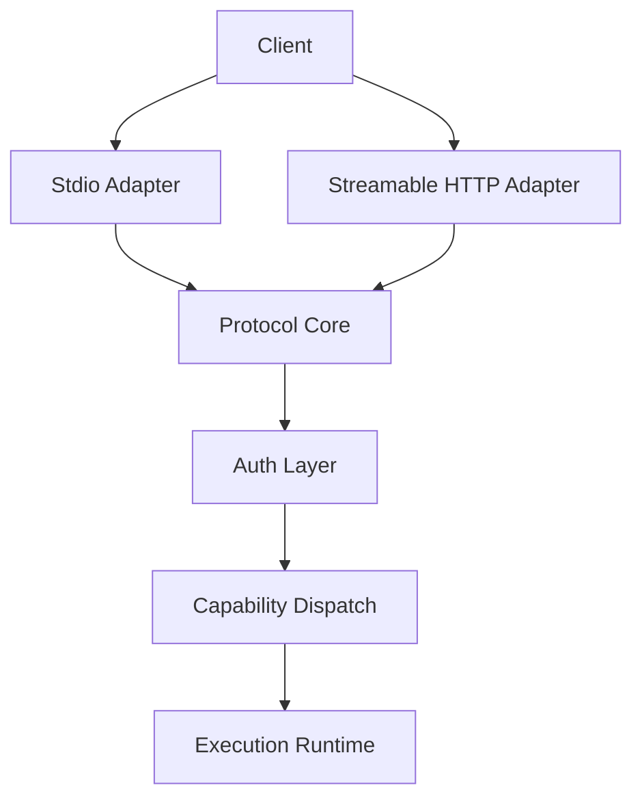
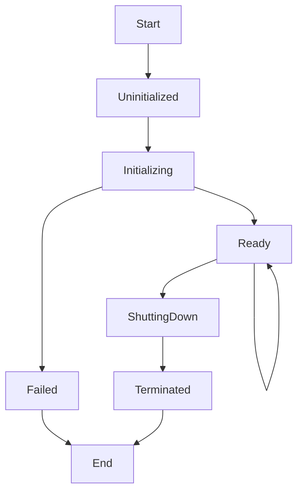

# File: documents/architecture/mcp_protocol_architecture.md
# MCP Protocol Architecture

**Status**: Authoritative source
**Supersedes**: N/A
**Referenced by**: [overview.md](overview.md#canonical-follow-on-documents), [server_mode.md](server_mode.md#cross-references), [../reference/mcp_surface.md](../reference/mcp_surface.md#cross-references), [../reference/mcp_tool_catalog.md](../reference/mcp_tool_catalog.md#cross-references), [../../DEVELOPMENT_PLAN.md](../../DEVELOPMENT_PLAN.md#documentation-governance)

> **Purpose**: Canonical architecture for the standards-compliant MCP layer in `studioMCP`, including protocol responsibilities, transports, capability shape, and Haskell implementation boundaries.

## Summary

`studioMCP` must implement MCP as MCP.

That means:

- JSON-RPC 2.0 framing
- MCP lifecycle negotiation beginning with `initialize`
- capability negotiation
- standard MCP transport behavior
- explicit tool, resource, and prompt semantics where supported

The public automation contract is not a collection of business REST routes such as `POST /runs`.

## Current Repo Note

The current repository exposes the MCP-first protocol contract as its authoritative automation surface. MCP conformance must be evaluated against `/mcp`, not against any retired migration-era aliases.

## Protocol Responsibilities

The MCP layer is responsible for:

- transport decoding and encoding
- lifecycle state management
- session establishment and teardown
- capability advertisement
- authn/authz enforcement at the protocol boundary
- dispatch to tools, resources, and prompts
- progress, logging, and error propagation

The MCP layer is not responsible for:

- storing durable media in process memory
- becoming a browser-specific API
- bypassing the typed DAG runtime
- allowing direct hard deletion of tenant media

## Target Transports

`studioMCP` targets two transports:

- `stdio` for local development, local operators, and Inspector-driven debugging
- Streamable HTTP for remote SaaS access and BFF mediation

Remote MCP traffic must terminate at a single coherent Streamable HTTP MCP endpoint rather than a family of business-specific REST routes.

WebSockets are not the canonical transport.

### Transport Selection Rationale

Both transports were selected for specific reasons:

- **MCP compliance**: Both stdio and Streamable HTTP are specified in the MCP standard
- **Use case coverage**: stdio enables CLI tooling (e.g., Claude Code), HTTP enables browser SaaS
- **Security model alignment**: HTTP transport integrates with Keycloak OAuth flow
- **Horizontal scaling**: HTTP transport supports non-sticky load balancing with externalized sessions

This dual-transport approach requires maintaining two transport implementations. Testing must cover both transport paths, and documentation must clarify transport selection for different deployment scenarios.

## Transport Split



## Session Model

The protocol core owns a session concept even when the underlying remote transport uses ordinary HTTP requests.

Session state may include:

- negotiated protocol version
- negotiated capabilities
- subject and tenant context
- request correlation metadata
- active subscriptions
- resumable stream cursors

In remote multi-node deployments, session data must be externalized as described in [../engineering/session_scaling.md](../engineering/session_scaling.md#session-scaling).

## HTTP Readiness And Session Bootstrap

The public Streamable HTTP MCP endpoint remains `/mcp`, but deploy-time admission now distinguishes
routing readiness from application readiness.

- Kubernetes rollout and `EndpointSlice` publication prove that `/mcp` is routable
- `/mcp/health/ready` proves that the listener can actually serve authenticated MCP traffic
- `studiomcp cluster deploy server` waits for that readiness contract before validators issue
  `initialize` or `tools/call` traffic

The readiness payload is operational, not part of the business MCP contract, but it names the same
blocking conditions that would otherwise surface as opaque startup races:

- protocol state not ready for traffic
- Redis-backed session store unavailable
- auth JWKS path unavailable
- Pulsar or MinIO unavailable for runtime-backed tool execution

This keeps session bootstrap deterministic. Final-request retries remain a transport hedge, not the
primary startup synchronization mechanism.

## Capability Scope

The target capability surface is intentionally constrained.

Release-priority capabilities:

- `tools`
- read-oriented `resources`
- selected `prompts`
- structured logging and progress notifications where the client supports them

Explicit non-goals for the first compliant release:

- arbitrary shell access
- protocol shortcuts that bypass typed DAG validation
- permanent delete tools for media artifacts

## Tool Dispatch Model

Tool handlers must be thin adapters over typed Haskell application services.

Preferred layering:

1. protocol request parsing
2. auth and tenant resolution
3. schema validation
4. typed domain command
5. runtime execution
6. structured result mapping

The domain service layer must remain transport-agnostic so the same command can be exercised through unit tests, protocol integration tests, and BFF-driven flows.

## Resource Model

Resources are read-oriented projections over server state, tenant metadata, manifests, summaries, and selected documentation.

Resources must:

- be tenant-scoped where applicable
- avoid embedding secrets
- avoid requiring sticky sessions
- prefer immutable or append-only backing models where possible

## Prompt Model

Prompts are optional higher-level helpers for DAG drafting, DAG repair, and operator assistance. They are advisory only and must not weaken the typed validation contract.

Inference-oriented prompts may exist, but the MCP server must remain authoritative over:

- validation
- execution
- summary creation
- artifact policy

## JSON-RPC 2.0 Message Format

All MCP messages use JSON-RPC 2.0 framing. The protocol defines three message types:

### Request

```json
{
  "jsonrpc": "2.0",
  "id": <string | number>,
  "method": "<method_name>",
  "params": { ... }
}
```

- `id`: Client-provided identifier for correlating responses. Must be unique per session.
- `method`: The MCP method name (e.g., `initialize`, `tools/list`, `tools/call`).
- `params`: Method-specific parameters object.

### Response

```json
{
  "jsonrpc": "2.0",
  "id": <string | number>,
  "result": { ... }
}
```

Or for errors:

```json
{
  "jsonrpc": "2.0",
  "id": <string | number>,
  "error": {
    "code": <integer>,
    "message": "<error_message>",
    "data": { ... }
  }
}
```

### Notification

```json
{
  "jsonrpc": "2.0",
  "method": "<notification_name>",
  "params": { ... }
}
```

Notifications have no `id` field and expect no response.

### Core MCP Methods

| Method | Direction | Description |
|--------|-----------|-------------|
| `initialize` | Client → Server | Begin session, negotiate capabilities |
| `notifications/initialized` | Client → Server | Confirm initialization complete |
| `tools/list` | Client → Server | List available tools |
| `tools/call` | Client → Server | Invoke a tool |
| `resources/list` | Client → Server | List available resources |
| `resources/read` | Client → Server | Read a resource |
| `prompts/list` | Client → Server | List available prompts |
| `prompts/get` | Client → Server | Get a prompt template |
| `notifications/progress` | Server → Client | Report progress on long operations |
| `logging/message` | Server → Client | Send log message to client |

## Protocol State Machine

The MCP protocol follows a strict lifecycle state machine:



### State Descriptions

| State | Description | Valid Operations |
|-------|-------------|------------------|
| `Uninitialized` | Connection established, no initialize yet | Only `initialize` accepted |
| `Initializing` | Initialize received, awaiting confirmation | Only `notifications/initialized` accepted |
| `Ready` | Session active, normal operation | All capability methods |
| `ShuttingDown` | Graceful shutdown in progress | Cleanup only |
| `Terminated` | Session ended | None |
| `Failed` | Initialization or fatal error | None |

### Lifecycle Enforcement

- Requests received before `initialize` must be rejected with error code `-32002` (Server not initialized)
- Requests received during `Initializing` (except `notifications/initialized`) must be rejected
- The server must track lifecycle state per session
- Lifecycle violations are protocol errors, not domain errors

## Error Codes

The protocol uses JSON-RPC 2.0 standard error codes plus MCP-specific and domain-specific ranges:

### JSON-RPC 2.0 Standard Errors

| Code | Name | Description |
|------|------|-------------|
| `-32700` | Parse error | Invalid JSON |
| `-32600` | Invalid request | JSON is not a valid request object |
| `-32601` | Method not found | Method does not exist or not available |
| `-32602` | Invalid params | Invalid method parameters |
| `-32603` | Internal error | Internal JSON-RPC error |

### MCP Protocol Errors (-32000 to -32099)

| Code | Name | Description |
|------|------|-------------|
| `-32001` | Connection closed | Transport connection lost |
| `-32002` | Server not initialized | Request before initialize |
| `-32003` | Unsupported protocol version | Version negotiation failed |
| `-32004` | Capability not supported | Requested capability not available |

### studioMCP Domain Errors (-31000 to -31999)

| Code | Name | Description |
|------|------|-------------|
| `-31001` | Authentication required | Missing or invalid bearer token |
| `-31002` | Authorization denied | Insufficient scopes or permissions |
| `-31003` | Tenant not found | Invalid tenant context |
| `-31004` | DAG validation failed | Schema or structural validation error |
| `-31005` | Execution failed | Runtime execution error |
| `-31006` | Resource not found | Requested resource does not exist |
| `-31007` | Artifact access denied | Artifact not accessible to tenant |
| `-31008` | Quota exceeded | Tenant quota limit reached |

### Error Data Structure

Domain errors should include structured `data` for debugging:

```json
{
  "code": -31004,
  "message": "DAG validation failed",
  "data": {
    "category": "ValidationFailure",
    "details": [
      { "path": "nodes[0].kind", "message": "unknown node kind: invalid" }
    ],
    "correlationId": "req-abc-123"
  }
}
```

## Error Model

The protocol must distinguish:

- protocol errors (JSON-RPC level: -32700 to -32603, -32000 to -32099)
- authn/authz failures (domain level: -31001, -31002)
- tool or domain failures (domain level: -31003 to -31999)
- transport failures (connection-level, not JSON-RPC)

Structured domain failures belong in tool results or typed resource errors. Malformed JSON-RPC, invalid lifecycle order, or unsupported methods are protocol-level failures.

## Haskell Implementation Boundaries

The Haskell implementation should be organized around explicit layers:

- transport adapters
- protocol state machine
- authn/authz middleware
- capability registry
- typed application services
- infrastructure adapters for storage, messaging, and external tools

Because there is no official Haskell MCP SDK at the time this document was written, `studioMCP` must own these layers explicitly rather than assuming an ecosystem framework will define them correctly.

### Target Module Structure

```
src/StudioMCP/MCP/
├── JsonRpc.hs              -- JSON-RPC 2.0 types and Aeson instances
├── Core.hs                 -- Protocol loop and dispatch
├── Context.hs              -- Request context threading
├── Protocol/
│   ├── Types.hs            -- MCP protocol types (capabilities, etc.)
│   ├── StateMachine.hs     -- Pure lifecycle state machine
│   └── Errors.hs           -- MCP-specific error types
├── Transport/
│   ├── Types.hs            -- Transport abstraction typeclass
│   ├── Stdio.hs            -- stdin/stdout transport
│   └── Http.hs             -- Streamable HTTP transport
├── Session/
│   ├── Types.hs            -- Session types (SessionId, Session, etc.)
│   └── Store.hs            -- Session store interface
├── Tools/                  -- Tool implementations
├── Resources/              -- Resource implementations
└── Prompts/                -- Prompt implementations
```

### Core Type Signatures

The following Haskell type signatures define the implementation contract:

```haskell
-- Transport abstraction
class Transport t where
  receiveMessage :: TransportHandle t -> IO (Either TransportError RawMessage)
  sendMessage :: TransportHandle t -> RawMessage -> IO (Either TransportError ())
  closeTransport :: TransportHandle t -> IO ()

-- Protocol state machine (pure)
data LifecycleState = Uninitialized | Initializing | Ready | ShuttingDown | Terminated | Failed
data LifecycleEvent = InitializeReceived | InitializedReceived | MethodReceived | ShutdownReceived | ErrorOccurred
transition :: LifecycleState -> LifecycleEvent -> Either ProtocolError LifecycleState

-- Session types
newtype SessionId = SessionId Text
data Session = Session
  { sessionId :: SessionId
  , sessionState :: LifecycleState
  , sessionProtocolVersion :: Maybe ProtocolVersion
  , sessionCapabilities :: NegotiatedCapabilities
  , sessionSubject :: Maybe SubjectContext      -- Populated by auth layer
  , sessionTenant :: Maybe TenantContext        -- Populated by auth layer
  , sessionCreatedAt :: UTCTime
  , sessionLastActiveAt :: UTCTime
  }

-- Request context
newtype CorrelationId = CorrelationId Text
data RequestContext = RequestContext
  { ctxCorrelationId :: CorrelationId
  , ctxSession :: Session
  , ctxMethod :: Text
  , ctxReceivedAt :: UTCTime
  }

-- JSON-RPC types
data JsonRpcRequest = JsonRpcRequest
  { reqJsonRpc :: Text                -- Always "2.0"
  , reqId :: Maybe Value              -- Absent for notifications
  , reqMethod :: Text
  , reqParams :: Maybe Value
  }

data JsonRpcResponse = JsonRpcResponse
  { respJsonRpc :: Text               -- Always "2.0"
  , respId :: Value
  , respResult :: Maybe Value
  , respError :: Maybe JsonRpcError
  }

data JsonRpcError = JsonRpcError
  { errCode :: Int
  , errMessage :: Text
  , errData :: Maybe Value
  }
```

### Transport-Agnostic Protocol Core

The protocol core must be transport-agnostic:

```haskell
-- Main protocol loop (transport-agnostic)
runProtocol :: Transport t => TransportHandle t -> ProtocolEnv -> IO ()

-- Message dispatch (pure routing)
dispatch :: RequestContext -> JsonRpcRequest -> IO JsonRpcResponse
```

This design allows the same protocol logic to be tested via in-memory transports, exercised via stdio for local development, and deployed via HTTP for remote access.

## Compatibility Rules

- the public MCP endpoint must be a single coherent MCP surface
- admin routes such as `/healthz`, `/version`, and `/metrics` are operational endpoints, not substitutes for MCP
- legacy migration-era automation surfaces must not be reintroduced as the public contract
- new feature work should target the MCP surface first unless a migration note explicitly says otherwise

## Cross-References

- [Architecture Overview](overview.md#architecture-overview)
- [Server Mode](server_mode.md#server-mode)
- [Session Scaling](../engineering/session_scaling.md#session-scaling)
- [Security Model](../engineering/security_model.md#security-model)
- [MCP Surface Reference](../reference/mcp_surface.md#mcp-surface-reference)
