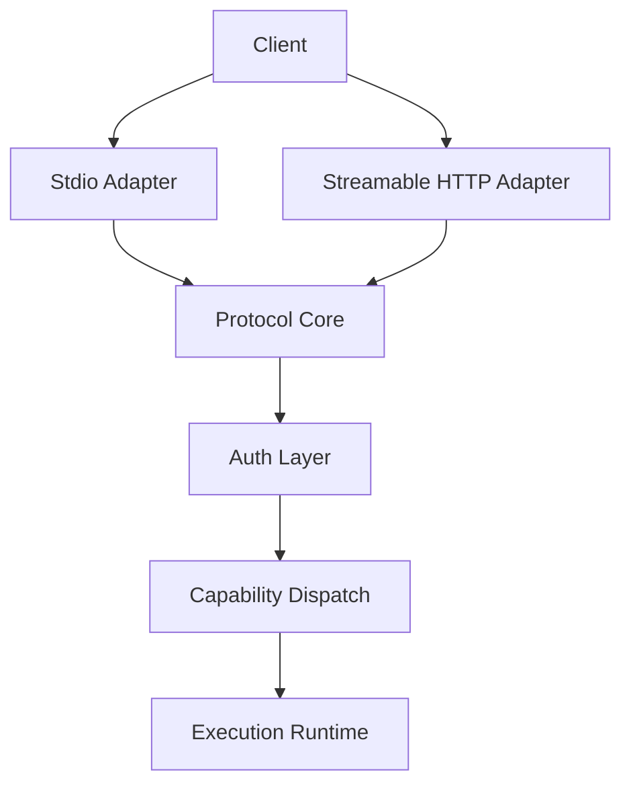

# File: documents/architecture/mcp_protocol_architecture.md
# MCP Protocol Architecture

**Status**: Authoritative source
**Supersedes**: N/A
**Referenced by**: [overview.md](overview.md#canonical-follow-on-documents), [server_mode.md](server_mode.md#cross-references), [../reference/mcp_surface.md](../reference/mcp_surface.md#cross-references), [../reference/mcp_tool_catalog.md](../reference/mcp_tool_catalog.md#cross-references), [../../STUDIOMCP_DEVELOPMENT_PLAN.md](../../STUDIOMCP_DEVELOPMENT_PLAN.md#documentation-governance)

> **Purpose**: Canonical architecture for the standards-compliant MCP layer in `studioMCP`, including protocol responsibilities, transports, capability shape, and Haskell implementation boundaries.

## Summary

`studioMCP` must implement MCP as MCP.

That means:

- JSON-RPC 2.0 framing
- MCP lifecycle negotiation beginning with `initialize`
- capability negotiation
- standard MCP transport behavior
- explicit tool, resource, and prompt semantics where supported

The public automation contract is not a collection of business REST routes such as `POST /runs`.

## Current Repo Note

The current repository still exposes a custom DAG HTTP API for submission and summary retrieval. That surface exists as a legacy foundation only. It is not the target protocol contract and must not be treated as conformance.

## Protocol Responsibilities

The MCP layer is responsible for:

- transport decoding and encoding
- lifecycle state management
- session establishment and teardown
- capability advertisement
- authn/authz enforcement at the protocol boundary
- dispatch to tools, resources, and prompts
- progress, logging, and error propagation

The MCP layer is not responsible for:

- storing durable media in process memory
- becoming a browser-specific API
- bypassing the typed DAG runtime
- allowing direct hard deletion of tenant media

## Target Transports

`studioMCP` targets two transports:

- `stdio` for local development, local operators, and Inspector-driven debugging
- Streamable HTTP for remote SaaS access and BFF mediation

Remote MCP traffic must terminate at a single coherent Streamable HTTP MCP endpoint rather than a family of business-specific REST routes.

WebSockets are not the canonical transport.

## Transport Split

## Session Model

The protocol core owns a session concept even when the underlying remote transport uses ordinary HTTP requests.

Session state may include:

- negotiated protocol version
- negotiated capabilities
- subject and tenant context
- request correlation metadata
- active subscriptions
- resumable stream cursors

In remote multi-node deployments, session data must be externalized as described in [../engineering/session_scaling.md](../engineering/session_scaling.md#session-scaling).

## Capability Scope

The target capability surface is intentionally constrained.

Release-priority capabilities:

- `tools`
- read-oriented `resources`
- selected `prompts`
- structured logging and progress notifications where the client supports them

Explicit non-goals for the first compliant release:

- arbitrary shell access
- protocol shortcuts that bypass typed DAG validation
- permanent delete tools for media artifacts

## Tool Dispatch Model

Tool handlers must be thin adapters over typed Haskell application services.

Preferred layering:

1. protocol request parsing
2. auth and tenant resolution
3. schema validation
4. typed domain command
5. runtime execution
6. structured result mapping

The domain service layer must remain transport-agnostic so the same command can be exercised through unit tests, protocol integration tests, and BFF-driven flows.

## Resource Model

Resources are read-oriented projections over server state, tenant metadata, manifests, summaries, and selected documentation.

Resources must:

- be tenant-scoped where applicable
- avoid embedding secrets
- avoid requiring sticky sessions
- prefer immutable or append-only backing models where possible

## Prompt Model

Prompts are optional higher-level helpers for DAG drafting, DAG repair, and operator assistance. They are advisory only and must not weaken the typed validation contract.

Inference-oriented prompts may exist, but the MCP server must remain authoritative over:

- validation
- execution
- summary creation
- artifact policy

## Error Model

The protocol must distinguish:

- protocol errors
- authn/authz failures
- tool or domain failures
- transport failures

Structured domain failures belong in tool results or typed resource errors. Malformed JSON-RPC, invalid lifecycle order, or unsupported methods are protocol-level failures.

## Haskell Implementation Boundaries

The Haskell implementation should be organized around explicit layers:

- transport adapters
- protocol state machine
- authn/authz middleware
- capability registry
- typed application services
- infrastructure adapters for storage, messaging, and external tools

Because there is no official Haskell MCP SDK at the time this document was written, `studioMCP` must own these layers explicitly rather than assuming an ecosystem framework will define them correctly.

## Compatibility Rules

- the public MCP endpoint must be a single coherent MCP surface
- admin routes such as `/healthz`, `/version`, and `/metrics` are operational endpoints, not substitutes for MCP
- the legacy custom `/runs` surface may exist only during migration
- new feature work should target the MCP surface first unless a migration note explicitly says otherwise

## Cross-References

- [Architecture Overview](overview.md#architecture-overview)
- [Server Mode](server_mode.md#server-mode)
- [Session Scaling](../engineering/session_scaling.md#session-scaling)
- [Security Model](../engineering/security_model.md#security-model)
- [MCP Surface Reference](../reference/mcp_surface.md#mcp-surface-reference)
