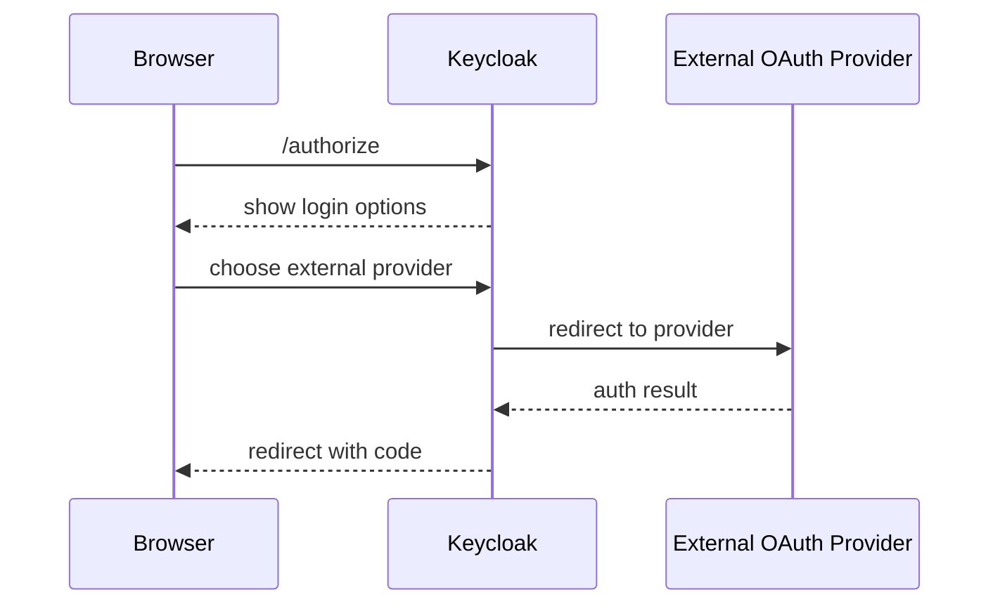
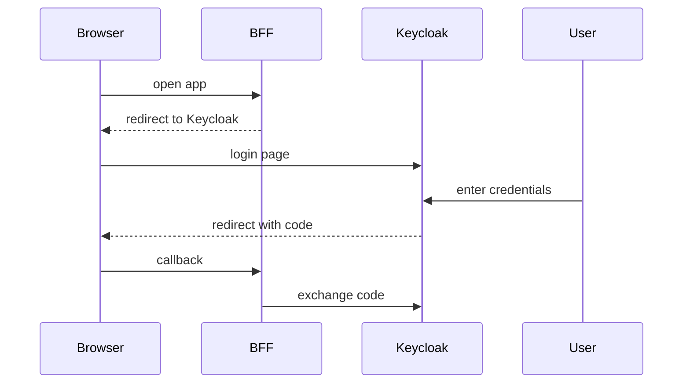
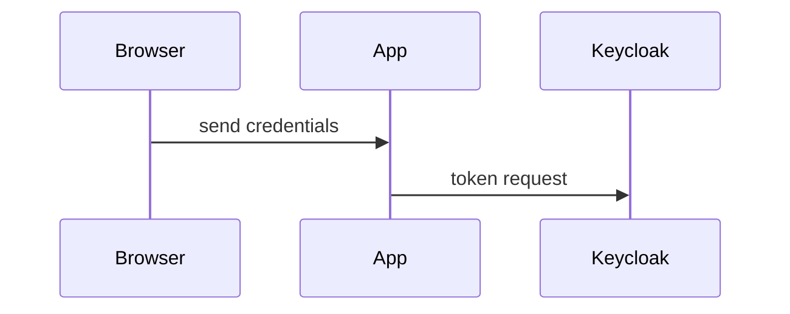
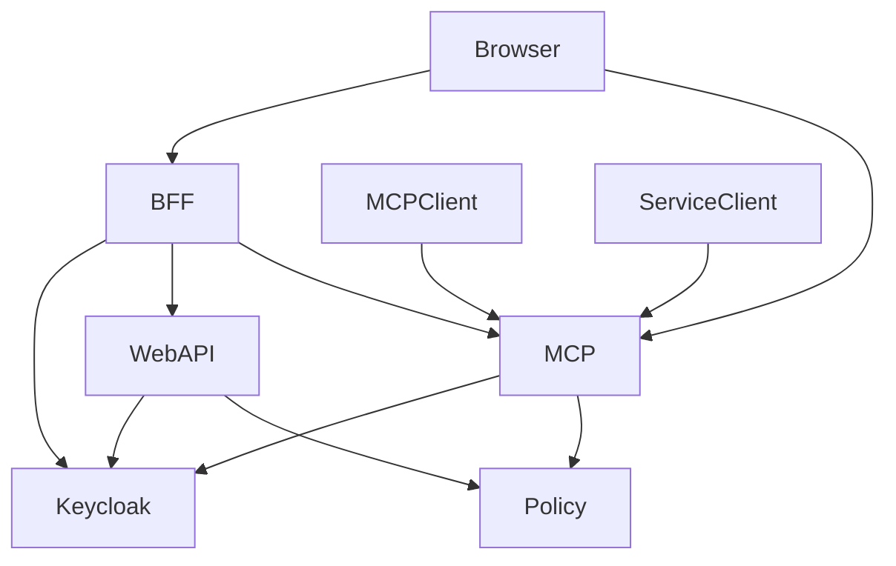
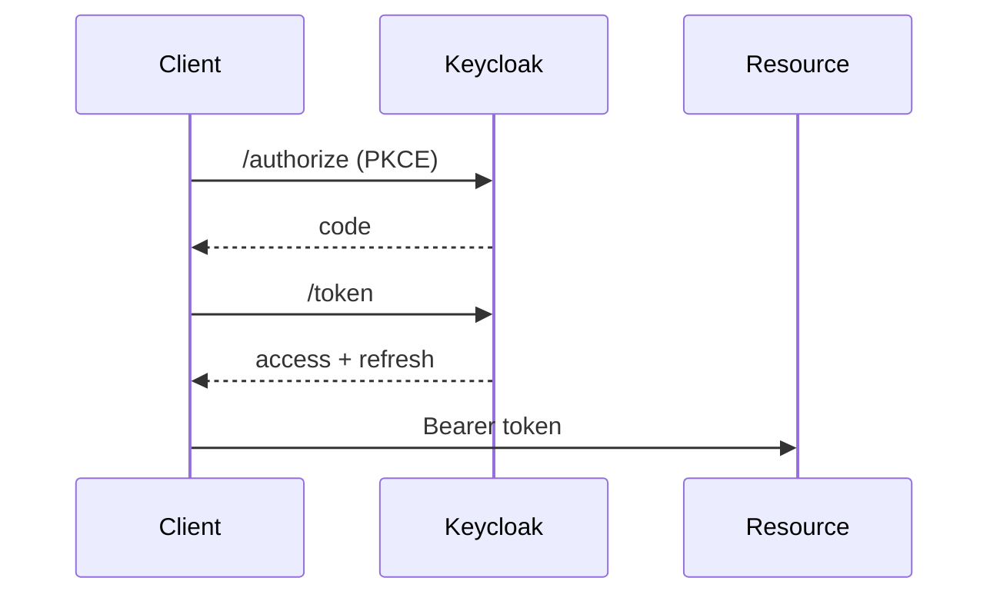
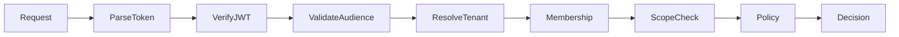
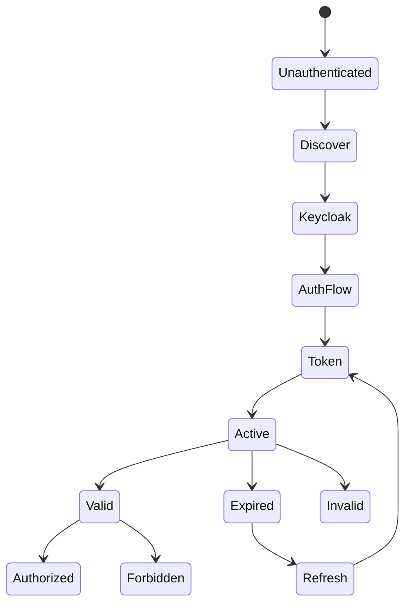
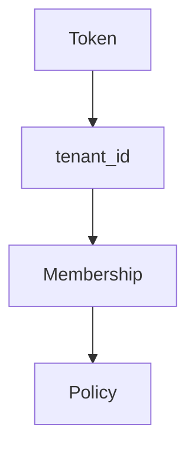
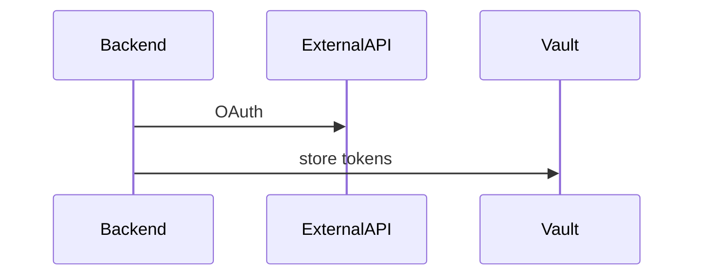

# COMPLETE KEYCLOAK-CENTRIC AUTH ARCHITECTURE GUIDE  
## Multi-Tenant SaaS + Web Portal + MCP Server (Definitive Version)

---

# 1. Overview

This guide defines a **complete, production-grade authentication and authorization architecture** for:

- Multi-tenant SaaS
- Web portal (browser + backend)
- MCP server (OAuth-protected)
- External MCP clients
- Service accounts
- Third-party integrations

It uses **Keycloak as the canonical identity provider and authorization server**.

---

# 2. Core Identity Model

👉 **Keycloak is the ONLY issuer your system trusts**

Your system components (Web API + MCP server) trust:
- Keycloak-issued tokens ONLY

They DO NOT trust tokens directly from:
- Google
- GitHub
- Microsoft
- any other public OAuth provider

---

# 3. Identity Brokering (Important Clarification)

Keycloak acts as an **identity broker**.

This means:

👉 Users may authenticate using:
- Username/password (local Keycloak users)
- ANY public OAuth provider (Google, GitHub, Microsoft, etc.)
- Enterprise SSO (OIDC/SAML)

BUT:

👉 Your system ALWAYS receives:
- **Keycloak-issued tokens**
- NEVER raw tokens from external providers

---

## 🔁 Generalized Flow (Any Public OAuth Provider)



👉 This applies to ANY provider  
(not just GitHub — GitHub is just one example)

---

# 4. Critical Nuance (Credentials Handling)

## 🔐 ALL credentials go through Keycloak

This includes:
- username/password
- MFA
- social login
- enterprise login

---

## ✅ Correct Pattern



👉 Your app NEVER sees:
- passwords
- external provider tokens

---

## ❌ Incorrect Pattern



❌ Avoid this:
- insecure
- deprecated flows
- breaks architecture

---

# 5. High-Level Architecture



---

# 6. Keycloak Deployment (Kubernetes)

- Deploy via official Helm chart
- Use external Postgres
- TLS via ingress
- Horizontal scaling

---

# 7. Development & Test Environments

## 🔧 Key requirement: Seed Keycloak

Your dev/test environments must include:

- predefined realms
- clients (web, MCP, service)
- roles
- test users
- tenant mappings

👉 This is CRITICAL because:

Keycloak is not just auth — it defines:
- identities
- roles
- scopes
- client config

---

## Recommended seeding approach

- Use realm export JSON
- Load on startup or via init job
- Version control your auth config

---

## Why this matters

Without seeding:
- dev is inconsistent
- auth flows break
- roles/scopes missing
- MCP auth testing becomes unreliable

---

## Dev vs Prod

| Environment | Behavior |
|------------|--------|
| Dev/Test | Full OAuth lifecycle + seeded data |
| Prod | Same flows + real providers |

👉 No "fake auth" anywhere

---

# 8. OAuth Lifecycle (All Environments)



---

# 9. Token Model

## Access Token (JWT)

```json
{
  "iss": "https://auth.example.com",
  "sub": "user_123",
  "aud": "mcp-server",
  "tenant_id": "tenant_acme",
  "scope": "mcp:tool:run",
  "exp": 123456
}
```

- short-lived
- audience-bound

## Refresh Token
- opaque
- rotated
- stored securely

---

# 10. Authorization Model

```
ALLOW =
  valid_token
  AND correct_audience
  AND tenant_membership
  AND scope_valid
  AND policy_valid
```

---

# 11. Authorization Pipeline



---

# 12. Auth State Machine



---

# 13. MCP Server Rules

- Require Bearer tokens
- Validate audience strictly
- Return:
  - 401 if invalid
  - 403 if unauthorized
- Never accept external provider tokens

---

# 14. Multi-Tenant Model



Rules:
- tenant_id required
- membership enforced server-side

---

# 15. Service Accounts

- Keycloak confidential clients
- client_credentials flow
- tenant-scoped
- auditable

---

# 16. Third-Party Integrations



Rules:
- do not pass MCP tokens
- store external tokens separately

---

# 17. Audit

Log:
- subject
- tenant
- action
- decision

Never log:
- tokens
- credentials

---

# 18. Golden Rules

1. Keycloak is the ONLY identity authority  
2. ALL authentication goes through Keycloak  
3. This includes username/password AND ANY public OAuth provider  
4. Your system trusts ONLY Keycloak tokens  
5. External providers are upstream identity sources ONLY  
6. Dev/test MUST seed Keycloak config  
7. Always validate audience  
8. Always enforce tenant membership  
9. No token passthrough  
10. Use real OAuth flows everywhere  

---

# FINAL SUMMARY

👉 Keycloak = identity + token issuer  
👉 MCP = protected resource server  
👉 SaaS = tenant + policy layer  

👉 ALL login methods (local OR external) are normalized through Keycloak  
👉 Dev/test environments must replicate this via seeded Keycloak configuration  
