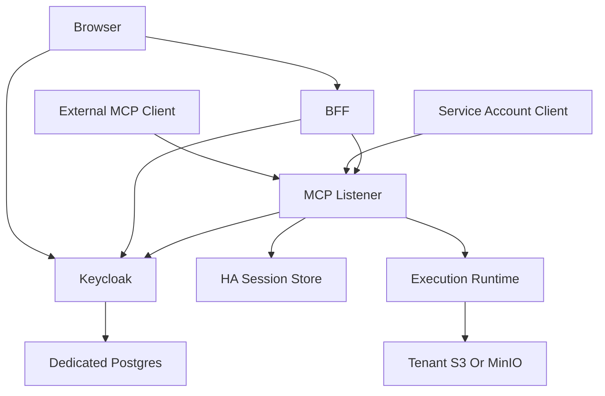
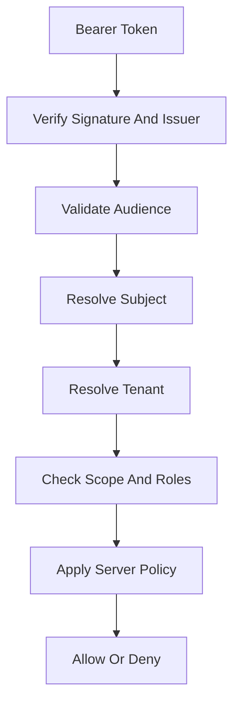

# File: documents/architecture/multi_tenant_saas_mcp_auth_architecture.md
# Multi-Tenant SaaS MCP Auth Architecture

**Status**: Authoritative source
**Supersedes**: ad hoc auth notes and the earlier non-standard version of this file
**Referenced by**: [overview.md](overview.md#canonical-follow-on-documents), [server_mode.md](server_mode.md#cross-references), [../engineering/security_model.md](../engineering/security_model.md#cross-references), [../reference/web_portal_surface.md](../reference/web_portal_surface.md#cross-references), [../../STUDIOMCP_DEVELOPMENT_PLAN.md](../../STUDIOMCP_DEVELOPMENT_PLAN.md#public-topology-baseline)

> **Purpose**: Canonical architecture for the publicly facing `studioMCP` service, including browser clients, external MCP clients, the BFF, Keycloak-based auth, tenant boundaries, and network topology.

## Summary

This document defines the target public topology for `studioMCP` as a secure multi-tenant SaaS product.

Scope boundary:

- this document defines actors, trust relationships, and network topology
- detailed enforcement rules live in [../engineering/security_model.md](../engineering/security_model.md#security-model)
- remote session externalization rules live in [../engineering/session_scaling.md](../engineering/session_scaling.md#session-scaling)

The system has three first-class client classes:

- browser users
- external MCP clients
- service accounts

All three authenticate through Keycloak-issued credentials and are authorized against tenant-aware server-side policy.

## Core Identity Rule

`studioMCP` trusts only Keycloak-issued tokens for its public auth boundary.

External identity providers may be brokered through Keycloak, but the MCP server and BFF do not trust raw upstream provider tokens directly.

## Public Topology

## Current Repo Note

This topology is a target-state document. The current repo does not yet implement the full public auth boundary, BFF, or remote MCP session topology described here.

## Client Classes

### Browser User

The browser interacts with:

- the BFF for application workflows
- Keycloak for authentication flows
- presigned storage URLs where the BFF authorizes them

The browser does not hold direct long-lived credentials for the execution plane.

### External MCP Client

An external MCP client talks to the remote MCP server over Streamable HTTP and authenticates through OAuth with PKCE.

This is the standards-compliant machine-facing integration surface.

### Service Account

Service accounts use confidential client credentials for tightly scoped automation paths.

They must remain:

- tenant-scoped or explicitly platform-scoped
- auditable
- narrower than human admin powers by default

## BFF Role

The BFF exists to serve browser product workflows.

It is responsible for:

- browser session management
- user-facing API composition
- upload and download orchestration
- chat surface orchestration
- calling MCP on behalf of the authenticated user

It is not a replacement for the MCP server and should not invent a second execution semantics model.

## Authorization Pipeline

## Token Rules

- short-lived access tokens
- refresh token rotation where applicable
- strict audience validation
- explicit tenant claims or resolvable tenant membership
- no token passthrough to downstream services

If the MCP server needs to call other protected resources, it must acquire downstream tokens under an explicit server-side client identity. It must not forward the inbound client token.

## Tenant Rules

- every mutable or tenant-private request resolves to exactly one tenant context
- tenant membership is enforced server-side
- tool, resource, prompt, and artifact access all inherit tenant constraints
- platform operators are subject to explicit break-glass policy, not hidden superuser assumptions

## Session Rules

Remote session stickiness is forbidden as a scaling requirement.

The public deployment must allow:

- multiple MCP listener pods
- reconnection to a different pod
- shared session and resumability metadata
- horizontal scaling without load-balancer affinity

The session-store specifics live in [../engineering/session_scaling.md](../engineering/session_scaling.md#session-scaling).

## Keycloak Deployment Model

Keycloak may run on the Kubernetes cluster alongside the rest of the platform.

The deployment baseline is:

- dedicated Keycloak deployment
- dedicated PostgreSQL instance or cluster for Keycloak only
- TLS at ingress
- realm and client bootstrap automation
- no sharing of the Keycloak database with unrelated platform services

For Helm-first deployments, the documented baseline is:

- `codecentric/keycloakx` for Keycloak packaging
- a dedicated PostgreSQL chart or managed PostgreSQL instance for Keycloak persistence

The repo must keep the deployment packaging separate from the logical auth model. Chart choice is operational packaging, not the definition of the security boundary.

## Realm Seeding Rule

Development, test, and cluster validation environments must seed Keycloak consistently.

Seeded artifacts include:

- realms
- clients
- roles
- scopes
- test users
- tenant mappings

Without deterministic seeding, auth validation in this repo is not credible.

## Hard Security Rules

- the browser never sends passwords to the BFF for resource-owner-password style login
- the BFF and MCP server accept only Keycloak-issued credentials
- invalid tokens return `401`
- authenticated but unauthorized requests return `403`
- external provider access tokens are not accepted as substitute bearer tokens for `studioMCP`

## Cross-References

- [Architecture Overview](overview.md#architecture-overview)
- [MCP Protocol Architecture](mcp_protocol_architecture.md#mcp-protocol-architecture)
- [Security Model](../engineering/security_model.md#security-model)
- [Session Scaling](../engineering/session_scaling.md#session-scaling)
- [Web Portal Surface](../reference/web_portal_surface.md#web-portal-surface)
