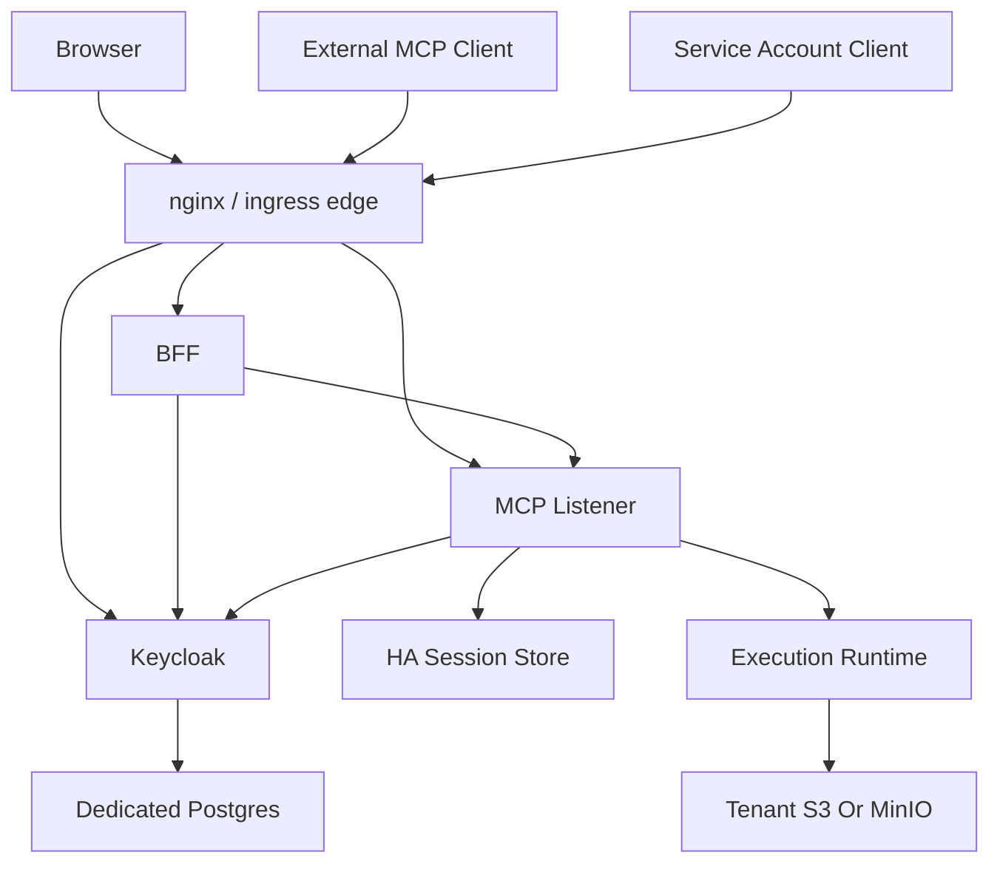
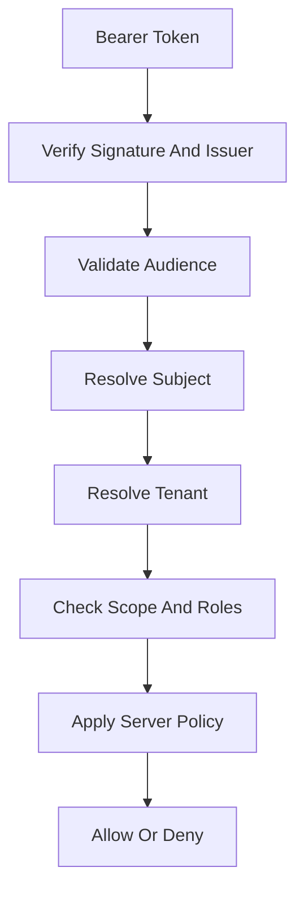
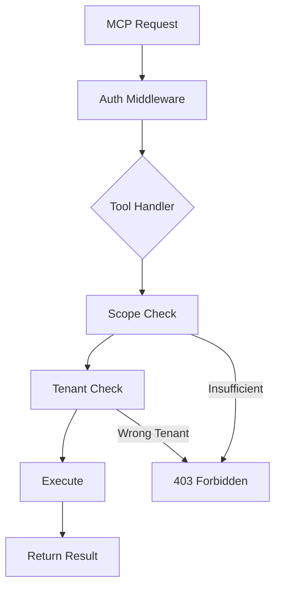

# File: documents/architecture/multi_tenant_saas_mcp_auth_architecture.md
# Multi-Tenant SaaS MCP Auth Architecture

**Status**: Authoritative source
**Supersedes**: ad hoc auth notes and the earlier non-standard version of this file
**Referenced by**: [overview.md](overview.md#canonical-follow-on-documents), [server_mode.md](server_mode.md#cross-references), [../engineering/security_model.md](../engineering/security_model.md#cross-references), [../reference/web_portal_surface.md](../reference/web_portal_surface.md#cross-references), [../../DEVELOPMENT_PLAN.md](../../DEVELOPMENT_PLAN.md#public-topology-baseline)

> **Purpose**: Canonical architecture for the publicly facing `studioMCP` service, including browser clients, external MCP clients, the BFF, Keycloak-based auth, tenant boundaries, and network topology.

## Summary

This document defines the target public topology for `studioMCP` as a secure multi-tenant SaaS product.

Scope boundary:

- this document defines actors, trust relationships, and network topology
- detailed enforcement rules live in [../engineering/security_model.md](../engineering/security_model.md#security-model)
- remote session externalization rules live in [../engineering/session_scaling.md](../engineering/session_scaling.md#session-scaling)

The system has three first-class client classes:

- browser users
- external MCP clients
- service accounts

All three authenticate through Keycloak-issued credentials and are authorized against tenant-aware server-side policy.

## Core Identity Rule

`studioMCP` trusts only Keycloak-issued tokens for its public auth boundary.

External identity providers may be brokered through Keycloak, but the MCP server and BFF do not trust raw upstream provider tokens directly.

## Public Topology



## Current Repo Note

This topology is now implemented for the current login/password delivery path. The repo ships the ingress-nginx-backed kind topology, live Keycloak-backed browser login/password flow, deterministic Keycloak realm bootstrap from the checked-in realm export, and live validation behind the shared ingress edge. Docker-compose launches only the outer development container; all application services run in the kind cluster.

## Client Classes

### Browser User

The browser interacts with:

- the BFF for authentication and application workflows
- presigned storage URLs where the BFF authorizes them

The browser does not hold direct long-lived credentials for the execution plane.

Bulk upload and download bytes are a separate data plane. The browser receives presigned URLs rooted at the environment's explicit public object-storage endpoint rather than sending large artifact bytes through `/api`.

### External MCP Client

An external MCP client talks to the remote MCP server over Streamable HTTP and authenticates with a Keycloak-issued bearer token.

How that token is obtained is intentionally out of scope for the current delivery plan. Redirect-based OAuth/PKCE may return later, but it is not a required dependency for the current delivery phases.

### Service Account

Service accounts use confidential client credentials for tightly scoped automation paths.

They must remain:

- tenant-scoped or explicitly platform-scoped
- auditable
- narrower than human admin powers by default

## BFF Role

The BFF exists to serve browser product workflows.

It is responsible for:

- accepting browser login/password over TLS during the simplified auth phase
- exchanging those credentials with Keycloak
- browser session management
- user-facing API composition
- upload and download orchestration
- chat surface orchestration
- calling MCP on behalf of the authenticated user

It is not a replacement for the MCP server and should not invent a second execution semantics model.

## Authorization Pipeline



## Token Rules

- short-lived access tokens
- refresh token rotation where applicable
- strict audience validation
- explicit tenant claims or resolvable tenant membership
- no token passthrough to downstream services

If the MCP server needs to call other protected resources, it must acquire downstream tokens under an explicit server-side client identity. It must not forward the inbound client token.

## JWT Validation Rules

The MCP server must validate JWT tokens according to these rules:

### Required Validations

| Check | Description | Failure |
|-------|-------------|---------|
| Signature | Verify RS256 signature against JWKS | 401 Unauthorized |
| Expiry | `exp` claim must be in the future | 401 Unauthorized |
| Not Before | `nbf` claim (if present) must be in the past | 401 Unauthorized |
| Issuer | `iss` must match configured Keycloak issuer | 401 Unauthorized |
| Audience | `aud` must contain the MCP resource server audience | 401 Unauthorized |

### Validation Order

```
1. Parse JWT structure
2. Fetch JWKS from Keycloak (cached with refresh)
3. Verify signature
4. Check expiry and nbf
5. Validate issuer
6. Validate audience
7. Extract claims
8. Resolve tenant
9. Check scopes/roles
```

### JWKS Handling

- JWKS endpoint: `{keycloak-url}/realms/{realm}/protocol/openid-connect/certs`
- Cache JWKS with 5-minute refresh interval
- Handle key rotation gracefully (retry with fresh JWKS on signature failure)
- Timeout JWKS fetch after 5 seconds

## JWT Claims Specification

### Required Claims

| Claim | Type | Description |
|-------|------|-------------|
| `iss` | string | Keycloak issuer URL |
| `sub` | string | Subject identifier when present on the access token |
| `aud` | string or array | Audience (must include MCP resource server) |
| `exp` | number | Expiration timestamp |
| `iat` | number | Issued-at timestamp |

### Tenant Resolution Claims

Tenant context is resolved from one of these sources (in order):

| Claim | Type | Description |
|-------|------|-------------|
| `tenant_id` | string | Explicit tenant ID (preferred) |
| `azp.tenant` | string | Authorized party tenant context |
| `resource_access.{client}.roles` | array | Tenant-scoped role (e.g., `tenant:acme-corp`) |

If no tenant can be resolved and the operation requires tenant context, reject with 403.

### Subject Resolution Note

Some Keycloak direct-grant access tokens in the current delivery path can omit `sub` even though they remain valid bearer tokens for the configured audience. In that case, `studioMCP` resolves the subject from Keycloak `userinfo` after signature, issuer, and audience validation succeed.

### Scope Claims

| Claim | Type | Description |
|-------|------|-------------|
| `scope` | string | Space-separated scope list |
| `realm_access.roles` | array | Realm-level roles |
| `resource_access.{client}.roles` | array | Client-specific roles |

### Example Token Payload

```json
{
  "iss": "https://auth.example.com/realms/studiomcp",
  "sub": "user-uuid-1234",
  "aud": ["studiomcp-mcp", "account"],
  "exp": 1700000000,
  "iat": 1699996400,
  "azp": "studiomcp-bff",
  "tenant_id": "tenant-acme-corp",
  "scope": "openid profile workflow:read workflow:write artifact:read",
  "realm_access": {
    "roles": ["user"]
  },
  "resource_access": {
    "studiomcp-mcp": {
      "roles": ["workflow.submit", "artifact.download"]
    }
  }
}
```

## Scope and Role Enforcement

### MCP Scopes

| Scope | Description |
|-------|-------------|
| `workflow:read` | List and view runs |
| `workflow:write` | Submit and cancel runs |
| `artifact:read` | Download artifacts |
| `artifact:write` | Upload artifacts |
| `artifact:manage` | Hide, archive, supersede artifacts |
| `prompt:read` | Access prompt templates |
| `resource:read` | Read MCP resources |

### Role-to-Capability Mapping

| Role | Capabilities |
|------|--------------|
| `user` | Basic workflow and artifact operations |
| `operator` | Full workflow, artifact, and prompt access |
| `admin` | All capabilities including tenant management |

### Enforcement Points



### Per-Tool Scope Requirements

| Tool | Required Scopes |
|------|-----------------|
| `workflow.submit_dag` | `workflow:write` |
| `workflow.list_runs` | `workflow:read` |
| `workflow.get_run` | `workflow:read` |
| `workflow.cancel_run` | `workflow:write` |
| `artifact.prepare_upload` | `artifact:write` |
| `artifact.prepare_download` | `artifact:read` |
| `artifact.hide` | `artifact:manage` |
| `artifact.archive` | `artifact:manage` |

## Authentication Flows

### Browser User (Login/Password Via BFF)

```
1. Browser submits login/password to the BFF over TLS
2. BFF exchanges those credentials with the Keycloak token endpoint
3. BFF creates a server-side web session and stores Keycloak tokens server-side
4. BFF returns an HTTP-only session cookie plus summary-only JSON that omits session identifiers and Keycloak tokens
5. Browser uses the cookie as the default `/api` credential and may call `GET /api/v1/session/me` to bootstrap its authenticated state
6. BFF refreshes or invalidates the Keycloak tokens as needed

Bearer session identifiers may remain available as a compatibility/debug path, but they are not the default browser contract and the cookie wins if both are present.
```

### External MCP Client

```
1. Client obtains a Keycloak-issued bearer token through an out-of-band process
2. Client includes the bearer token in `/mcp` requests
3. MCP validates signature, issuer, audience, tenant, scopes, and roles
```

### Service Account Flow

```
1. Service obtains tokens via client_credentials grant
2. Service includes access_token in MCP requests
3. No user context; tenant from client configuration
```

## Keycloak Client Configuration

### MCP Resource Server Client

```json
{
  "clientId": "studiomcp-mcp",
  "bearerOnly": true,
  "publicClient": false,
  "defaultClientScopes": ["openid", "profile"],
  "optionalClientScopes": ["workflow:read", "workflow:write", "artifact:read", "artifact:write"]
}
```

### Interactive CLI Client (Deferred)

The current realm import does not define a public interactive CLI client. External redirect-based
OAuth/PKCE remains deferred and is not part of the supported auth contract.

### BFF Client

```json
{
  "clientId": "studiomcp-bff",
  "publicClient": false,
  "secret": "***",
  "directAccessGrantsEnabled": true,
  "defaultClientScopes": [
    "profile",
    "email",
    "roles",
    "web-origins",
    "workflow:read",
    "workflow:write",
    "artifact:read",
    "artifact:write",
    "prompt:read"
  ]
}
```

### Service Account Client

```json
{
  "clientId": "studiomcp-service",
  "publicClient": false,
  "secret": "***",
  "serviceAccountsEnabled": true,
  "standardFlowEnabled": false,
  "defaultClientScopes": ["openid", "workflow:read", "workflow:write"]
}
```

## Tenant Rules

- every mutable or tenant-private request resolves to exactly one tenant context
- tenant membership is enforced server-side
- tool, resource, prompt, and artifact access all inherit tenant constraints
- platform operators are subject to explicit break-glass policy, not hidden superuser assumptions

## Session Rules

Remote session stickiness is forbidden as a scaling requirement.

The public deployment must allow:

- multiple MCP listener pods
- reconnection to a different pod
- shared session and resumability metadata
- horizontal scaling without load-balancer affinity

The session-store specifics live in [../engineering/session_scaling.md](../engineering/session_scaling.md#session-scaling).

## Keycloak Deployment Model

Keycloak runs in the kind cluster for local development and on production Kubernetes clusters for shared environments.

The deployment baseline is:

- an nginx or ingress edge as the only published entrypoint
- Keycloak published behind the edge on `/kc`
- dedicated Keycloak deployment
- dedicated PostgreSQL instance or cluster for Keycloak only
- TLS at ingress
- realm and client bootstrap automation
- no sharing of the Keycloak database with unrelated platform services

Current local edge baselines:

- kind control plane: `http://localhost:8081`
- kind object storage: `http://localhost:9000`

For Helm-first deployments, the documented baseline is:

- `codecentric/keycloakx` for Keycloak packaging
- a dedicated PostgreSQL chart or managed PostgreSQL instance for Keycloak persistence

The repo must keep the deployment packaging separate from the logical auth model. Chart choice is operational packaging, not the definition of the security boundary.

## Realm Seeding Rule

Development, test, and cluster validation environments must seed Keycloak consistently.

Seeded artifacts include:

- realms
- clients
- roles
- scopes
- test users
- tenant mappings

Without deterministic seeding, auth validation in this repo is not credible.

In the current repo, `cluster ensure`, `cluster deploy sidecars`, and `cluster deploy server` all use the checked-in realm export at `docker/keycloak/realm/studiomcp-realm.json`, import it if the realm is missing, and then wait for `/kc/realms/studiomcp/.well-known/openid-configuration` on the published edge.

## Hard Security Rules

- in the current simplified delivery path, the browser may send username/password to the BFF only on `POST /api/v1/session/login` over TLS
- the BFF and MCP server accept only Keycloak-issued credentials
- invalid tokens return `401`
- authenticated but unauthorized requests return `403`
- external provider access tokens are not accepted as substitute bearer tokens for `studioMCP`

## Cross-References

- [Architecture Overview](overview.md#architecture-overview)
- [MCP Protocol Architecture](mcp_protocol_architecture.md#mcp-protocol-architecture)
- [Security Model](../engineering/security_model.md#security-model)
- [Session Scaling](../engineering/session_scaling.md#session-scaling)
- [Web Portal Surface](../reference/web_portal_surface.md#web-portal-surface)
