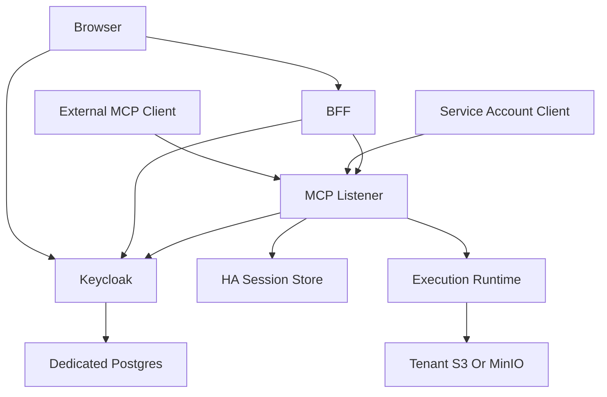
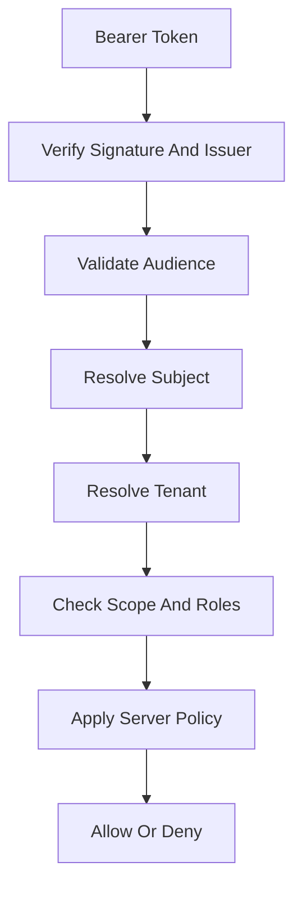
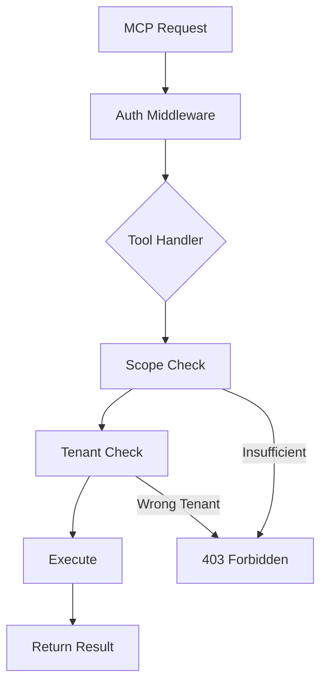

# File: documents/architecture/multi_tenant_saas_mcp_auth_architecture.md
# Multi-Tenant SaaS MCP Auth Architecture

**Status**: Authoritative source
**Supersedes**: ad hoc auth notes and the earlier non-standard version of this file
**Referenced by**: [overview.md](overview.md#canonical-follow-on-documents), [server_mode.md](server_mode.md#cross-references), [../engineering/security_model.md](../engineering/security_model.md#cross-references), [../reference/web_portal_surface.md](../reference/web_portal_surface.md#cross-references), [../../STUDIOMCP_DEVELOPMENT_PLAN.md](../../STUDIOMCP_DEVELOPMENT_PLAN.md#public-topology-baseline)

> **Purpose**: Canonical architecture for the publicly facing `studioMCP` service, including browser clients, external MCP clients, the BFF, Keycloak-based auth, tenant boundaries, and network topology.

## Summary

This document defines the public topology for `studioMCP` as a secure multi-tenant SaaS product.

Scope boundary:

- this document defines actors, trust relationships, and network topology
- detailed enforcement rules live in [../engineering/security_model.md](../engineering/security_model.md#security-model)
- remote session externalization rules live in [../engineering/session_scaling.md](../engineering/session_scaling.md#session-scaling)

The system has three first-class client classes:

- browser users
- external MCP clients
- service accounts

External MCP clients and service-account-style calls already authenticate through Keycloak-issued credentials at the MCP boundary. The browser-user path described here is now implemented in the repo as a browser-session-issuing BFF layered on top of the MCP HTTP surface.

## Core Identity Rule

`studioMCP` trusts only Keycloak-issued tokens for its public auth boundary.

External identity providers may be brokered through Keycloak, but the MCP server and BFF do not trust raw upstream provider tokens directly.

## Public Topology



## Current Repo Note

The current repo implements the MCP listener, Keycloak/JWKS auth boundary, Redis-backed MCP session store, and a BFF that validates browser-provided access tokens, issues Redis-backed server-side browser sessions, serves a built-in browser UI, and calls MCP over the live HTTP transport.

## Client Classes

### Browser User

The intended browser flow is:

- the BFF for application workflows
- Keycloak for authentication flows
- presigned storage URLs where the BFF authorizes them

The browser does not hold direct long-lived credentials for the execution plane.

### External MCP Client

An external MCP client talks to the remote MCP server over Streamable HTTP and authenticates through OAuth with PKCE.

This is the standards-compliant machine-facing integration surface.

### Service Account

Service accounts use confidential client credentials for tightly scoped automation paths.

They must remain:

- tenant-scoped or explicitly platform-scoped
- auditable
- narrower than human admin powers by default

## BFF Role

The BFF exists to serve browser product workflows.

It is responsible for:

- browser session management
- user-facing API composition
- upload and download orchestration
- chat surface orchestration
- calling MCP on behalf of the authenticated user

It is not a replacement for the MCP server and should not invent a second execution semantics model.

## Authorization Pipeline



## Token Rules

- short-lived access tokens
- refresh token rotation where applicable
- strict audience validation
- explicit tenant claims or resolvable tenant membership
- no token passthrough to downstream services

If the MCP server needs to call other protected resources, it must acquire downstream tokens under an explicit server-side client identity. It must not forward the inbound client token.

## JWT Validation Rules

The MCP server must validate JWT tokens according to these rules:

### Required Validations

| Check | Description | Failure |
|-------|-------------|---------|
| Signature | Verify RS256 signature against JWKS | 401 Unauthorized |
| Expiry | `exp` claim must be in the future | 401 Unauthorized |
| Not Before | `nbf` claim (if present) must be in the past | 401 Unauthorized |
| Issuer | `iss` must match configured Keycloak issuer | 401 Unauthorized |
| Audience | `aud` must contain the MCP resource server audience | 401 Unauthorized |

### Validation Order

```
1. Parse JWT structure
2. Fetch JWKS from Keycloak (cached with refresh)
3. Verify signature
4. Check expiry and nbf
5. Validate issuer
6. Validate audience
7. Extract claims
8. Resolve tenant
9. Check scopes/roles
```

### JWKS Handling

- JWKS endpoint: `{keycloak-url}/realms/{realm}/protocol/openid-connect/certs`
- Cache JWKS with 5-minute refresh interval
- Handle key rotation gracefully (retry with fresh JWKS on signature failure)
- Timeout JWKS fetch after 5 seconds

## JWT Claims Specification

### Required Claims

| Claim | Type | Description |
|-------|------|-------------|
| `iss` | string | Keycloak issuer URL |
| `sub` | string | Subject identifier (user ID) |
| `aud` | string or array | Audience (must include MCP resource server) |
| `exp` | number | Expiration timestamp |
| `iat` | number | Issued-at timestamp |

### Tenant Resolution Claims

Tenant context is resolved from one of these sources (in order):

| Claim | Type | Description |
|-------|------|-------------|
| `tenant_id` | string | Explicit tenant ID (preferred) |
| `azp.tenant` | string | Authorized party tenant context |
| `resource_access.{client}.roles` | array | Tenant-scoped role (e.g., `tenant:acme-corp`) |

If no tenant can be resolved and the operation requires tenant context, reject with 403.

### Scope Claims

| Claim | Type | Description |
|-------|------|-------------|
| `scope` | string | Space-separated scope list |
| `realm_access.roles` | array | Realm-level roles |
| `resource_access.{client}.roles` | array | Client-specific roles |

### Example Token Payload

```json
{
  "iss": "https://auth.example.com/realms/studiomcp",
  "sub": "user-uuid-1234",
  "aud": ["studiomcp-mcp", "account"],
  "exp": 1700000000,
  "iat": 1699996400,
  "azp": "studiomcp-cli",
  "tenant_id": "tenant-acme-corp",
  "scope": "openid profile workflow:read workflow:write artifact:read",
  "realm_access": {
    "roles": ["user"]
  },
  "resource_access": {
    "studiomcp-mcp": {
      "roles": ["workflow.submit", "artifact.download"]
    }
  }
}
```

## Scope and Role Enforcement

### MCP Scopes

| Scope | Description |
|-------|-------------|
| `workflow:read` | List and view runs |
| `workflow:write` | Submit and cancel runs |
| `artifact:read` | Download artifacts |
| `artifact:write` | Upload artifacts |
| `artifact:manage` | Hide, archive, supersede artifacts |
| `prompt:read` | Access prompt templates |
| `resource:read` | Read MCP resources |

### Role-to-Capability Mapping

| Role | Capabilities |
|------|--------------|
| `user` | Basic workflow and artifact operations |
| `operator` | Full workflow, artifact, and prompt access |
| `admin` | All capabilities including tenant management |

### Enforcement Points



### Per-Tool Scope Requirements

| Tool | Required Scopes |
|------|-----------------|
| `workflow.submit` | `workflow:write` |
| `workflow.list` | `workflow:read` |
| `workflow.status` | `workflow:read` |
| `workflow.cancel` | `workflow:write` |
| `artifact.upload_url` | `artifact:write` |
| `artifact.download_url` | `artifact:read` |
| `artifact.hide` | `artifact:manage` |
| `artifact.archive` | `artifact:manage` |

## OAuth Flows

### External MCP Client (PKCE)

```
1. Client initiates authorize request with PKCE code_challenge
2. User authenticates with Keycloak
3. Keycloak redirects with authorization code
4. Client exchanges code + code_verifier for tokens
5. Client uses access_token in MCP requests
6. Client uses refresh_token to obtain new access_token
```

### BFF Session Flow

```
1. Browser obtains a Keycloak-issued access token
2. Browser submits the access token to the BFF login route
3. BFF validates the token and resolves subject and tenant
4. BFF stores browser-session state server-side and returns a session cookie
5. BFF opens or resumes an MCP session as needed
6. BFF uses the stored user access token for MCP calls on the user's behalf
```

### Service Account Flow

```
1. Service obtains tokens via client_credentials grant
2. Service includes access_token in MCP requests
3. No user context; tenant from client configuration
```

## Keycloak Client Configuration

### MCP Resource Server Client

```json
{
  "clientId": "studiomcp-mcp",
  "bearerOnly": true,
  "publicClient": false,
  "defaultClientScopes": ["openid", "profile"],
  "optionalClientScopes": ["workflow:read", "workflow:write", "artifact:read", "artifact:write"]
}
```

### External CLI Client

```json
{
  "clientId": "studiomcp-cli",
  "publicClient": true,
  "redirectUris": ["http://localhost:*"],
  "webOrigins": ["+"],
  "defaultClientScopes": ["openid", "profile", "workflow:read", "artifact:read"],
  "attributes": {
    "pkce.code.challenge.method": "S256"
  }
}
```

### Browser App Client

```json
{
  "clientId": "studiomcp-web",
  "publicClient": true,
  "redirectUris": ["https://app.example.com/*", "http://localhost:*"],
  "webOrigins": ["https://app.example.com", "http://localhost:*"],
  "defaultClientScopes": ["openid", "profile", "workflow:read", "workflow:write", "artifact:read", "artifact:write"],
  "attributes": {
    "pkce.code.challenge.method": "S256"
  }
}
```

This browser-facing client obtains the access token that the BFF login route validates before issuing a server-side browser session cookie.

## Tenant Rules

- every mutable or tenant-private request resolves to exactly one tenant context
- tenant membership is enforced server-side
- tool, resource, prompt, and artifact access all inherit tenant constraints
- platform operators are subject to explicit break-glass policy, not hidden superuser assumptions

## Session Rules

Remote session stickiness is forbidden as a scaling requirement.

The public deployment must allow:

- multiple MCP listener pods
- reconnection to a different pod
- shared session and resumability metadata
- horizontal scaling without load-balancer affinity

The session-store specifics live in [../engineering/session_scaling.md](../engineering/session_scaling.md#session-scaling).

## Keycloak Deployment Model

Keycloak may run on the Kubernetes cluster alongside the rest of the platform.

The deployment baseline is:

- dedicated Keycloak deployment
- dedicated PostgreSQL instance or cluster for Keycloak only
- TLS at ingress
- realm and client bootstrap automation
- no sharing of the Keycloak database with unrelated platform services

For Helm-first deployments, the documented baseline is:

- `codecentric/keycloakx` for Keycloak packaging
- a dedicated PostgreSQL chart or managed PostgreSQL instance for Keycloak persistence

The repo must keep the deployment packaging separate from the logical auth model. Chart choice is operational packaging, not the definition of the security boundary.

## Realm Seeding Rule

Development, test, and cluster validation environments must seed Keycloak consistently.

Seeded artifacts include:

- realms
- clients
- roles
- scopes
- test users
- tenant mappings

Without deterministic seeding, auth validation in this repo is not credible.

## Hard Security Rules

- the browser never sends passwords to the BFF for resource-owner-password style login
- the BFF and MCP server accept only Keycloak-issued credentials
- invalid tokens return `401`
- authenticated but unauthorized requests return `403`
- external provider access tokens are not accepted as substitute bearer tokens for `studioMCP`

## Cross-References

- [Architecture Overview](overview.md#architecture-overview)
- [MCP Protocol Architecture](mcp_protocol_architecture.md#mcp-protocol-architecture)
- [Security Model](../engineering/security_model.md#security-model)
- [Session Scaling](../engineering/session_scaling.md#session-scaling)
- [Web Portal Surface](../reference/web_portal_surface.md#web-portal-surface)
