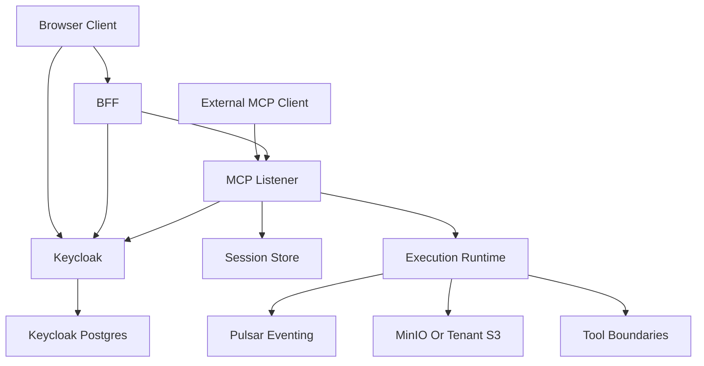

# File: documents/architecture/overview.md
# Architecture Overview

**Status**: Authoritative source
**Supersedes**: N/A
**Referenced by**: [../README.md](../README.md#documentation-suite), [mcp_protocol_architecture.md](mcp_protocol_architecture.md#cross-references), [server_mode.md](server_mode.md#cross-references), [multi_tenant_saas_mcp_auth_architecture.md](multi_tenant_saas_mcp_auth_architecture.md#cross-references), [artifact_storage_architecture.md](artifact_storage_architecture.md#cross-references)

> **Purpose**: Canonical high-level description of the current `studioMCP` system boundary, major runtime components, and the top-level document map for the MCP-first architecture.

## Executive Summary

`studioMCP` is a Haskell-first MCP platform for secure multi-tenant media workflows. The implemented public automation surface is MCP on `/mcp`, not a custom REST automation API, and it couples that protocol layer to a typed DAG execution engine, tenant-aware storage, and a browser-facing BFF layer.

The current system has four major planes:

- browser and external MCP clients
- BFF and auth plane
- MCP listener plane
- execution, metadata, and artifact plane

## Current Repo Note

The current codebase has completed the tracked MCP-first migration plan. `/mcp` is the live automation surface, the browser-facing BFF now mediates workflow and governance operations through the MCP HTTP boundary, the BFF serves a built-in browser control-room UI plus SSE chat and run-progress routes, deterministic parallel DAG execution is live, and the CLI ergonomics tracked in the plan are implemented. Browser-session state is shared through Redis for multi-instance deployment.

## System Topology

## Architectural Pillars

- standards-compliant MCP over `stdio` and Streamable HTTP
- Haskell ownership of protocol, execution, failure algebra, and summary model
- secure multi-tenant authn/authz with Keycloak as the trusted issuer
- horizontally scalable non-sticky listener nodes
- immutable artifact and manifest contracts
- strict prohibition on permanent MCP-driven media deletion
- browser product surface mediated through a BFF rather than direct browser-to-storage trust expansion

## Canonical Follow-On Documents

- protocol shape: [MCP Protocol Architecture](mcp_protocol_architecture.md#mcp-protocol-architecture)
- server runtime: [Server Mode](server_mode.md#server-mode)
- BFF runtime: [BFF Architecture](bff_architecture.md#bff-architecture)
- CLI control plane: [CLI Architecture](cli_architecture.md#cli-architecture)
- advisory model path: [Inference Mode](inference_mode.md#inference-mode)
- public network and auth topology: [Multi-Tenant SaaS MCP Auth Architecture](multi_tenant_saas_mcp_auth_architecture.md#multi-tenant-saas-mcp-auth-architecture)
- artifact rules: [Artifact Storage Architecture](artifact_storage_architecture.md#artifact-storage-architecture)
- storage split: [Pulsar vs MinIO](pulsar_vs_minio.md#pulsar-vs-minio)
- security rules: [Security Model](../engineering/security_model.md#security-model)
- non-sticky scaling rules: [Session Scaling](../engineering/session_scaling.md#session-scaling)
- timeout rules: [Timeout Enforcement Policy](../engineering/timeout_policy.md#timeout-enforcement-policy)
- tool and resource catalog: [MCP Surface Reference](../reference/mcp_surface.md#mcp-surface-reference)
- web/BFF product surface: [Web Portal Surface](../reference/web_portal_surface.md#web-portal-surface)

## Cross-References

- [Documentation Standards](../documentation_standards.md#studiomcp-documentation-standards)
- [Testing Strategy](../development/testing_strategy.md#testing-strategy)
- [studioMCP Development Plan](../../STUDIOMCP_DEVELOPMENT_PLAN.md#studiomcp-development-plan)
