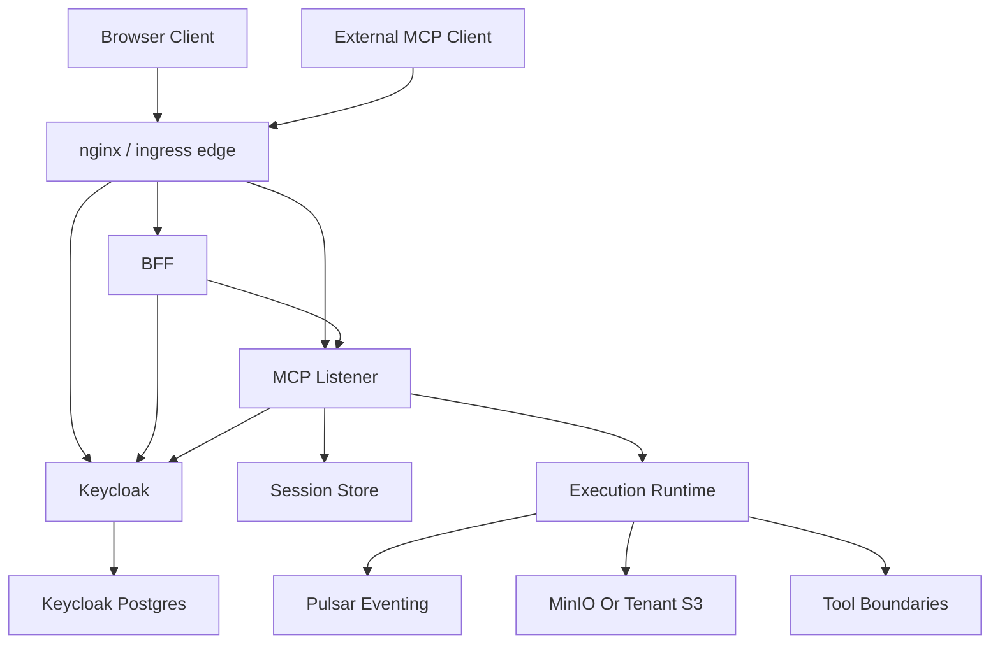

# File: documents/architecture/overview.md
# Architecture Overview

**Status**: Authoritative source
**Supersedes**: N/A
**Referenced by**: [../README.md](../README.md#documentation-suite), [mcp_protocol_architecture.md](mcp_protocol_architecture.md#cross-references), [server_mode.md](server_mode.md#cross-references), [multi_tenant_saas_mcp_auth_architecture.md](multi_tenant_saas_mcp_auth_architecture.md#cross-references), [artifact_storage_architecture.md](artifact_storage_architecture.md#cross-references)

> **Purpose**: Canonical high-level description of the target `studioMCP` system boundary, major runtime components, and the top-level document map for the MCP-first architecture.

## Executive Summary

`studioMCP` is a Haskell-first MCP platform for secure multi-tenant media workflows. The target system exposes a real MCP surface, not a custom REST automation API, and couples that protocol layer to a typed DAG execution engine, tenant-aware storage, and a browser-facing SaaS application.

The target public topology has four major planes:

- browser and external MCP clients
- BFF and auth plane
- MCP listener plane
- execution, metadata, and artifact plane

## Current Repo Note

The current codebase already includes the live Keycloak boundary, the ingress-nginx-fronted kind topology, the browser-facing login/session behavior, and the MCP/runtime surface described by this suite. The documents here now describe implemented architecture for the current login/password delivery path, with OAuth/PKCE explicitly deferred.

The current repo also treats runtime readiness as an explicit application contract rather than a
pod-liveness side effect:

- `/mcp`, `/api`, worker, and inference surfaces expose structured readiness state with blocking
  reasons
- Kubernetes rollout and published service endpoints remain necessary routing checks, but live
  traffic does not begin until the application readiness contract has also closed
- cluster waiters and live validators reuse that readiness contract instead of relying on fixed
  sleeps or startup-race retry loops

## System Topology

## Architectural Pillars

- standards-compliant MCP over `stdio` and Streamable HTTP
- Haskell ownership of protocol, execution, failure algebra, and summary model
- secure multi-tenant authn/authz with Keycloak as the trusted issuer
- horizontally scalable non-sticky listener nodes
- dependency-aware readiness with structured blocking reasons at each runtime surface
- immutable artifact and manifest contracts
- strict prohibition on permanent MCP-driven media deletion
- browser product surface mediated through a BFF rather than direct browser-to-storage trust expansion

## Canonical Follow-On Documents

- protocol shape: [MCP Protocol Architecture](mcp_protocol_architecture.md#mcp-protocol-architecture)
- server runtime: [Server Mode](server_mode.md#server-mode)
- public network and auth topology: [Multi-Tenant SaaS MCP Auth Architecture](multi_tenant_saas_mcp_auth_architecture.md#multi-tenant-saas-mcp-auth-architecture)
- artifact rules: [Artifact Storage Architecture](artifact_storage_architecture.md#artifact-storage-architecture)
- storage split: [Pulsar vs MinIO](pulsar_vs_minio.md#pulsar-vs-minio)
- security rules: [Security Model](../engineering/security_model.md#security-model)
- non-sticky scaling rules: [Session Scaling](../engineering/session_scaling.md#session-scaling)
- tool and resource catalog: [MCP Surface Reference](../reference/mcp_surface.md#mcp-surface-reference)
- web/BFF product surface: [Web Portal Surface](../reference/web_portal_surface.md#web-portal-surface)

## Cross-References

- [Documentation Standards](../documentation_standards.md#studiomcp-documentation-standards)
- [Testing Strategy](../development/testing_strategy.md#testing-strategy)
- [studioMCP Development Plan](../../DEVELOPMENT_PLAN.md#studiomcp-development-plan)
