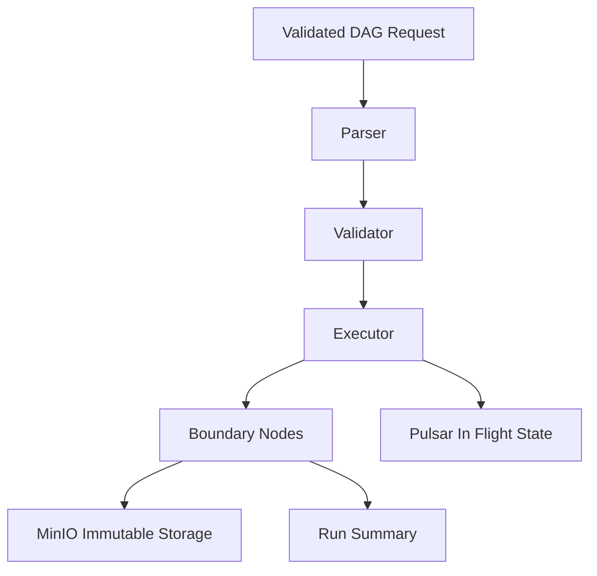

# File: documents/architecture/overview.md
# Architecture Overview

**Status**: Authoritative source
**Supersedes**: N/A
**Referenced by**: [../README.md](../README.md#documentation-suite), [pulsar_vs_minio.md](pulsar_vs_minio.md#cross-references), [server_mode.md](server_mode.md#cross-references), [inference_mode.md](inference_mode.md#cross-references), [cli_architecture.md](cli_architecture.md#cross-references)

> **Purpose**: Canonical high-level description of the `studioMCP` system boundary, execution flow, and top-level documentation map for architecture topics.

## Executive Summary

`studioMCP` is a Haskell-first execution system for typed studio DAGs. Haskell owns the DAG model, failure algebra, timeout behavior, summary construction, and memoization contract. Impure tools and sidecars exist behind explicit boundaries. Repository deployment semantics are Kubernetes-forward: Helm defines topology, Skaffold drives the local loop, and kind is the default local cluster.

This document describes the target steady-state architecture. Current implementation maturity is tracked in [../../STUDIOMCP_DEVELOPMENT_PLAN.md](../../STUDIOMCP_DEVELOPMENT_PLAN.md#current-repo-assessment-against-this-plan).

## System Flow

## Architectural Pillars

- typed DAG input and validation
- explicit `Result success failure` semantics
- timeout-first execution behavior
- Kubernetes as deployment topology SSoT via Helm
- Skaffold and kind as the preferred local orchestration path
- Pulsar as the SSoT for in-flight execution state
- MinIO as immutable persistent storage
- a final summary object as the terminal truth for each run

## Canonical Follow-On Documents

- Storage split: [Pulsar vs MinIO](pulsar_vs_minio.md#pulsar-vs-minio)
- Local control plane: [CLI Architecture](cli_architecture.md#cli-architecture)
- Server runtime: [Server Mode](server_mode.md#server-mode)
- Assistive model path: [Inference Mode](inference_mode.md#inference-mode)
- Future concurrency design: [Parallel Scheduling](parallel_scheduling.md#parallel-scheduling)
- DAG schema: [DAG Specification](../domain/dag_specification.md#dag-specification)
- Deployment policy: [Kubernetes-Native Development Policy](../engineering/k8s_native_dev_policy.md#kubernetes-native-development-policy)
- test policy: [Testing Strategy](../development/testing_strategy.md#testing-strategy)

## Cross-References

- [Documentation Standards](../documentation_standards.md#studiomcp-documentation-standards)
- [Local Development](../development/local_dev.md#local-development)
