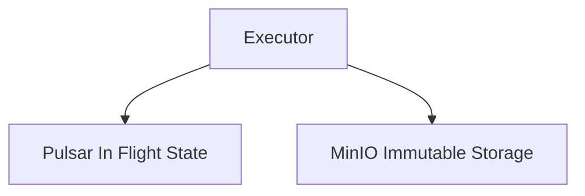

# File: documents/architecture/pulsar_vs_minio.md
# Pulsar vs MinIO

**Status**: Authoritative source
**Supersedes**: legacy `documents/architecture/pulsar-vs-minio.md`
**Referenced by**: [overview.md](overview.md#canonical-follow-on-documents), [../development/testing_strategy.md](../development/testing_strategy.md#integration-tests), [../tools/minio.md](../tools/minio.md#cross-references), [../tools/pulsar.md](../tools/pulsar.md#cross-references), [../engineering/k8s_storage.md](../engineering/k8s_storage.md#cross-references)

> **Purpose**: Canonical definition of the storage and messaging split between Pulsar and MinIO in `studioMCP`.

## Core Rule

Pulsar and MinIO are different systems with different responsibilities. They must stay separate in both code and documentation.

## Pulsar

Pulsar is the Single Source of Truth for in-flight execution state.

Use Pulsar for:

- run submission
- node scheduling
- node lifecycle events
- replay and retry coordination
- execution progress event history

Do not use Pulsar for:

- durable artifact bodies
- memoized outputs
- long-term summary persistence

## MinIO

MinIO is the canonical immutable object store.

Use MinIO for:

- memoized outputs
- immutable intermediate artifacts
- final artifacts
- manifests
- persisted summaries

Do not use MinIO for:

- orchestration authority over active runs
- queue semantics
- transient execution-state coordination

## Testing Implication

Because both systems are stateful, local persistence and reset behavior must follow the explicit environment and PV rules described in [Testing Strategy](../development/testing_strategy.md#reproducible-environment) and [Kubernetes Storage Policy](../engineering/k8s_storage.md#kubernetes-storage-policy).

## Cross-References

- [Architecture Overview](overview.md#architecture-overview)
- [Testing Strategy](../development/testing_strategy.md#testing-strategy)
- [Kubernetes Storage Policy](../engineering/k8s_storage.md#kubernetes-storage-policy)
