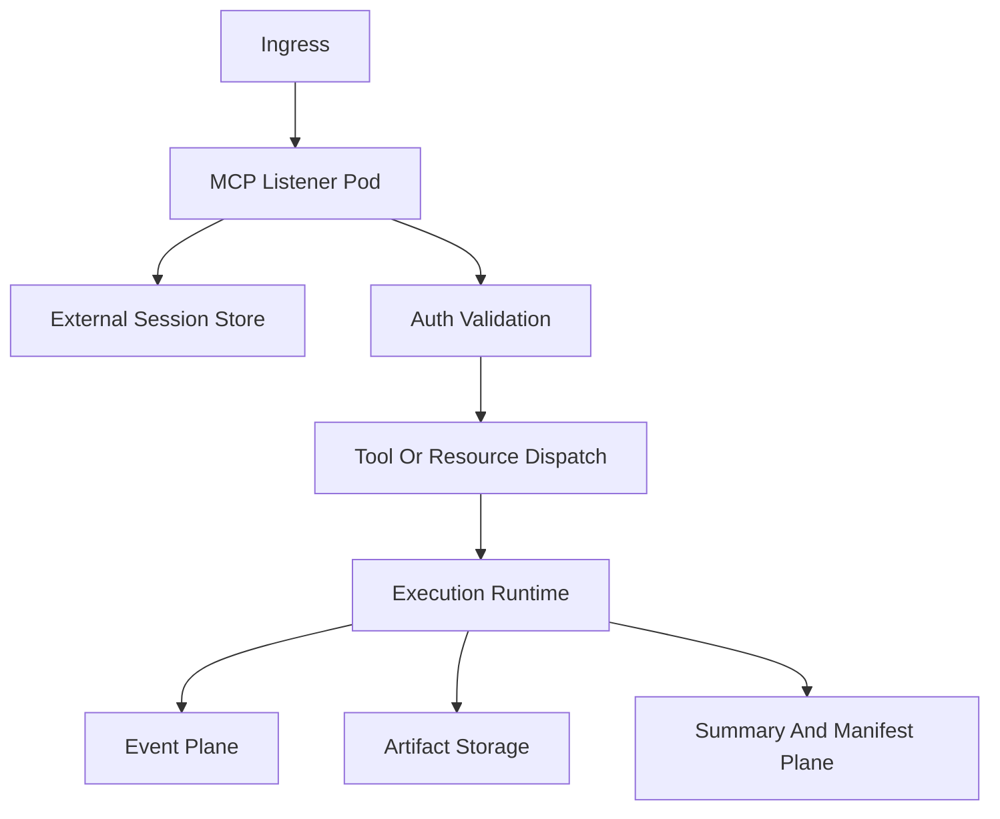

# File: documents/architecture/server_mode.md
# Server Mode

**Status**: Authoritative source
**Supersedes**: legacy `documents/architecture/server-mode.md`
**Referenced by**: [overview.md](overview.md#canonical-follow-on-documents), [../README.md](../README.md#documentation-suite), [../reference/mcp_surface.md](../reference/mcp_surface.md#cross-references), [../../STUDIOMCP_DEVELOPMENT_PLAN.md](../../STUDIOMCP_DEVELOPMENT_PLAN.md#documentation-governance)

> **Purpose**: Canonical definition of the authoritative Haskell server runtime in `studioMCP`, including its responsibilities as an MCP listener tier over the DAG execution system.

## Summary

Server mode is the authoritative MCP runtime. It terminates MCP transports, authenticates callers, dispatches tools and resources, coordinates execution, and publishes stable summaries and manifests.

The runtime must support horizontal listener scaling without sticky sessions. Execution durability and artifact durability must live outside individual listener pods.

## Current Repo Note

The current `studiomcp server` binary already exposes a Haskell HTTP runtime, but its public API is still a custom DAG control surface. This document defines the target server mode once the MCP protocol migration lands.

## Responsibilities

- terminate `stdio` and Streamable HTTP MCP transports
- perform lifecycle negotiation
- resolve subject and tenant identity
- authorize capability access
- dispatch tool, resource, and prompt handlers
- enqueue or execute typed DAG workflows
- emit progress, logs, summaries, and manifests through supported MCP surfaces
- expose admin endpoints for health, version, and metrics

## Non-Responsibilities

- becoming a generic browser BFF
- storing durable session state only in pod memory
- acting as the system of record for tenant credentials
- permanently deleting media artifacts

## Runtime Shape

## Listener Tier Rules

- listener pods must remain replaceable
- any required remote session state must be externalized
- authz decisions must be reproducible on any pod
- progress and subscription behavior must survive reconnection where the protocol contract requires it

## Execution Rules

Execution remains governed by the typed DAG runtime already present in the repo.

That runtime must continue to own:

- validation
- timeout enforcement
- failure projection
- summary construction
- memoization contracts
- tool-boundary execution

The MCP layer dispatches into that runtime. It does not replace it.

## Artifact Rules

Server mode may:

- create immutable artifacts
- create new versions
- create manifests and summaries
- expose metadata and retrieval handles

Server mode may not:

- permanently delete tenant media
- accept a tool that performs permanent media deletion

## Operational Endpoints

Operational endpoints remain out of band from MCP:

- `/healthz`
- `/version`
- `/metrics`

These routes exist for operators, load balancers, and observability systems. They are not part of the MCP business contract.

## Cross-References

- [Architecture Overview](overview.md#architecture-overview)
- [MCP Protocol Architecture](mcp_protocol_architecture.md#mcp-protocol-architecture)
- [Multi-Tenant SaaS MCP Auth Architecture](multi_tenant_saas_mcp_auth_architecture.md#multi-tenant-saas-mcp-auth-architecture)
- [Artifact Storage Architecture](artifact_storage_architecture.md#artifact-storage-architecture)
- [MCP Surface Reference](../reference/mcp_surface.md#mcp-surface-reference)
