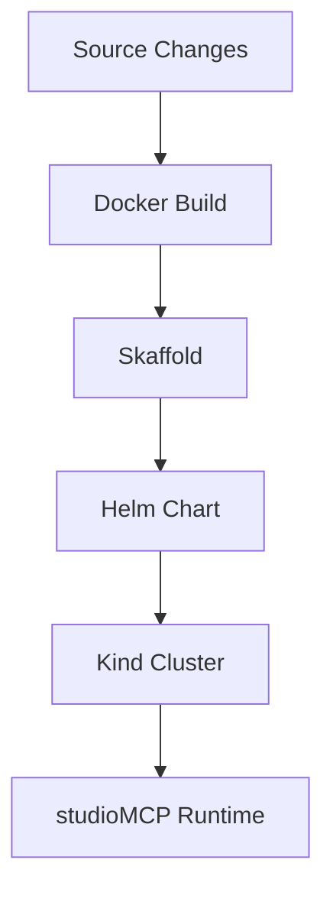

# File: documents/engineering/k8s_native_dev_policy.md
# Kubernetes-Native Development Policy

**Status**: Authoritative source
**Supersedes**: N/A
**Referenced by**: [../README.md](../README.md#documentation-suite), [../architecture/overview.md](../architecture/overview.md#canonical-follow-on-documents), [../development/local_dev.md](../development/local_dev.md#cross-references), [../../README.md](../../README.md#kubernetes-native-development), [../../STUDIOMCP_DEVELOPMENT_PLAN.md](../../STUDIOMCP_DEVELOPMENT_PLAN.md#documentation-governance)

> **Purpose**: Canonical engineering policy for the Kubernetes-forward repository design in `studioMCP`, including the outer development container, kind lifecycle ownership, and the limited role of Docker Compose.

## Executive Summary

`studioMCP` is Kubernetes-forward. Docker remains the image build substrate, but Kubernetes is the deployment and topology source of truth. Helm defines service relationships and runtime semantics. kind is the default local cluster target.

Docker Compose is retained only as the outer development-container launcher. It is not the authoritative deployment model for the application runtime.

## Policy

### Kubernetes is the Deployment Source of Truth

All service relationships, topology, and runtime deployment semantics belong in the Helm chart under `chart/`.

### One Dockerfile

The repo keeps one Dockerfile at `docker/Dockerfile`.

- it is multi-stage
- one stage is the outer development container
- one stage is the runtime image consumed by Helm and kind

### No Scripts Command Surface

Supported repository commands must live in the Haskell CLI, not in checked-in shell helpers.

- local cluster actions belong in `studiomcp cluster ...`
- deployment actions belong in `studiomcp cluster deploy ...` or a closely related native CLI family
- validation actions belong in `studiomcp validate ...`
- LLMs should enter the outer development container and invoke the Haskell CLI there
- storage lifecycle actions belong in the CLI as well

### One Helm Chart

The repo keeps one Helm chart at `chart/`.

- `values.yaml` is the base configuration
- `values-kind.yaml` is the local cluster overlay
- `values-prod.yaml` is the production-oriented overlay

### The Outer Development Container Owns the Local Control Plane

The local control-plane loop is:

1. start the outer development container with Docker Compose
2. enter it with `docker compose -f docker/docker-compose.yaml exec`
3. run `studiomcp cluster ...` commands to manage kind
4. run `studiomcp cluster deploy ...` commands to deploy Helm-backed workloads

kind must run against the selected host Docker context through the outer development container. This is not Docker-in-Docker.
Persistent storage must follow the explicit PV policy in [Kubernetes Storage Policy](k8s_storage.md#kubernetes-storage-policy).

### Skaffold Still Matters

Skaffold remains part of the Kubernetes-native toolchain for image-build and deployment workflows. It does not replace the need for the Haskell CLI command surface.

### Compose Is a Container Launcher, Not a Platform Model

Compose remains in the repo for one narrow reason: to launch the outer development container with access to the active host Docker context.

Compose must not become:

- the deployment source of truth
- the expression of canonical service topology
- a substitute for the Haskell CLI

## Repository Embodiment

This policy is represented today through:

- `docker/Dockerfile`
- `chart/`
- `skaffold.yaml`
- `kind/kind_config.yaml`
- `docker/docker-compose.yaml`
- [Docker Policy](docker_policy.md#docker-policy)
- [CLI Architecture](../architecture/cli_architecture.md#cli-architecture)

Current repo note: the policy is now materially implemented for the local cluster baseline. The native Haskell cluster-management surface exists, Compose launches the outer development container, sidecars and the server can be deployed through the CLI, and the cluster, MCP, inference, and observability workflows have been verified from inside that container on this machine. Remaining work is now limited to persistence-enabled local releases, broader host-context coverage, and any new CLI surface the next plan may introduce.

## Cross-References

- [Architecture Overview](../architecture/overview.md#architecture-overview)
- [Docker Policy](docker_policy.md#docker-policy)
- [Kubernetes Storage Policy](k8s_storage.md#kubernetes-storage-policy)
- [CLI Architecture](../architecture/cli_architecture.md#cli-architecture)
- [Local Development](../development/local_dev.md#local-development)
- [Testing Strategy](../development/testing_strategy.md#testing-strategy)
