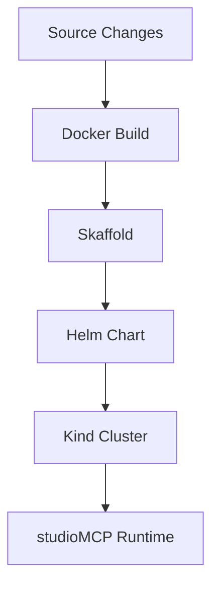

# File: documents/engineering/k8s_native_dev_policy.md
# Kubernetes-Native Development Policy

**Status**: Authoritative source
**Supersedes**: N/A
**Referenced by**: [../README.md](../README.md#canonical-documents), [../architecture/overview.md](../architecture/overview.md#canonical-follow-on-documents), [../development/local_dev.md](../development/local_dev.md#cross-references), [../../README.md](../../README.md#kubernetes-native-development), [../../STUDIOMCP_DEVELOPMENT_PLAN.md](../../STUDIOMCP_DEVELOPMENT_PLAN.md#documentation-governance)

> **Purpose**: Canonical engineering policy for the Kubernetes-forward repository design in `studioMCP`, including build ownership, deployment ownership, local development workflow, and the limited role of Docker Compose.

## Executive Summary

`studioMCP` is Kubernetes-forward. Docker remains the image build substrate, but Kubernetes is the deployment and topology source of truth. Helm defines service relationships and runtime semantics. Skaffold drives the local development loop. kind is the default local cluster.

Docker Compose is retained only for the stateful integration-test harness. It is not the authoritative deployment model for the application.

## Policy

### Kubernetes is the Deployment Source of Truth

All service relationships, topology, and runtime deployment semantics belong in the Helm chart under `chart/`.

### One Dockerfile

The repo keeps one Dockerfile at `docker/Dockerfile`.

- it is multi-stage
- it exposes a `production` target
- Helm and Skaffold consume that target

### One Helm Chart

The repo keeps one Helm chart at `chart/`.

- `values.yaml` is the base configuration
- `values-kind.yaml` is the local cluster overlay
- `values-prod.yaml` is the production-oriented overlay

### Skaffold Owns the Dev Loop

The local orchestration loop is:

1. ensure the kind cluster exists
2. build the `production` image target
3. deploy via Helm
4. port-forward the active services

Current repo note: file sync is used where it is low-risk today, mainly for docs and shell assets. Haskell source changes still expect rebuild-driven redeploys until a tighter live-reload path exists.

### Compose Is a Test Harness, Not a Platform Model

Compose remains in the repo for one narrow reason: repeatable sidecar-backed integration testing of stateful dependencies such as Pulsar and MinIO.

Compose must not become:

- the deployment source of truth
- the expression of canonical service topology
- the primary local development path for the application runtime

## Repository Embodiment

This policy is currently implemented through:

- `docker/Dockerfile`
- `chart/`
- `skaffold.yaml`
- `kind/kind_config.yaml`
- `scripts/k8s_dev.sh`
- `scripts/kind_create_cluster.sh`
- `scripts/helm_template.sh`
- `docker/docker-compose.yaml` only for the integration harness

## Cross-References

- [Architecture Overview](../architecture/overview.md#architecture-overview)
- [Local Development](../development/local_dev.md#local-development)
- [Testing Strategy](../development/testing_strategy.md#testing-strategy)
