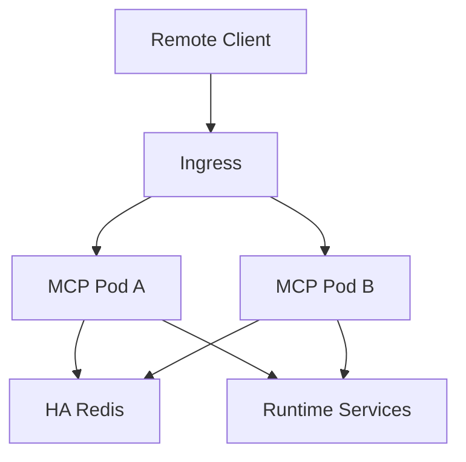

# File: documents/engineering/session_scaling.md
# Session Scaling

**Status**: Authoritative source
**Supersedes**: N/A
**Referenced by**: [../architecture/overview.md](../architecture/overview.md#canonical-follow-on-documents), [../architecture/mcp_protocol_architecture.md](../architecture/mcp_protocol_architecture.md#cross-references), [../architecture/multi_tenant_saas_mcp_auth_architecture.md](../architecture/multi_tenant_saas_mcp_auth_architecture.md#cross-references), [../engineering/security_model.md](../engineering/security_model.md#cross-references), [../../STUDIOMCP_DEVELOPMENT_PLAN.md](../../STUDIOMCP_DEVELOPMENT_PLAN.md#documentation-governance)

> **Purpose**: Canonical engineering rules for horizontally scaling remote MCP listener nodes without sticky sessions.

## Summary

Remote MCP listener nodes must be horizontally scalable and replaceable behind a load balancer without session affinity.

That requires explicit externalization of any session metadata needed by the remote transport.

All remote session metadata required for correctness lives outside individual listener pods. Durable business state remains outside the session store.

## Design Rationale

Session externalization to Redis was selected for the following reasons:

- **Horizontal scaling**: Stateless pods scale independently without coordination
- **Operational simplicity**: No sticky session configuration required at the load balancer
- **Fault tolerance**: Pod restarts do not lose session state
- **Resource efficiency**: Session memory offloaded from application pods to Redis

This design introduces Redis as a critical dependency. Network latency is added to session operations, Redis cluster sizing must account for session count, and session serialization/deserialization adds processing overhead.

## Current Repo Note

The current repository implements the Redis-backed MCP session store described here. Shared session metadata, subscriptions, cursors, and locks are modeled in Haskell and validated across multiple store instances plus alternating live listener nodes using the same `Mcp-Session-Id`. The browser-facing BFF now uses the same Redis deployment pattern to externalize browser sessions, pending uploads, and cached MCP session identifiers across BFF replicas.

## Non-Sticky Requirement

Hard rule:

- no remote listener correctness may depend on sticky sessions

Implications:

- a reconnecting client may land on a different pod
- rolling deploys must not break protocol correctness
- listener HPA decisions must not require custom affinity rules

## Session Data Classes

The external session store may hold:

- negotiated protocol version
- negotiated capabilities
- subject and tenant identifiers
- resumable stream metadata
- active subscription metadata
- reconnect continuity metadata
- session heartbeat timestamps

The external session store must not become the durable source of truth for:

- run summaries
- manifests
- tenant media
- irreversible business decisions

## Store Choice

An HA Redis deployment is the baseline external session-store choice for the remote MCP tier.

Redis is used here for:

- low-latency shared session metadata
- resumable stream cursors
- subscription coordination
- cross-pod reconnect continuity

Redis is not the artifact store and is not the identity source of truth.

## Redis Key Schema

All MCP session keys use a consistent prefix and structure:

### Key Prefixes

| Prefix | Purpose |
|--------|---------|
| `mcp:session:` | Session metadata |
| `mcp:sub:` | Subscription state |
| `mcp:cursor:` | Stream cursor positions |
| `mcp:lock:` | Distributed locks |

### Session Keys

```
mcp:session:{session_id}
```

Value: JSON-serialized SessionData

```json
{
  "sessionId": "sess-abc123",
  "state": "Ready",
  "protocolVersion": "2024-11-05",
  "capabilities": {
    "tools": true,
    "resources": true,
    "prompts": true
  },
  "subject": {
    "id": "user-uuid",
    "roles": ["user"]
  },
  "tenant": {
    "id": "tenant-acme"
  },
  "createdAt": "2024-01-15T10:30:00Z",
  "lastActiveAt": "2024-01-15T11:45:00Z"
}
```

### Subscription Keys

```
mcp:sub:{session_id}:{resource_uri}
```

Value: JSON-serialized subscription state

```json
{
  "resourceUri": "studiomcp://tenants/acme/runs/123/events",
  "subscribedAt": "2024-01-15T11:00:00Z",
  "lastEventId": "evt-456"
}
```

### Cursor Keys

```
mcp:cursor:{session_id}:{stream_name}
```

Value: Cursor position (string or number)

### Lock Keys

```
mcp:lock:session:{session_id}
```

Value: Pod ID holding the lock, with TTL

## TTL Policies

| Key Type | TTL | Rationale |
|----------|-----|-----------|
| Session | 30 minutes | Idle session expiration |
| Subscription | Session TTL | Tied to session lifetime |
| Cursor | Session TTL | Tied to session lifetime |
| Lock | 30 seconds | Short lock duration for failover |

### TTL Refresh

Session TTL is refreshed on every MCP request:

```
1. Receive MCP request
2. Lookup session by Mcp-Session-Id header
3. If found, refresh TTL (EXPIRE command)
4. Process request
5. Update lastActiveAt in session data
```

### TTL Commands

```redis
# Set session with TTL
SET mcp:session:{id} {json} EX 1800

# Refresh session TTL
EXPIRE mcp:session:{id} 1800

# Check TTL remaining
TTL mcp:session:{id}
```

## Session Data Serialization

### Format: JSON

Session data is serialized as JSON for:

- Human readability during debugging
- Compatibility with Redis inspection tools
- Schema evolution flexibility

### Compression

For sessions with large subscription lists or metadata:

- Compress JSON if >1KB
- Use gzip compression
- Store with prefix byte indicating compression

### Haskell Types

```haskell
-- Session store interface
class SessionStore s where
  createSession :: s -> Session -> IO (Either SessionStoreError SessionId)
  lookupSession :: s -> SessionId -> IO (Maybe Session)
  updateSession :: s -> SessionId -> (Session -> Session) -> IO (Either SessionStoreError Session)
  deleteSession :: s -> SessionId -> IO ()
  touchSession :: s -> SessionId -> IO ()  -- Refresh TTL only

-- Redis implementation
data RedisSessionStore = RedisSessionStore
  { redisConnection :: Connection
  , redisKeyPrefix :: Text
  , redisSessionTtl :: Int  -- seconds
  }

instance SessionStore RedisSessionStore where
  createSession store session = do
    let key = redisKeyPrefix store <> "session:" <> unSessionId (sessionId session)
    let value = encode session
    let ttl = redisSessionTtl store
    runRedis (redisConnection store) $ setex key ttl value
    return $ Right (sessionId session)

  lookupSession store sid = do
    let key = redisKeyPrefix store <> "session:" <> unSessionId sid
    result <- runRedis (redisConnection store) $ get key
    case result of
      Right (Just bytes) -> return $ decode bytes
      _ -> return Nothing

  touchSession store sid = do
    let key = redisKeyPrefix store <> "session:" <> unSessionId sid
    let ttl = redisSessionTtl store
    void $ runRedis (redisConnection store) $ expire key ttl
```

## Redis Configuration

### Connection Settings

| Setting | Development | Production |
|---------|-------------|------------|
| Host | `localhost` | `redis-master.studiomcp.svc` |
| Port | 6379 | 6379 |
| Database | 0 | 0 |
| Pool Size | 5 | 50 |
| Timeout | 5s | 5s |

### HA Configuration

Production deployments use Redis Sentinel or Redis Cluster:

```yaml
# Helm values for Redis HA
redis:
  sentinel:
    enabled: true
    masterSet: studiomcp-redis
  replica:
    replicaCount: 3
```

### Environment Variables

```bash
STUDIOMCP_REDIS_HOST=localhost
STUDIOMCP_REDIS_PORT=6379
STUDIOMCP_REDIS_PASSWORD=  # Optional
STUDIOMCP_REDIS_DATABASE=0
STUDIOMCP_REDIS_POOL_SIZE=10
STUDIOMCP_SESSION_TTL=1800  # 30 minutes
```

## Graceful Degradation

### Redis Unavailable

When Redis is unavailable:

1. New sessions cannot be created (reject with 503)
2. Existing in-flight requests may complete if session was cached
3. Health check reports degraded status
4. Reconnecting clients receive reinitialize signal

### Failover Behavior

During Redis failover (Sentinel switching master):

1. Brief connection errors (1-5 seconds typical)
2. Retry with exponential backoff
3. Sessions remain valid (data persisted)
4. No data loss for committed sessions

## Topology



## Pod Responsibilities

Each listener pod must be able to:

- authenticate the request
- reconstruct or resume the session context
- continue subscriptions or stream delivery based on shared metadata
- dispatch tools and resources without special local affinity

## Failure Scenarios

The architecture must explicitly handle:

- pod restart during an active session
- rolling deployment while clients remain connected
- reconnect to a different listener pod
- temporary session-store unavailability

In all cases, correctness takes priority over superficial continuity. If a session cannot be safely resumed, the client must receive a deterministic retry or reinitialize path.

## Testing Expectations

- multi-pod integration coverage
- reconnect-to-different-pod validation
- rolling-deploy validation
- session-store outage behavior
- no-sticky ingress validation

## Cross-References

- [MCP Protocol Architecture](../architecture/mcp_protocol_architecture.md#mcp-protocol-architecture)
- [Multi-Tenant SaaS MCP Auth Architecture](../architecture/multi_tenant_saas_mcp_auth_architecture.md#multi-tenant-saas-mcp-auth-architecture)
- [Security Model](security_model.md#security-model)
