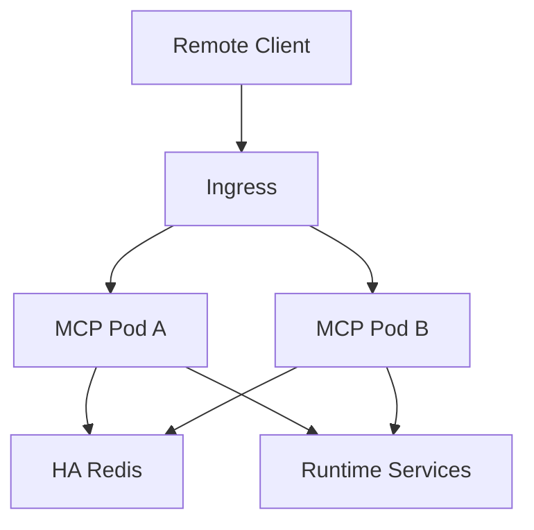

# File: documents/engineering/session_scaling.md
# Session Scaling

**Status**: Authoritative source
**Supersedes**: N/A
**Referenced by**: [../architecture/overview.md](../architecture/overview.md#canonical-follow-on-documents), [../architecture/mcp_protocol_architecture.md](../architecture/mcp_protocol_architecture.md#cross-references), [../architecture/multi_tenant_saas_mcp_auth_architecture.md](../architecture/multi_tenant_saas_mcp_auth_architecture.md#cross-references), [../engineering/security_model.md](../engineering/security_model.md#cross-references), [../../STUDIOMCP_DEVELOPMENT_PLAN.md](../../STUDIOMCP_DEVELOPMENT_PLAN.md#documentation-governance)

> **Purpose**: Canonical engineering rules for horizontally scaling remote MCP listener nodes without sticky sessions.

## Summary

Remote MCP listener nodes must be horizontally scalable and replaceable behind a load balancer without session affinity.

That requires explicit externalization of any session metadata needed by the remote transport.

All remote session metadata required for correctness lives outside individual listener pods. Durable business state remains outside the session store.

## Current Repo Note

The current repository does not yet implement the remote session architecture described here. This document defines the target scaling contract.

## Non-Sticky Requirement

Hard rule:

- no remote listener correctness may depend on sticky sessions

Implications:

- a reconnecting client may land on a different pod
- rolling deploys must not break protocol correctness
- listener HPA decisions must not require custom affinity rules

## Session Data Classes

The external session store may hold:

- negotiated protocol version
- negotiated capabilities
- subject and tenant identifiers
- resumable stream metadata
- active subscription metadata
- reconnect continuity metadata
- session heartbeat timestamps

The external session store must not become the durable source of truth for:

- run summaries
- manifests
- tenant media
- irreversible business decisions

## Store Choice

An HA Redis deployment is the baseline external session-store choice for the remote MCP tier.

Redis is used here for:

- low-latency shared session metadata
- resumable stream cursors
- subscription coordination
- cross-pod reconnect continuity

Redis is not the artifact store and is not the identity source of truth.

## Topology

## Pod Responsibilities

Each listener pod must be able to:

- authenticate the request
- reconstruct or resume the session context
- continue subscriptions or stream delivery based on shared metadata
- dispatch tools and resources without special local affinity

## Failure Scenarios

The architecture must explicitly handle:

- pod restart during an active session
- rolling deployment while clients remain connected
- reconnect to a different listener pod
- temporary session-store unavailability

In all cases, correctness takes priority over superficial continuity. If a session cannot be safely resumed, the client must receive a deterministic retry or reinitialize path.

## Testing Expectations

- multi-pod integration coverage
- reconnect-to-different-pod validation
- rolling-deploy validation
- session-store outage behavior
- no-sticky ingress validation

## Cross-References

- [MCP Protocol Architecture](../architecture/mcp_protocol_architecture.md#mcp-protocol-architecture)
- [Multi-Tenant SaaS MCP Auth Architecture](../architecture/multi_tenant_saas_mcp_auth_architecture.md#multi-tenant-saas-mcp-auth-architecture)
- [Security Model](security_model.md#security-model)
