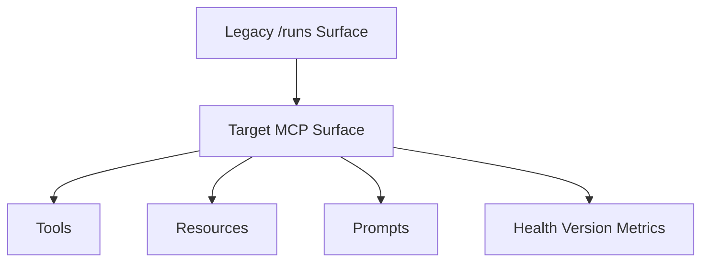

# File: documents/reference/mcp_surface.md
# MCP Surface Reference

**Status**: Authoritative source
**Supersedes**: N/A
**Referenced by**: [../README.md](../README.md#documentation-suite), [../operations/runbook_local_debugging.md](../operations/runbook_local_debugging.md#cross-references), [../reference/cli_surface.md](../reference/cli_surface.md#cross-references), [../architecture/server_mode.md](../architecture/server_mode.md#cross-references), [../../STUDIOMCP_DEVELOPMENT_PLAN.md](../../STUDIOMCP_DEVELOPMENT_PLAN.md#documentation-governance)

> **Purpose**: Canonical reference for the target public MCP-facing surface in `studioMCP`, including target transports, capability scope, operational endpoints, and the current implementation gap.

## Current Repo Status

The current repository does not yet expose a true MCP public surface.

Implemented today:

- a custom DAG-oriented HTTP API on `studiomcp server`
- a direct execution HTTP worker surface
- an advisory inference HTTP surface
- admin and observability endpoints

Current limitation:

- the current `server` endpoint family is not standards-compliant MCP and should be treated as a migration surface only

## Target Public MCP Surface

The target public MCP surface is:

- `stdio` for local development and local tooling
- Streamable HTTP for remote clients and BFF mediation
- a single MCP endpoint for remote protocol traffic
- separate operational endpoints for `/healthz`, `/version`, and `/metrics`

## Capability Scope

Release-priority capability groups:

- workflow tools
- artifact mediation tools
- run and artifact resources
- selected prompts for DAG planning and repair

The exact catalog lives in [mcp_tool_catalog.md](mcp_tool_catalog.md#mcp-tool-catalog).

## Current Versus Target

## Operational Endpoints

Operational endpoints remain out of band from MCP:

- `GET /healthz`
- `GET /version`
- `GET /metrics`

They exist for operational control, not as a substitute automation contract.

## Auth Expectations

- remote MCP access is OAuth-protected
- browser traffic reaches MCP through the BFF rather than ad hoc direct browser automation
- external MCP clients authenticate directly through the MCP auth model
- tenant scoping is enforced on every capability

## Migration Rule

The existing `validate mcp` command must eventually split into:

- validation of the legacy migration surface while it still exists
- validation of the real MCP `stdio` surface
- validation of the real remote HTTP MCP surface

New public feature work should target the MCP surface first.

## Cross-References

- [MCP Protocol Architecture](../architecture/mcp_protocol_architecture.md#mcp-protocol-architecture)
- [Server Mode](../architecture/server_mode.md#server-mode)
- [MCP Tool Catalog](mcp_tool_catalog.md#mcp-tool-catalog)
- [Security Model](../engineering/security_model.md#security-model)
- [Web Portal Surface](web_portal_surface.md#web-portal-surface)
