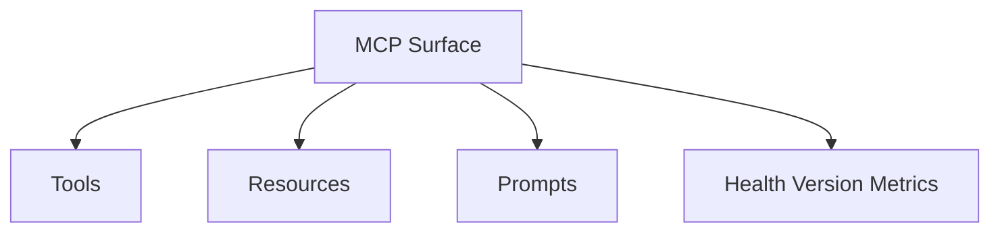

# File: documents/reference/mcp_surface.md
# MCP Surface Reference

**Status**: Authoritative source
**Supersedes**: N/A
**Referenced by**: [../README.md](../README.md#documentation-suite), [../operations/runbook_local_debugging.md](../operations/runbook_local_debugging.md#cross-references), [../reference/cli_surface.md](../reference/cli_surface.md#cross-references), [../architecture/server_mode.md](../architecture/server_mode.md#cross-references), [../../STUDIOMCP_DEVELOPMENT_PLAN.md](../../STUDIOMCP_DEVELOPMENT_PLAN.md#documentation-governance)

> **Purpose**: Canonical reference for the public MCP-facing surface in `studioMCP`, including transports, capability scope, and operational endpoints.

## Current Repo Status

The current repository exposes the completed MCP-first automation surface.

Implemented today:

- MCP JSON-RPC handling with `initialize`, `tools/*`, `resources/*`, and `prompts/*`
- Streamable HTTP on `POST /mcp` plus SSE bootstrap on `GET /mcp`
- admin and observability endpoints on `/healthz`, `/version`, and `/metrics`
- live auth, session, catalog, and conformance validation through `validate mcp-http`, `validate mcp-auth`, `validate observability`, and `validate mcp-conformance`

Current note:

- the legacy `validate mcp` alias has been retired
- the stdio transport is exposed directly through `studiomcp stdio`

## Public MCP Surface

The current public MCP surface is:

- `stdio` for local development and local tooling
- Streamable HTTP for remote clients and the BFF mediation path
- a single MCP endpoint for remote protocol traffic
- separate operational endpoints for `/healthz`, `/version`, and `/metrics`

## Stdio Transport Specification

The stdio transport is used for local development, CLI tooling, and MCP Inspector integration.

### Message Framing

Messages are newline-delimited JSON:

```
<JSON message>\n
<JSON message>\n
...
```

Each message is a complete JSON-RPC 2.0 object on a single line. No length prefix is used.

### Streams

| Stream | Direction | Purpose |
|--------|-----------|---------|
| `stdin` | Client → Server | JSON-RPC requests and notifications |
| `stdout` | Server → Client | JSON-RPC responses and notifications |
| `stderr` | Server → (logs) | Diagnostic logging only (not protocol) |

### Lifecycle

1. Server starts and waits for `initialize` on stdin
2. Server sends `initialize` response on stdout
3. Client sends `notifications/initialized` on stdin
4. Normal request/response flow on stdin/stdout
5. Client closes stdin or sends shutdown to end session

### Example Session

```
→ {"jsonrpc":"2.0","id":1,"method":"initialize","params":{"protocolVersion":"2024-11-05","capabilities":{},"clientInfo":{"name":"claude-code","version":"1.0.0"}}}
← {"jsonrpc":"2.0","id":1,"result":{"protocolVersion":"2024-11-05","capabilities":{"tools":{},"resources":{},"prompts":{}},"serverInfo":{"name":"studioMCP","version":"0.1.0"}}}
→ {"jsonrpc":"2.0","method":"notifications/initialized"}
→ {"jsonrpc":"2.0","id":2,"method":"tools/list"}
← {"jsonrpc":"2.0","id":2,"result":{"tools":[{"name":"workflow.submit","description":"Submit a DAG for execution","inputSchema":{...}}]}}
```

### CLI Invocation

```bash
studiomcp stdio                     # Start stdio MCP server
studiomcp validate mcp-stdio       # Validate stdio transport
```

**Note**: `studiomcp stdio` and `validate mcp-stdio` exercise the same stdio transport implementation.

## Streamable HTTP Transport Specification

The Streamable HTTP transport is used for remote SaaS access and is the current BFF mediation path for workflow and artifact-governance operations.

### Endpoint

```
POST /mcp
```

All MCP protocol traffic uses a single HTTP endpoint. This is not a REST API with multiple routes.

### Request Format

```http
POST /mcp HTTP/1.1
Host: api.example.com
Content-Type: application/json
Authorization: Bearer <token>
Mcp-Session-Id: <session-id>          (optional, for session resumption)

{"jsonrpc":"2.0","id":1,"method":"initialize","params":{...}}
```

### Response Format

For synchronous responses:

```http
HTTP/1.1 200 OK
Content-Type: application/json
Mcp-Session-Id: <session-id>

{"jsonrpc":"2.0","id":1,"result":{...}}
```

For streaming responses (Server-Sent Events):

```http
HTTP/1.1 200 OK
Content-Type: text/event-stream
Mcp-Session-Id: <session-id>

event: message
data: {"jsonrpc":"2.0","id":1,"result":{...}}

event: message
data: {"jsonrpc":"2.0","method":"notifications/progress","params":{...}}
```

### Session Management

| Header | Purpose |
|--------|---------|
| `Mcp-Session-Id` | Session identifier for correlation and resumption |
| `Authorization` | Bearer token for authentication |

Session behavior:
- First request (initialize) creates a new session
- Server returns `Mcp-Session-Id` in response
- Client includes `Mcp-Session-Id` in subsequent requests
- Sessions expire after inactivity timeout (default: 30 minutes)
- Session state flows through the shared Redis-backed session store and is validated across store instances

### HTTP Status Codes

| Status | Meaning |
|--------|---------|
| `200` | Success (check JSON-RPC response for errors) |
| `401` | Authentication required or token invalid |
| `403` | Authorization denied |
| `404` | Endpoint not found |
| `429` | Rate limit exceeded |
| `500` | Server error |

Note: JSON-RPC protocol errors return HTTP 200 with error in the JSON body.

### CLI Validation

```bash
studiomcp validate mcp-http        # Validate HTTP transport
```

**Note**: `validate mcp-http` exercises initialize, `tools/list`, `resources/list`, `prompts/list`, `ping`, parse-error handling, unknown-method handling, and the SSE bootstrap event.

## Capability Negotiation

### Initialize Request

```json
{
  "jsonrpc": "2.0",
  "id": 1,
  "method": "initialize",
  "params": {
    "protocolVersion": "2024-11-05",
    "capabilities": {
      "roots": { "listChanged": true },
      "sampling": {}
    },
    "clientInfo": {
      "name": "my-client",
      "version": "1.0.0"
    }
  }
}
```

### Initialize Response

```json
{
  "jsonrpc": "2.0",
  "id": 1,
  "result": {
    "protocolVersion": "2024-11-05",
    "capabilities": {
      "tools": { "listChanged": true },
      "resources": { "subscribe": true, "listChanged": true },
      "prompts": { "listChanged": true },
      "logging": {}
    },
    "serverInfo": {
      "name": "studioMCP",
      "version": "0.1.0"
    }
  }
}
```

### Server Capabilities

| Capability | Description | Supported |
|------------|-------------|-----------|
| `tools` | Tool invocation | Yes |
| `tools.listChanged` | Notify when tool list changes | Yes |
| `resources` | Resource access | Yes |
| `resources.subscribe` | Resource change subscriptions | Yes |
| `resources.listChanged` | Notify when resource list changes | Yes |
| `prompts` | Prompt templates | Yes |
| `prompts.listChanged` | Notify when prompt list changes | Yes |
| `logging` | Server-to-client logging | Yes |

### Protocol Version

The target protocol version is `2024-11-05` (MCP specification version).

Version negotiation:
- Client sends requested version in `initialize`
- Server responds with actual version it will use
- If versions incompatible, server returns error `-32003`

## Capability Scope

Release-priority capability groups:

- workflow tools
- artifact mediation tools
- run and artifact resources
- selected prompts for DAG planning and repair

The exact catalog lives in [mcp_tool_catalog.md](mcp_tool_catalog.md#mcp-tool-catalog).

## Public Surface



## Operational Endpoints

Operational endpoints remain out of band from MCP:

- `GET /healthz`
- `GET /version`
- `GET /metrics`

They exist for operational control, not as a substitute automation contract.

## Auth Expectations

- remote MCP access is OAuth-protected
- browser traffic reaches MCP through the BFF rather than ad hoc direct browser automation
- external MCP clients authenticate directly through the MCP auth model
- tenant scoping is enforced on every capability

## Validation Rule

Use the explicit MCP validators:

- `validate mcp-stdio`
- `validate mcp-http`
- `validate mcp-conformance`

New public feature work must continue to target the MCP surface first.

## Cross-References

- [MCP Protocol Architecture](../architecture/mcp_protocol_architecture.md#mcp-protocol-architecture)
- [Server Mode](../architecture/server_mode.md#server-mode)
- [MCP Tool Catalog](mcp_tool_catalog.md#mcp-tool-catalog)
- [Security Model](../engineering/security_model.md#security-model)
- [Web Portal Surface](web_portal_surface.md#web-portal-surface)
