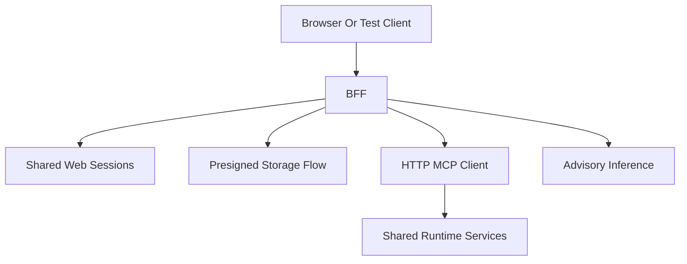

# File: documents/reference/web_portal_surface.md
# Web Portal Surface

**Status**: Authoritative source
**Supersedes**: N/A
**Referenced by**: [../architecture/overview.md](../architecture/overview.md#canonical-follow-on-documents), [../architecture/multi_tenant_saas_mcp_auth_architecture.md](../architecture/multi_tenant_saas_mcp_auth_architecture.md#cross-references), [../engineering/security_model.md](../engineering/security_model.md#cross-references), [../../STUDIOMCP_DEVELOPMENT_PLAN.md](../../STUDIOMCP_DEVELOPMENT_PLAN.md#documentation-governance)

> **Purpose**: Canonical reference for the current browser-facing BFF surface in `studioMCP`, including the implemented HTTP routes, session contract, and MCP mediation model.

## Summary

The current browser-facing surface in this repository is the Haskell BFF HTTP service. It serves a same-origin browser control room and provides login, logout, profile, upload, download, chat, workflow, SSE progress, and artifact-governance routes on top of tenant-scoped storage and the MCP server.

## Current Repo Note

Implemented today:

- browser login route
- browser logout route
- browser profile route
- browser shell routes at `/` and `/app`
- upload intent request
- upload confirmation
- download intent request
- advisory chat
- advisory chat SSE route
- workflow submission
- workflow list
- workflow status lookup
- workflow run SSE route
- workflow cancel
- artifact hide
- artifact archive
- cookie-backed browser session auth
- Redis-backed shared browser-session state across BFF replicas
- live BFF-to-MCP mediation for workflow and governance operations

Still intentionally bounded:

- advanced editing or timeline UI
- collaborative multi-user browser editing
- token-level advisory-model streaming

## Current BFF Responsibilities

- maintain web-session state
- maintain shared browser-session state in Redis for multi-instance deployment
- serve the built-in browser control-room UI
- authorize upload and download intents
- shape browser-facing JSON payloads
- enforce tenant scoping at the BFF boundary
- open and reuse MCP sessions on behalf of the browser session
- submit, list, inspect, and cancel workflows through `/mcp`
- expose chat and run updates through SSE-friendly browser routes
- forward artifact-governance actions through `/mcp`

Upload and download intent generation remain direct tenant-storage operations inside the BFF because the browser-facing contract is presigned-storage oriented.

## Current Flow



## Implemented Routes

| Method | Path | Behavior |
|--------|------|----------|
| `GET` | `/` | Serve built-in browser shell |
| `GET` | `/app` | Serve built-in browser shell |
| `GET` | `/healthz` | BFF health check |
| `GET` | `/health/live` | Liveness check |
| `GET` | `/health/ready` | Readiness check |
| `POST` | `/api/v1/auth/login` | Create browser session and set cookie |
| `POST` | `/api/v1/auth/logout` | Invalidate browser session and clear cookie |
| `GET` | `/api/v1/profile` | Return active browser session profile |
| `POST` | `/api/v1/upload/request` | Create artifact and return upload URL |
| `POST` | `/api/v1/upload/confirm/{artifactId}` | Confirm a pending upload |
| `POST` | `/api/v1/download` | Return a presigned download URL |
| `POST` | `/api/v1/chat` | Return one advisory chat response |
| `POST` | `/api/v1/chat/stream` | Return advisory chat over `text/event-stream` |
| `POST` | `/api/v1/runs` | Submit a workflow run |
| `GET` | `/api/v1/runs` | List visible workflow runs |
| `GET` | `/api/v1/runs/{runId}/events` | Return run-status updates over `text/event-stream` |
| `GET` | `/api/v1/runs/{runId}/status` | Fetch run status |
| `POST` | `/api/v1/runs/{runId}/cancel` | Cancel a workflow run |
| `POST` | `/api/v1/artifacts/{artifactId}/hide` | Hide an artifact through MCP governance |
| `POST` | `/api/v1/artifacts/{artifactId}/archive` | Archive an artifact through MCP governance |

## Authentication

The primary browser contract is a cookie-backed session:

```http
Set-Cookie: studiomcp_session={web_session_id}; Path=/; HttpOnly; SameSite=Lax
```

Protected requests then carry:

```http
Cookie: studiomcp_session={web_session_id}
```

Compatibility note:

- the handler layer still accepts `Authorization: Bearer {web_session_id}` as a fallback for non-browser clients
- the BFF session id is distinct from the MCP session id
- when MCP auth is enabled, login validates the presented access token before minting the browser session
- when MCP auth is disabled for local development, the BFF aligns browser sessions with the server’s dev-bypass subject and tenant
- validated local flows now alternate requests across two BFF instances sharing Redis-backed browser state

## Browser Shell

`GET /` and `GET /app` serve the built-in browser control-room UI. The shipped UI is same-origin with the BFF routes and uses the same cookie-backed browser session as the JSON and SSE surfaces.

## Upload Contract

### Request

```http
POST /api/v1/upload/request
Cookie: studiomcp_session={web_session_id}
Content-Type: application/json

{
  "artifactId": null,
  "fileName": "raw-footage.mp4",
  "contentType": "video/mp4",
  "fileSize": 1073741824,
  "metadata": [["source", "camera-a"]]
}
```

### Response

```json
{
  "artifactId": "artifact-xyz789",
  "presignedUrl": {
    "url": "http://localhost:9000/...",
    "method": "PUT",
    "headers": [
      ["Content-Type", "video/mp4"]
    ],
    "expiresAt": "2024-01-15T12:00:00Z",
    "artifactId": "artifact-xyz789"
  }
}
```

`artifactId` is optional on the upload request. When omitted, the BFF creates a new artifact. When provided, the BFF creates a new immutable version for that existing artifact and returns a fresh presigned upload URL for the new version.

### Confirm Upload

```http
POST /api/v1/upload/confirm/{artifactId}
Cookie: studiomcp_session={web_session_id}
```

## Download Contract

### Request

```http
POST /api/v1/download
Cookie: studiomcp_session={web_session_id}
Content-Type: application/json

{
  "artifactId": "artifact-xyz789",
  "version": null
}
```

### Response

```json
{
  "artifactId": "artifact-xyz789",
  "fileName": "output-render.mp4",
  "presignedUrl": {
    "url": "http://localhost:9000/...",
    "expiresAt": "2024-01-15T12:00:00Z",
    "contentType": "video/mp4",
    "fileSize": 536870912
  }
}
```

## Chat Contract

### Request

```http
POST /api/v1/chat
Cookie: studiomcp_session={web_session_id}
Content-Type: application/json

{
  "messages": [
    {
      "role": "user",
      "content": "Help me submit this workflow",
      "timestamp": null
    }
  ],
  "context": "optional context"
}
```

### Response

```json
{
  "message": {
    "role": "assistant",
    "content": "ADVISORY: ...",
    "timestamp": "2024-01-15T11:30:00Z"
  },
  "conversationId": "conv-abc123"
}
```

### Stream

```http
POST /api/v1/chat/stream
Cookie: studiomcp_session={web_session_id}
Content-Type: application/json
Accept: text/event-stream
```

The SSE route emits:

- `conversation.started`
- `message.delta`
- `message.completed`
- `done`

The current implementation chunks the completed advisory response into assistant-message deltas for browser consumption.

## Run Contract

### Submit Run

```http
POST /api/v1/runs
Cookie: studiomcp_session={web_session_id}
Content-Type: application/json

{
  "dagSpec": {
    "name": "example",
    "nodes": []
  },
  "inputArtifacts": [["input", "artifact-xyz789"]]
}
```

### Get Run Status

```http
GET /api/v1/runs/{runId}/status
Cookie: studiomcp_session={web_session_id}
```

### Stream Run Events

```http
GET /api/v1/runs/{runId}/events
Cookie: studiomcp_session={web_session_id}
Accept: text/event-stream
```

The SSE route emits short-lived reconnectable status windows with:

- `run.snapshot`
- `run.status`
- `run.completed`
- `run.window.closed`

Additional implemented routes:

- `GET /api/v1/runs?status={status}&limit={n}`
- `POST /api/v1/runs/{runId}/cancel`
- `POST /api/v1/artifacts/{artifactId}/hide`
- `POST /api/v1/artifacts/{artifactId}/archive`

Workflow and artifact-governance routes are mediated through a real MCP HTTP client path. The BFF opens `/mcp` sessions, caches the returned `Mcp-Session-Id` inside the browser session record, and reuses that MCP session across subsequent tool calls.

## Error Shape

Errors are serialized from the typed `BFFError` values. The response body is the JSON encoding of that error type, not a wrapped `{ "error": ... }` envelope.

Representative statuses:

| HTTP Status | Condition |
|-------------|-----------|
| `400` | Invalid request payload |
| `401` | Missing, unknown, or expired web session |
| `403` | Forbidden request |
| `404` | Artifact not found |
| `500` | Internal BFF failure |
| `502` | Runtime or inference dependency failure |

## Known Bounds

The implemented BFF surface is intentionally bounded:

- chat SSE is assistant-message chunking over a completed advisory response rather than token-level model streaming
- run progress SSE is exposed through reconnectable status-polling windows rather than a per-node runtime event bus
- the shipped browser UI is a control-room/workbench surface, not an advanced editor or collaborative timeline

## Cross-References

- [BFF Architecture](../architecture/bff_architecture.md#bff-architecture)
- [Multi-Tenant SaaS MCP Auth Architecture](../architecture/multi_tenant_saas_mcp_auth_architecture.md#multi-tenant-saas-mcp-auth-architecture)
- [MCP Surface Reference](mcp_surface.md#mcp-surface-reference)
- [MCP Tool Catalog](mcp_tool_catalog.md#mcp-tool-catalog)
