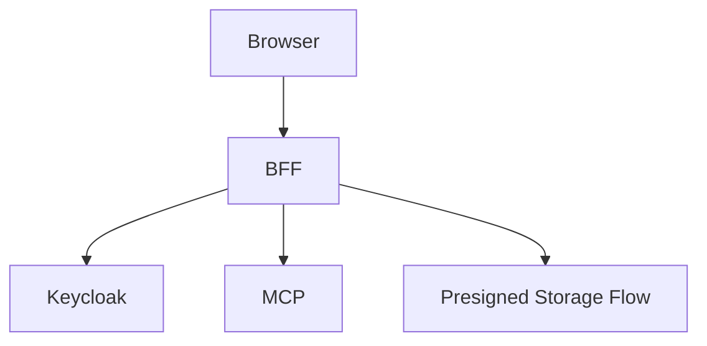

# File: documents/reference/web_portal_surface.md
# Web Portal Surface

**Status**: Authoritative source
**Supersedes**: N/A
**Referenced by**: [../architecture/overview.md](../architecture/overview.md#canonical-follow-on-documents), [../architecture/multi_tenant_saas_mcp_auth_architecture.md](../architecture/multi_tenant_saas_mcp_auth_architecture.md#cross-references), [../engineering/security_model.md](../engineering/security_model.md#cross-references), [../../STUDIOMCP_DEVELOPMENT_PLAN.md](../../STUDIOMCP_DEVELOPMENT_PLAN.md#documentation-governance)

> **Purpose**: Canonical reference for the target browser-facing product surface and the BFF contract that mediates upload, download, render, and chat workflows.

## Summary

The web portal is the human-facing product surface for `studioMCP`.

It provides:

- raw footage upload
- artifact download
- render and run inspection
- chat and workflow assistance

The BFF is the browser-facing mediator that translates these product workflows into authenticated MCP interactions and storage actions.

## Current Repo Note

The current repository now implements the BFF service and WAI handlers for upload, download, run submission, run status, and chat. Browser UX, Keycloak login UX, and live BFF-to-MCP orchestration remain follow-on work.

## Top-Level Browser Workflows

- sign in through Keycloak
- upload source media
- browse tenant artifacts and runs
- request renders or workflow execution
- follow run progress
- chat with the system about workflows, failures, and outputs
- download rendered artifacts

## BFF Responsibilities

- maintain browser session state
- authorize upload and download intents
- call MCP on behalf of the authenticated user
- shape browser-friendly payloads
- avoid leaking raw infrastructure topology or storage credentials to the browser

## Target Browser Flows



## Upload Contract

- browser requests upload intent from BFF
- BFF validates tenant and subject rights
- BFF issues short-lived upload authorization
- browser uploads media directly to storage where possible
- BFF or MCP records metadata after upload completion

### Upload API

**Request upload URL:**

```http
POST /api/v1/upload/request
Authorization: Bearer {session_token}
Content-Type: application/json

{
  "fileName": "raw-footage.mp4",
  "contentType": "video/mp4",
  "fileSize": 1073741824
}
```

**Response:**

```json
{
  "artifactId": "artifact-xyz789",
  "presignedUrl": {
    "url": "http://localhost:9000/studiomcp-tenant-acme/artifact-xyz789?operation=upload&version=1&signature=abc123",
    "method": "PUT",
    "headers": [
      ["Content-Type", "video/mp4"]
    ],
    "expiresAt": "2024-01-15T12:00:00Z",
    "artifactId": "artifact-xyz789"
  }
}
```

**Confirm upload:**

```http
POST /api/v1/upload/confirm/{artifactId}
Authorization: Bearer {session_token}
```

### Presigned URL Expiration

| Operation | Default TTL | Max TTL |
|-----------|-------------|---------|
| Upload | 15 minutes | 60 minutes |
| Download | 15 minutes | 60 minutes |
| Multipart upload part | 60 minutes | 4 hours |

## Download Contract

- browser requests download intent from BFF
- BFF validates tenant and subject rights
- BFF issues short-lived download authorization
- browser downloads directly from storage where possible

### Download API

**Request download URL:**

```http
POST /api/v1/download
Authorization: Bearer {session_token}
Content-Type: application/json

{
  "artifactId": "artifact-xyz789",
  "version": "1"
}
```

**Response:**

```json
{
  "artifactId": "artifact-xyz789",
  "fileName": "output-render.mp4",
  "presignedUrl": {
    "url": "http://localhost:9000/studiomcp-tenant-acme/artifact-xyz789?operation=download&version=1&signature=def456",
    "expiresAt": "2024-01-15T12:00:00Z",
    "contentType": "video/mp4",
    "fileSize": 536870912
  }
}
```

## Chat Contract

- browser sends chat messages to the BFF
- BFF uses MCP tools, resources, or prompts to fulfill the request
- chat may be advisory or operational depending on authorized capability
- chat may not bypass the typed DAG and artifact governance rules

### Chat API

**Send message:**

```http
POST /api/v1/chat
Authorization: Bearer {session_token}
Content-Type: application/json

{
  "messages": [
    {
      "role": "user",
      "content": "Transcode my raw footage to 1080p"
    }
  ],
  "context": "artifact-abc123"
}
```

**Response:**

```json
{
  "message": {
    "role": "assistant",
    "content": "Tenant tenant-acme: I can help you prepare uploads, submit DAG runs, inspect workflow state, and fetch artifacts."
  },
  "conversationId": "conv-abc123"
}
```

## Render And Run Contract

- browser initiates workflow execution through the BFF
- BFF calls the MCP workflow tools on behalf of the user
- BFF displays progress and summaries using MCP responses and resources

### Workflow API

**List runs:**

```http
GET /api/v1/runs
Authorization: Bearer {session_token}
```

**Response:**

```json
{
  "runs": [
    {
      "runId": "run-xyz789",
      "status": "Running",
      "submittedAt": "2024-01-15T10:00:00Z",
      "progress": 45
    }
  ],
  "pagination": {
    "total": 25,
    "page": 1,
    "pageSize": 20
  }
}
```

**Get run details:**

```http
GET /api/v1/runs/{runId}
Authorization: Bearer {session_token}
```

**Submit workflow:**

```http
POST /api/v1/runs
Authorization: Bearer {session_token}
Content-Type: application/json

{
  "dag": {
    "nodes": [
      {
        "id": "transcode",
        "kind": "ffmpeg.transcode",
        "inputs": { "source": "artifact:abc123" },
        "params": { "resolution": "1920x1080" }
      }
    ]
  }
}
```

**Cancel run:**

```http
POST /api/v1/runs/{runId}/cancel
Authorization: Bearer {session_token}
```

## BFF API Summary

### Endpoints

| Method | Path | Description |
|--------|------|-------------|
| `POST` | `/api/v1/uploads` | Request upload presigned URL |
| `POST` | `/api/v1/uploads/{id}/complete` | Confirm upload completion |
| `POST` | `/api/v1/artifacts/{id}/download` | Request download presigned URL |
| `GET` | `/api/v1/artifacts` | List tenant artifacts |
| `GET` | `/api/v1/artifacts/{id}` | Get artifact details |
| `POST` | `/api/v1/artifacts/{id}/hide` | Hide artifact |
| `POST` | `/api/v1/artifacts/{id}/archive` | Archive artifact |
| `GET` | `/api/v1/runs` | List runs |
| `GET` | `/api/v1/runs/{id}` | Get run details |
| `POST` | `/api/v1/runs` | Submit workflow |
| `POST` | `/api/v1/runs/{id}/cancel` | Cancel run |
| `POST` | `/api/v1/chat` | Send chat message (SSE response) |
| `GET` | `/api/v1/me` | Get current user info |

### Authentication

All BFF endpoints require a valid session cookie or Bearer token:

```http
Authorization: Bearer {access_token}
```

Or:

```http
Cookie: session={session_id}
```

### Error Responses

```json
{
  "error": {
    "code": "ARTIFACT_NOT_FOUND",
    "message": "Artifact not found or not accessible",
    "details": {}
  }
}
```

| HTTP Status | Error Code | Description |
|-------------|------------|-------------|
| 400 | `INVALID_REQUEST` | Malformed request |
| 401 | `UNAUTHORIZED` | Authentication required |
| 403 | `FORBIDDEN` | Insufficient permissions |
| 404 | `NOT_FOUND` | Resource not found |
| 409 | `CONFLICT` | Operation conflict |
| 429 | `RATE_LIMITED` | Too many requests |
| 500 | `INTERNAL_ERROR` | Server error |

## Security Rules

- the browser does not receive tenant-scoped long-lived infrastructure secrets
- the BFF does not invent independent authorization semantics
- BFF-mediated actions remain tenant-scoped and auditable

## Cross-References

- [Multi-Tenant SaaS MCP Auth Architecture](../architecture/multi_tenant_saas_mcp_auth_architecture.md#multi-tenant-saas-mcp-auth-architecture)
- [Artifact Storage Architecture](../architecture/artifact_storage_architecture.md#artifact-storage-architecture)
- [MCP Surface Reference](mcp_surface.md#mcp-surface-reference)
- [MCP Tool Catalog](mcp_tool_catalog.md#mcp-tool-catalog)
