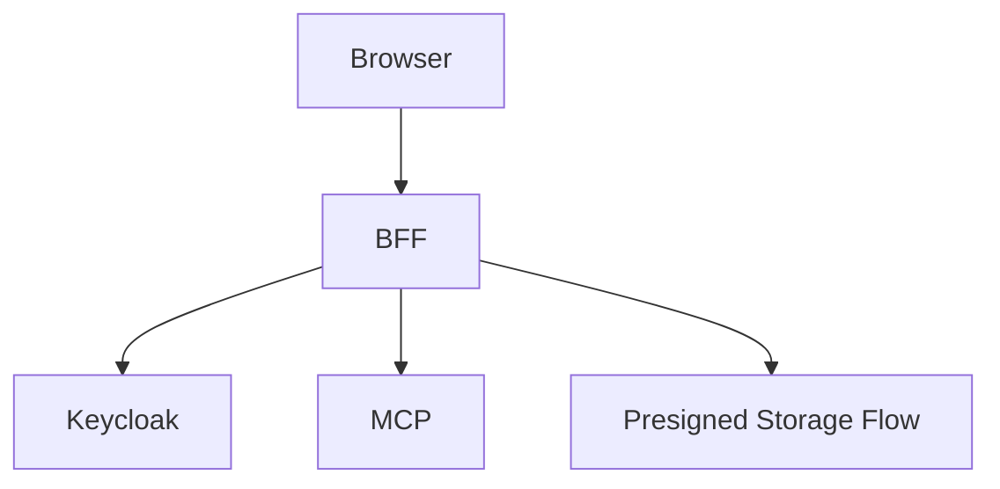

# File: documents/reference/web_portal_surface.md
# Web Portal Surface

**Status**: Authoritative source
**Supersedes**: N/A
**Referenced by**: [../architecture/overview.md](../architecture/overview.md#canonical-follow-on-documents), [../architecture/multi_tenant_saas_mcp_auth_architecture.md](../architecture/multi_tenant_saas_mcp_auth_architecture.md#cross-references), [../engineering/security_model.md](../engineering/security_model.md#cross-references), [../../STUDIOMCP_DEVELOPMENT_PLAN.md](../../STUDIOMCP_DEVELOPMENT_PLAN.md#documentation-governance)

> **Purpose**: Canonical reference for the target browser-facing product surface and the BFF contract that mediates upload, download, render, and chat workflows.

## Summary

The web portal is the human-facing product surface for `studioMCP`.

It provides:

- raw footage upload
- artifact download
- render and run inspection
- chat and workflow assistance

The BFF is the browser-facing mediator that translates these product workflows into authenticated MCP interactions and storage actions.

## Current Repo Note

The current repository does not yet implement the browser and BFF surface described here. This document defines the target product contract.

## Top-Level Browser Workflows

- sign in through Keycloak
- upload source media
- browse tenant artifacts and runs
- request renders or workflow execution
- follow run progress
- chat with the system about workflows, failures, and outputs
- download rendered artifacts

## BFF Responsibilities

- maintain browser session state
- authorize upload and download intents
- call MCP on behalf of the authenticated user
- shape browser-friendly payloads
- avoid leaking raw infrastructure topology or storage credentials to the browser

## Target Browser Flows

## Upload Contract

- browser requests upload intent from BFF
- BFF validates tenant and subject rights
- BFF issues short-lived upload authorization
- browser uploads media directly to storage where possible
- BFF or MCP records metadata after upload completion

## Download Contract

- browser requests download intent from BFF
- BFF validates tenant and subject rights
- BFF issues short-lived download authorization
- browser downloads directly from storage where possible

## Chat Contract

- browser sends chat messages to the BFF
- BFF uses MCP tools, resources, or prompts to fulfill the request
- chat may be advisory or operational depending on authorized capability
- chat may not bypass the typed DAG and artifact governance rules

## Render And Run Contract

- browser initiates workflow execution through the BFF
- BFF calls the MCP workflow tools on behalf of the user
- BFF displays progress and summaries using MCP responses and resources

## Security Rules

- the browser does not receive tenant-scoped long-lived infrastructure secrets
- the BFF does not invent independent authorization semantics
- BFF-mediated actions remain tenant-scoped and auditable

## Cross-References

- [Multi-Tenant SaaS MCP Auth Architecture](../architecture/multi_tenant_saas_mcp_auth_architecture.md#multi-tenant-saas-mcp-auth-architecture)
- [Artifact Storage Architecture](../architecture/artifact_storage_architecture.md#artifact-storage-architecture)
- [MCP Surface Reference](mcp_surface.md#mcp-surface-reference)
- [MCP Tool Catalog](mcp_tool_catalog.md#mcp-tool-catalog)
