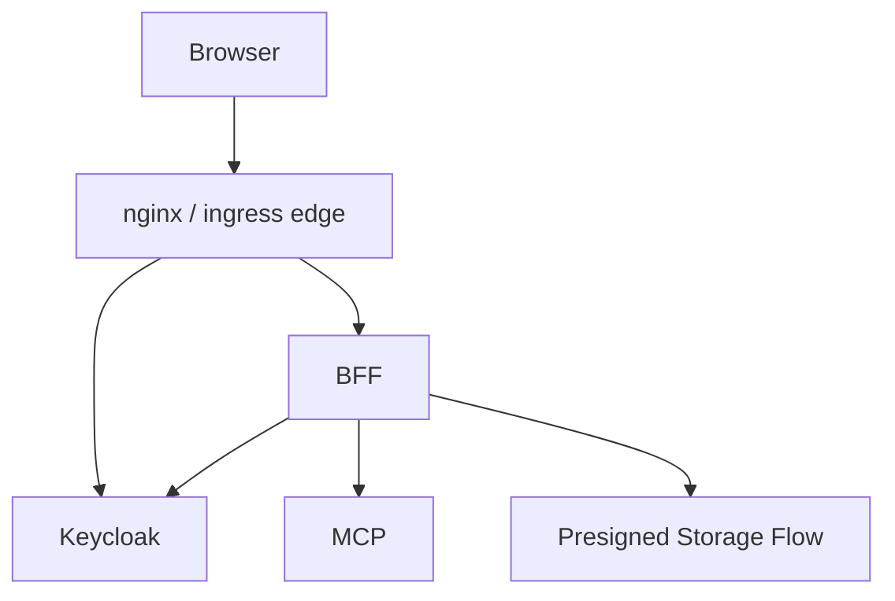

# File: documents/reference/web_portal_surface.md
# Web Portal Surface

**Status**: Authoritative source
**Supersedes**: N/A
**Referenced by**: [../architecture/overview.md](../architecture/overview.md#canonical-follow-on-documents), [../architecture/multi_tenant_saas_mcp_auth_architecture.md](../architecture/multi_tenant_saas_mcp_auth_architecture.md#cross-references), [../engineering/security_model.md](../engineering/security_model.md#cross-references), [../../DEVELOPMENT_PLAN/README.md](../../DEVELOPMENT_PLAN/README.md#standards)

> **Purpose**: Canonical reference for the target browser-facing product surface and the BFF contract that mediates upload, download, render, and chat workflows.

## Summary

The web portal is the human-facing product surface for `studioMCP`.

It provides:

- raw footage upload
- artifact download
- render and run inspection
- chat and workflow assistance

The BFF is the browser-facing mediator that translates these product workflows into authenticated MCP interactions and storage actions.

## Current Repo Note

The current repository implements the browser-facing BFF contract for username/password login, logout, refresh, session bootstrap, upload, download, chat, run submission, run status, and run-events SSE.

The active browser contract is now cookie-first:

- `POST /api/v1/session/login` returns an HTTP-only session cookie plus summary-only JSON
- `GET /api/v1/session/me` returns the authenticated subject, tenant, and session timing metadata
- `POST /api/v1/session/refresh` rotates server-side tokens and returns summary-only JSON
- login and refresh responses do not expose `sessionId`, access tokens, or refresh tokens
- Bearer session identifiers remain a compatibility/debug path, but the browser-default contract is the cookie

## Control-Plane And Data-Plane Contract

The published control plane is always the shared edge:

- `/api` routes to the BFF
- `/mcp` routes to the MCP server
- `/kc` routes to Keycloak

Artifact bytes are a separate data plane:

- the BFF authorizes upload and download requests
- the browser transfers bulk bytes directly against presigned object-storage URLs
- those presigned URLs must be rooted at the environment's explicit public object-storage endpoint

Current local baselines:

- kind control-plane edge: `http://localhost:8081`
- kind object-storage public endpoint: `http://localhost:9000`

Chart-driven environments define the same contract through `global.publicBaseUrl` and `global.objectStorage.publicEndpoint`.

## Top-Level Browser Workflows

- sign in with login/password through the BFF
- upload source media
- browse tenant artifacts and runs
- request renders or workflow execution
- follow run progress
- chat with the system about workflows, failures, and outputs
- download rendered artifacts

## BFF Responsibilities

- accept login/password over TLS and exchange it with Keycloak
- maintain browser session state
- authorize upload and download intents
- call MCP on behalf of the authenticated user
- shape browser-friendly payloads
- avoid leaking raw infrastructure topology or storage credentials to the browser

## Target Browser Flows



## Authentication Contract

The target browser auth surface is session-oriented and lives under `/api`, not under Keycloak callback routes.

**Login:**

```http
POST /api/v1/session/login
Content-Type: application/json

{
  "username": "editor@example.com",
  "password": "secret"
}
```

The BFF exchanges the credentials with Keycloak, creates a server-side session, sets an HTTP-only `studiomcp_session` cookie, and returns summary-only JSON:

```json
{
  "session": {
    "subjectId": "user-uuid-1234",
    "tenantId": "tenant-acme",
    "expiresAt": "2024-01-15T12:00:00Z",
    "createdAt": "2024-01-15T11:00:00Z",
    "lastActiveAt": "2024-01-15T11:45:00Z"
  }
}
```

The JSON surface intentionally omits `sessionId`, access tokens, and refresh tokens. Bearer-style session identifiers remain available only as a secondary compatibility/debug interface for non-browser callers that need them.

**Session bootstrap:**

```http
GET /api/v1/session/me
Cookie: studiomcp_session={session_id}
```

**Response:**

```json
{
  "session": {
    "subjectId": "user-uuid-1234",
    "tenantId": "tenant-acme",
    "expiresAt": "2024-01-15T12:00:00Z",
    "createdAt": "2024-01-15T11:00:00Z",
    "lastActiveAt": "2024-01-15T11:45:00Z"
  }
}
```

**Logout:**

```http
POST /api/v1/session/logout
```

**Refresh:**

```http
POST /api/v1/session/refresh
Cookie: studiomcp_session={session_id}
```

**Response:**

```json
{
  "success": true,
  "session": {
    "subjectId": "user-uuid-1234",
    "tenantId": "tenant-acme",
    "expiresAt": "2024-01-15T12:30:00Z",
    "createdAt": "2024-01-15T11:00:00Z",
    "lastActiveAt": "2024-01-15T12:00:00Z"
  }
}
```

Current repo note:

- the active browser auth contract is `POST /api/v1/session/login`, `GET /api/v1/session/me`, `POST /api/v1/session/logout`, and `POST /api/v1/session/refresh`
- cookie authentication wins when both the session cookie and a Bearer session identifier are present
- repository OAuth/PKCE modules remain deferred implementation inventory and are not part of the active browser route surface

## Upload Contract

- browser requests upload intent from BFF
- BFF validates tenant and subject rights
- BFF issues short-lived upload authorization
- browser uploads media directly to storage where possible
- BFF or MCP records metadata after upload completion

### Upload API

**Request upload URL:**

```http
POST /api/v1/upload/request
Cookie: studiomcp_session={session_id}
Content-Type: application/json

{
  "fileName": "raw-footage.mp4",
  "contentType": "video/mp4",
  "fileSize": 1073741824
}
```

**Response:**

```json
{
  "artifactId": "artifact-xyz789",
  "presignedUrl": {
    "url": "http://localhost:9000/studiomcp-tenant-acme/artifact-xyz789?operation=upload&version=1&signature=abc123",
    "method": "PUT",
    "headers": [
      ["Content-Type", "video/mp4"]
    ],
    "expiresAt": "2024-01-15T12:00:00Z",
    "artifactId": "artifact-xyz789"
  }
}
```

**Confirm upload:**

```http
POST /api/v1/upload/confirm/{artifactId}
Cookie: studiomcp_session={session_id}
```

The returned upload URL must be rooted at the explicit public object-storage endpoint for the current environment. In local kind, that endpoint is `http://localhost:9000`.

### Presigned URL Expiration

| Operation | Default TTL | Max TTL |
|-----------|-------------|---------|
| Upload | 15 minutes | 60 minutes |
| Download | 15 minutes | 60 minutes |
| Multipart upload part | 60 minutes | 4 hours |

## Download Contract

- browser requests download intent from BFF
- BFF validates tenant and subject rights
- BFF issues short-lived download authorization
- browser downloads directly from storage where possible

### Download API

**Request download URL:**

```http
POST /api/v1/download
Cookie: studiomcp_session={session_id}
Content-Type: application/json

{
  "artifactId": "artifact-xyz789",
  "version": "1"
}
```

The returned download URL must be rooted at the explicit public object-storage endpoint for the current environment. In local kind, that endpoint is `http://localhost:9000`.

**Response:**

```json
{
  "artifactId": "artifact-xyz789",
  "fileName": "output-render.mp4",
  "presignedUrl": {
    "url": "http://localhost:9000/studiomcp-tenant-acme/artifact-xyz789?operation=download&version=1&signature=def456",
    "expiresAt": "2024-01-15T12:00:00Z",
    "contentType": "video/mp4",
    "fileSize": 536870912
  }
}
```

## Chat Contract

- browser sends chat messages to the BFF
- BFF uses MCP tools, resources, or prompts to fulfill the request
- chat may be advisory or operational depending on authorized capability
- chat may not bypass the typed DAG and artifact governance rules

### Chat API

**Send message:**

```http
POST /api/v1/chat
Cookie: studiomcp_session={session_id}
Content-Type: application/json

{
  "messages": [
    {
      "role": "user",
      "content": "Transcode my raw footage to 1080p"
    }
  ],
  "context": "artifact-abc123"
}
```

**Response:**

```json
{
  "message": {
    "role": "assistant",
    "content": "Tenant tenant-acme: I can help you prepare uploads, submit DAG runs, inspect workflow state, and fetch artifacts."
  },
  "conversationId": "conv-abc123"
}
```

## Render And Run Contract

- browser initiates workflow execution through the BFF
- BFF calls the MCP workflow tools on behalf of the user
- BFF displays progress and summaries using MCP responses and resources

### Workflow API

**Get run status:**

```http
GET /api/v1/runs/{runId}/status
Cookie: studiomcp_session={session_id}
```

**Submit workflow:**

```http
POST /api/v1/runs
Cookie: studiomcp_session={session_id}
Content-Type: application/json

{
  "dag": {
    "nodes": [
      {
        "id": "transcode",
        "kind": "ffmpeg.transcode",
        "inputs": { "source": "artifact:abc123" },
        "params": { "resolution": "1920x1080" }
      }
    ]
  }
}
```

**Stream run progress:**

```http
GET /api/v1/runs/{runId}/events
Cookie: studiomcp_session={session_id}
```

## BFF API Summary

### Endpoints

| Method | Path | Description |
|--------|------|-------------|
| `POST` | `/api/v1/session/login` | Login with username/password |
| `GET` | `/api/v1/session/me` | Return browser-safe session summary |
| `POST` | `/api/v1/session/logout` | End browser session |
| `POST` | `/api/v1/session/refresh` | Refresh browser session |
| `POST` | `/api/v1/upload/request` | Request upload presigned URL |
| `POST` | `/api/v1/upload/confirm/{artifactId}` | Confirm upload completion |
| `POST` | `/api/v1/download` | Request download presigned URL |
| `POST` | `/api/v1/runs` | Submit workflow |
| `GET` | `/api/v1/runs/{id}/status` | Get run status |
| `GET` | `/api/v1/runs/{id}/events` | Stream run progress with SSE |
| `POST` | `/api/v1/chat` | Send chat message |

### Authentication

All authenticated BFF endpoints accept these browser-session credentials after login:

Primary browser credential:

```http
Cookie: studiomcp_session={session_id}
```

Compatibility/debug credential:

```http
Authorization: Bearer {session_id}
```

If both are present on the same request, the cookie wins.

Username/password is submitted only to `POST /api/v1/session/login` and must be exchanged immediately with Keycloak. It must not be reused as a general-purpose API credential.

### Error Responses

```json
{
  "error": {
    "code": "ARTIFACT_NOT_FOUND",
    "message": "Artifact not found or not accessible",
    "details": {}
  }
}
```

| HTTP Status | Error Code | Description |
|-------------|------------|-------------|
| 400 | `INVALID_REQUEST` | Malformed request |
| 401 | `UNAUTHORIZED` | Authentication required |
| 403 | `FORBIDDEN` | Insufficient permissions |
| 404 | `NOT_FOUND` | Resource not found |
| 409 | `CONFLICT` | Operation conflict |
| 429 | `RATE_LIMITED` | Too many requests |
| 500 | `INTERNAL_ERROR` | Server error |

## Security Rules

- the browser does not receive tenant-scoped long-lived infrastructure secrets
- the BFF does not invent independent authorization semantics
- BFF-mediated actions remain tenant-scoped and auditable

## Cross-References

- [Multi-Tenant SaaS MCP Auth Architecture](../architecture/multi_tenant_saas_mcp_auth_architecture.md#multi-tenant-saas-mcp-auth-architecture)
- [Artifact Storage Architecture](../architecture/artifact_storage_architecture.md#artifact-storage-architecture)
- [MCP Surface Reference](mcp_surface.md#mcp-surface-reference)
- [MCP Tool Catalog](mcp_tool_catalog.md#mcp-tool-catalog)
