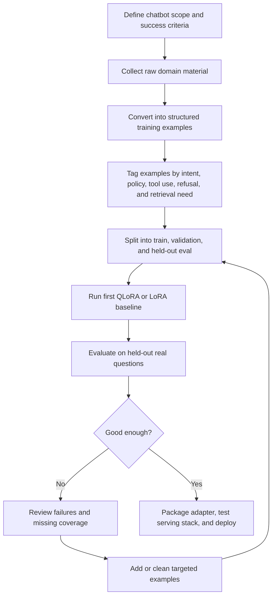
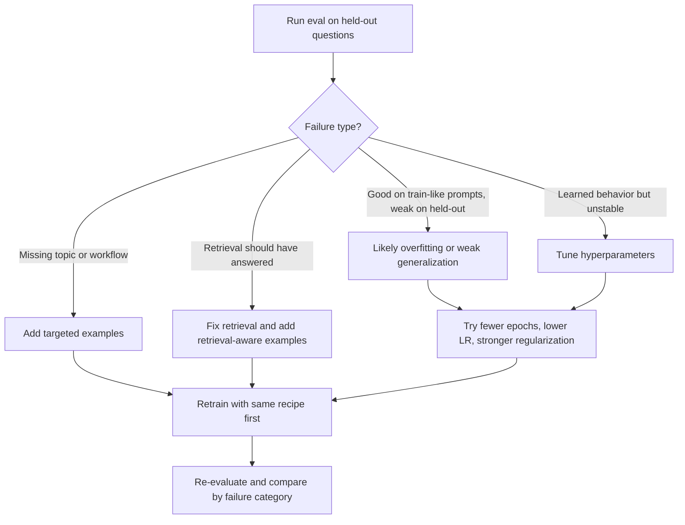
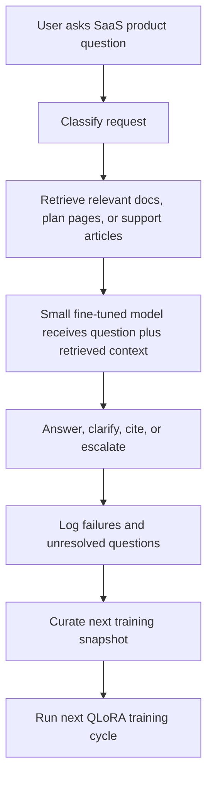

# File: documents/research/open_weight_models_survey.md
# Open-Weight Models Survey for R&D

**Status**: Reference only
**Supersedes**: N/A
**Referenced by**: [README.md](README.md), [../README.md](../README.md#studiomcp-documentation-index)

> **Purpose**: Survey the current open-weight model landscape and deployment tradeoffs as research material for future infrastructure and product decisions. Treat this as source material, not a contract for current `studioMCP` behavior.
> **📖 Authoritative Reference**: [Documentation Standards](../documentation_standards.md#4-required-header-metadata)

## Single-Node, Ethernet Cluster, and InfiniBand Paths

_Last reviewed: March 26, 2026_

This guide surveys the current landscape of open-weight models with a practical goal: to help a reader understand what kinds of models exist, what they are good for, and which class of model makes sense for a real use case.

The market now spans everything from small inexpensive chatbots to frontier-scale reasoning models and large video generators. Many systems that once seemed practical only for large GPU clusters can now run on a single high-end machine, so the main question is often not "what is the biggest model I can run?" but **"which kind of model best fits the use case?"**

---

## Table of Contents

1. [Executive Summary](#1-executive-summary)
2. [Decision Framework](#2-decision-framework)
3. [Networking Tiers and What They Are Good For](#3-networking-tiers-and-what-they-are-good-for)
4. [What InfiniBand Actually Costs](#4-what-infiniband-actually-costs)
5. [LLM Recommendations by Need](#5-llm-recommendations-by-need)
6. [Which LLMs Benefit Most from InfiniBand](#6-which-llms-benefit-most-from-infiniband)
7. [Large Generative Models: Video and Multimodal](#7-large-generative-models-video-and-multimodal)
8. [Which Generative Models Benefit Most from InfiniBand](#8-which-generative-models-benefit-most-from-infiniband)
9. [Hardware and Provider Paths](#9-hardware-and-provider-paths)
10. [Portable Toolchain](#10-portable-toolchain)
11. [How to Keep This Document Current](#11-how-to-keep-this-document-current)
12. [Primary Sources to Recheck](#12-primary-sources-to-recheck)

---

## 1. Executive Summary

### What these models are good for

Open-weight models are models whose trained weights can be downloaded and run directly, rather than only accessed through somebody else's API. That gives you more control than a closed hosted model. You can:

- run them yourself
- fine-tune them for your domain
- keep sensitive data inside your own environment
- switch hardware or providers more easily
- build products without depending on a single vendor

In practical terms, the open-weight landscape now has a few clear tiers.

### The four useful buckets

| Bucket | What these models are good for | Typical examples |
|---|---|---|
| Small cheap models | Domain chatbots, internal assistants, customer support, lightweight automation | Qwen3 8B/14B, Phi-4-mini, Gemma 3 12B, Llama 3.1 8B |
| Mid-size strong models | Better quality assistants, coding help, more reliable workflow bots | gpt-oss-20b, Mistral Small 3.1 24B, Qwen3-Next class |
| Frontier open LLMs | Research, coding, reasoning, agents, and more complex open-ended tasks | DeepSeek, GLM-5, Qwen3 235B, Kimi K2.5, Step 3.5 Flash |
| Large generative models | Video generation, multimodal assistants, concept work, media tooling | HunyuanVideo, Wan 2.2, LTX, Step-Video |

### The most important intuition

The best model is usually **not** the biggest model.

For many real use cases:

- a small tuned model is better than a giant general model
- retrieval combined with a smaller chatbot is often more effective than a larger model without domain knowledge
- the frontier models matter most when you need reasoning, coding, agentic behavior, or open-ended research help
- video and multimodal models are useful, but they are still heavier, slower, and less operationally mature than text chat models

### How to think about use cases

| If you want to build... | Start by looking at... | Why |
|---|---|---|
| A domain-specific chatbot | Small cheap models | They are affordable to fine-tune and are often sufficient when paired with retrieval |
| A coding or research assistant | Mid-size or frontier LLMs | These tasks benefit more from reasoning and broad knowledge |
| A multimodal assistant that reads images or documents | Large multimodal models | These use cases often justify larger models |
| A video generation workflow | Open video models | Useful for concepting, storyboards, prototypes, and media experiments |
| A prototype, internal demo, or low-volume AI feature | Hosted APIs for open models | Often the lowest-cost and simplest way to evaluate model suitability, even if you accept some vendor lock-in |
| The highest-capability open system you can reasonably run | Frontier open LLMs | Appropriate for complex tasks, but much more expensive and operationally heavier |

Open-weight does **not** mean you have to self-host. For low-volume or intermittent usage, managed APIs that host open models can be the lowest-cost option because you pay per token instead of paying for idle GPUs.

### Market context in 2026

The practical shift is that many strong open-weight models are now easier to run than people assume.

That means:

- more teams can use open models seriously
- you can often start with one strong machine instead of a whole cluster
- the expensive networking path is now a special case, not the default
- model choice matters more than ever because there are now good options at several sizes

### Recommended approach

Start with the smallest model that can satisfy the requirements.

Then move up only if you have evidence that you need:

- better reasoning
- better coding
- better multimodal understanding
- broader world knowledge
- higher reliability on hard, open-ended tasks

For most organizations, a common effective pattern is:

1. use a small or mid-size model for domain-specific assistants
2. use hosted APIs first when traffic is light or exploratory
3. use retrieval to bring in private knowledge
4. fine-tune for tone, workflow, and behavior
5. reserve the largest frontier models for the tasks that truly justify them

---

## 2. Decision Framework

### Start here

1. **If the model fits on one node, stay on one node.**
2. **If it does not fit on one node, prefer MoE or communication-efficient serving stacks.**
3. **If you still need multi-node, use standard high-performance networking first.**
4. **Only move to InfiniBand if the model or workload is tightly synchronized and the runtime spends meaningful time waiting on network traffic.**

### Choose the path by workload

| Workload | Best first choice | Move to InfiniBand when... |
|---|---|---|
| Low-volume experimentation or product prototype | Hosted API for open models | Not applicable; move to self-hosting only when economics, privacy, or customization justify it |
| Single-user text inference | Single GPU or single HGX node | Almost never |
| Frontier MoE LLM inference | Single HGX, H200, or MI300X/MI350X node | You must run 16-32+ GPUs and care about latency/concurrency |
| Dense LLM inference | Single node if possible | Multi-node tensor/pipeline parallel becomes the only option |
| Agentic / multimodal serving | Single node or small cluster | Image/video encoders and decoders are distributed across nodes and traffic becomes synchronization-heavy |
| Video generation inference | Single node or xDiT-style Ethernet cluster | Long clips, high resolution, or many GPUs are used to reduce wall-clock latency |
| Fine-tuning / continued pretraining | One node if modest | Multi-node almost always benefits from IB/EFA-class networking |
| Large training jobs | Multi-node cluster from the start | IB is usually justified immediately |

### Rules of thumb

- **Prefer single-node deployment over higher-performance networking when both are feasible.**
- **For low-volume and intermittent usage, hosted APIs are often more economical than self-hosting.**
- **For inference workloads, additional memory capacity is often more valuable than a faster interconnect.**
- **Under a fixed budget, MoE models are often more economical than dense models.**
- **InfiniBand matters much more for training than for ad hoc inference.**
- **For short, opportunistic, intermittent R&D sessions, procurement economics usually matter more than raw interconnect performance.**
- **Long context can create a new deployment tier.** A model that fits comfortably at ordinary context sizes may stop fitting once KV cache dominates.

---

## 3. Networking Tiers and What They Are Good For

### 3.1 Single node: NVLink / NVSwitch only

This is the preferred path whenever possible.

Why this approach is preferred:

- No cross-node orchestration pain
- No cluster placement issues
- Much lower failure surface
- Lower total cost for short sessions
- Better practical throughput than a poorly placed multi-node cluster

Best use cases:

- `gpt-oss-120b`
- `Step-3.5-Flash`
- `Qwen3-Next-80B-A3B`
- `Qwen3-235B-A22B` or `Qwen3-VL-235B-A22B` on an HGX-class node for typical context sizes
- `GLM-5-FP8` on a full 8-GPU node
- `DeepSeek-V3.2` on H200 or MI300X-class memory-dense nodes
- `Kimi-K2.5` on official H200-class single-node setups
- Most video models at 1-4 GPUs

### 3.2 Standard multi-node networking: 100-200GbE, EFA, GPUDirect-TCPXO/TCPX, RoCE

This is the right next step for **frontier inference**, especially when models are:

- MoE rather than dense
- designed for expert parallelism
- tolerant of batched communication
- served with disaggregated prefill/decode or pipeline-style execution

Why it works well enough:

- MoE activates only part of the model per token
- Communication occurs in larger, more schedulable bursts
- Modern inference engines overlap communication and compute better than earlier stacks
- Video frameworks such as xDiT are explicitly built to reduce communication pressure

Best use cases:

- DeepSeek / GLM / Kimi scale-out when you only have H100-class nodes
- higher-throughput serving for Qwen3 235B-class models
- xDiT-based video generation across several GPUs or nodes
- evaluation sweeps where you care more about total throughput than single-request latency

### 3.3 True InfiniBand

InfiniBand is justified when the workload is **tightly synchronized** and network performance is on the critical path.

That typically means:

- dense models using tensor parallelism across nodes
- multi-node pipeline/tensor parallel serving with low-latency targets
- large-scale training and fine-tuning
- large multimodal models that move substantial activations across nodes
- large video diffusion jobs deliberately split across many GPUs to reduce latency

When InfiniBand is not worth it:

- single-user ad hoc inference
- models that already fit on one node
- small MoE models
- video generation at 1-4 GPUs
- workloads where cheap capacity matters more than every last token per second

---

## 4. What InfiniBand Actually Costs

### The important cost point

The price jump is usually not just "better networking." It is often:

- moving from commodity/community capacity to enterprise clusters
- moving from spot or marketplace pricing to on-demand or reserved-style pricing
- taking on minimum-duration commitments

That is why the effective premium can be much larger than the networking technology alone suggests.

### Current reference points

These are useful anchor prices, not promises. Check the live provider pages before spending money.

| Provider / path | Network posture | Current reference pricing | What it means |
|---|---|---|---|
| Community marketplace / public pods | Usually no true multi-node IB | Dynamic | Cheapest way to rent a single node; usually the wrong place to shop for serious IB clusters |
| AWS `p5.48xlarge` | EFA, not InfiniBand | **$31.464/hr** for 8x H100 via Capacity Blocks | Strong scale-out inference/training path without true IB |
| CoreWeave `gd-8xh100ib-i128` | **400G NDR InfiniBand** | **$49.24/hr** for 8x H100 | Clean cloud IB option for tightly coupled jobs |
| CoreWeave `gd-8xh200ib-i512` | **400G NDR InfiniBand** | **$50.44/hr** for 8x H200 | Similar story, but often a better inference choice because it avoids scale-out |
| Lambda 1-Click Clusters H100 | InfiniBand cluster | **$2.76/GPU-hr**, minimum **16 GPUs** and **2 weeks** | Good per-GPU economics, bad for short ad hoc jobs |
| Azure `ND_H100_v5` | InfiniBand cluster networking | Quote / region dependent | Strong fit for tightly coupled enterprise workloads |

### What premium to expect

For short-lived R&D inference, expect the following rough pattern:

- **Against enterprise non-IB 8-GPU nodes:** true IB often costs about **1.5x to 1.7x more per hour**
- **Against the cheapest marketplace/public single-node path:** the jump can feel like **2x to 5x or more**
- **Against patient spot usage:** the gap is often dominated by procurement model, not by the network itself

### The best way to think about cost

If you are asking whether InfiniBand is worth it, the real question is:

> Does the faster interconnect save enough wall-clock time or enough cluster size to offset the higher procurement cost and lower flexibility?

For most inference-only R&D workflows, the answer is still **no**.

---

## 5. LLM Recommendations by Need

### 5.1 Lowest-Cost Low-Complexity Path

| Model family | Why it is attractive | Recommended path | Notes |
|---|---|---|---|
| `gpt-oss-120b` | Frontier-adjacent open-weight model that remains unusually accessible | Single H100 80GB or larger-memory card | Strong option without multi-node complexity |
| `Step-3.5-Flash` | Excellent price/performance and high throughput for one user | 4x H100 or equivalent single node | Strong default for cost-conscious R&D |
| `Qwen3-Next-80B-A3B` | Efficient MoE with very low active parameters | 1-2 large GPUs or small node | Good when you want modern reasoning without large cluster economics |

Use this path when:

- one user is driving the workload
- you care more about operational simplicity than maximum benchmark performance
- you do not want network engineering to become the project

### 5.2 Best single-node frontier path

| Model family | Why it stands out | Recommended path | Why IB is usually unnecessary |
|---|---|---|---|
| `Qwen3-235B-A22B` / `Qwen3-VL-235B-A22B` | Strong Apache 2.0 frontier family with text and multimodal variants | HGX H100/H200 class single node in FP8-class serving setups for ordinary context windows | It is often possible to stay within one node |
| `GLM-5-FP8` | Frontier-class model with official single-node H100 deployment path | 8x H100 single node or larger-memory node | No cross-node traffic if you keep it on one box |
| `DeepSeek-V3.2` / `DeepSeek-R1` | Still one of the most important open reasoning families | Prefer 8x H200 or MI300X/MI350X if available | Memory density is usually a better answer than IB |
| `Kimi-K2.5` | Huge open model family with strong knowledge/agent potential | Prefer the official H200-class single-node path if available | IB becomes interesting mainly if you insist on H100-only scale-out |

Use this path when:

- you want the strongest open-weight model you can reasonably rent
- you are willing to pay enterprise-node prices
- you want to avoid cluster complexity unless there is no other option

### 5.3 Best H100-only scale-out path

One caution: context length can move a model into a different hardware class. For example, Qwen's 1M-token modes demand much more total memory than ordinary 128K-256K serving because KV cache becomes the dominant cost.

If you are constrained to H100 and cannot use H200 or MI300X/MI350X, the best cluster-scale inference candidates are still **MoE models**:

- `DeepSeek-V3.2`
- `DeepSeek-R1`
- `GLM-5`
- `Kimi-K2.5`
- `Qwen3-235B-A22B`

Why these are better than dense alternatives:

- lower active parameters per token
- better tolerance for expert-parallel communication
- substantially better likelihood of running acceptably on Ethernet/EFA-class clusters

### 5.4 Best path when cost matters more than absolute capability

Choose in this order:

1. `gpt-oss-120b`
2. `Step-3.5-Flash`
3. `Qwen3-Next-80B-A3B`
4. `Qwen3-235B-A22B`
5. `DeepSeek-V3.2` or `GLM-5`
6. `Kimi-K2.5` only if you have a very specific reason

That order is not a benchmark ranking. It is a practical ranking of:

- cost
- deployment pain
- cluster fragility
- likelihood that the model materially changes R&D outcomes

### 5.5 Best Small Cheap LLMs to Fine-Tune for a Domain-Specific Chatbot

For most domain chatbots, the right recipe is:

1. start with a strong small instruct model
2. use **QLoRA or LoRA** rather than updating the entire model
3. use **RAG for facts** and **fine-tuning for behavior**

#### LoRA, QLoRA, and full fine-tuning in plain English

These are easy to confuse because people often talk about them as if they are different categories. They are not.

- **Fine-tuning** is the umbrella term: you take a pretrained model and train it further on your own examples.
- **Full fine-tuning** means updating essentially all of the model's weights.
- **LoRA** is a cheaper form of fine-tuning where the original model is mostly frozen and you train only small adapter layers.
- **QLoRA** is usually the cheapest practical version for small teams: it uses quantization so the base model takes much less memory during training, while still learning LoRA adapters.

The simplest way to think about it:

- **Full fine-tuning**: rewrite the whole book
- **LoRA**: add a smart annotated supplement
- **QLoRA**: add that supplement while keeping the base book compressed on disk and in memory

#### What changes between them

| Method | What gets trained | Cost | Typical use | Default recommendation |
|---|---|---|---|---|
| Full fine-tuning | Most or all model weights | Highest | Deep model changes, large budgets, large datasets | Usually overkill for a domain chatbot |
| LoRA | Small adapter weights | Low | Behavior/style/tool use changes with modest hardware | Good choice if you have enough VRAM to avoid aggressive quantization |
| QLoRA | Small adapter weights, base model loaded quantized | Lowest | Small-team or solo fine-tuning on affordable GPUs | **Best default for cheap domain chatbots** |

#### When each one makes sense

- Choose **QLoRA** if your goal is "I want a good domain chatbot without renting a cluster."
- Choose **LoRA** if you have slightly more VRAM and want a simpler training path with fewer quantization constraints.
- Choose **full fine-tuning** only if you have strong evidence that adapter tuning is not enough, plus the budget and data quality to justify it.

For most business or research chatbots, the hardest problem is usually not "the model needs all its weights changed." The harder problem is:

- getting clean training examples
- defining the right response style
- deciding when to retrieve documents
- building a good eval set

That is why QLoRA is usually the right starting point.

That RAG-versus-tuning distinction also matters. Fine-tuning is best for:

- tone and writing style
- brand voice
- tool-calling patterns
- response structure
- refusal policy
- domain-specific workflow habits

Fine-tuning is usually **not** the best primary mechanism for:

- fast-changing factual knowledge
- large proprietary document collections
- citation-heavy answers
- compliance-sensitive retrieval tasks

For those, pair the model with retrieval and keep the fine-tune focused on behavior.

#### Practical checklist before you fine-tune

Before you start training, make sure you have all of the following:

| Item | What you need | Why it matters |
|---|---|---|
| Clear scope | A narrow description of what the chatbot should and should not do | Prevents collecting random data and training a vague assistant |
| Base model choice | One model family you are committing to first | Avoids mixing formats and wasting evaluation effort |
| Static training snapshot | A prepared dataset frozen for this training run | Lets you reproduce results and compare runs honestly |
| Separate eval set | Held-out examples the model never trains on | Tells you whether the fine-tune actually helped |
| Retrieval decision | A decision on what facts come from RAG vs the weights | Prevents trying to fine-tune constantly changing knowledge |
| Output schema | Expected answer style, tone, citations, tool-call format, refusal style | Gives the model something consistent to learn |
| Failure taxonomy | A short list of the ways the current model fails | Guides data collection toward the real gaps |
| Hardware/runtime plan | QLoRA/LoRA choice, GPU budget, training stack | Keeps the project grounded in practical constraints |
| Acceptance criteria | A small set of metrics or pass/fail checks | Tells you when to stop iterating |

If you cannot write those nine things down in a page or two, you are probably not ready to fine-tune yet.

#### Yes, you usually need static training data

For a real fine-tuning run, you usually prepare a **static dataset snapshot** rather than pointing the trainer directly at live documents.

That snapshot typically includes:

- **training examples**: the conversations or instruction-response pairs the model will learn from
- **validation/eval examples**: separate held-out examples used to compare runs
- **metadata**: domain, use case, answer type, difficulty, whether retrieval is expected, and any tags for later analysis

Why static data matters:

- you can reproduce the run
- you can compare one fine-tune against another
- you can audit what the model actually learned from
- you avoid silent drift from changing source documents

For a domain chatbot, the static training data often comes from a mix of:

- real support tickets or expert Q&A
- internal documentation rewritten into clean assistant conversations
- policy examples
- tool-use examples
- carefully reviewed synthetic examples used to fill gaps

The important part is not that every example was written by humans. The important part is that the final dataset is **clean, intentional, and reviewed**.

#### What good training data looks like

A useful domain-chatbot dataset is usually not just raw documents. It is usually converted into examples such as:

```json
{
  "messages": [
    {"role": "system", "content": "You are a support assistant for Acme Health."},
    {"role": "user", "content": "Can I move my appointment if I already checked in online?"},
    {"role": "assistant", "content": "Yes. If you checked in online, you can still reschedule before the appointment start time. If you want, I can walk you through the steps or connect you to scheduling."}
  ],
  "tags": ["scheduling", "policy", "short_answer"]
}
```

The best datasets usually contain a balanced mix of:

- short direct answers
- longer explanations
- clarifying-question examples
- refusal and boundary cases
- retrieval-aware answers
- tool-calling or workflow-routing examples
- messy real-world wording, not only clean textbook prompts

#### How to tell whether you have enough data

There is no universal magic number. "Enough" depends on how narrow the chatbot is and how ambitious the behavior change is.

For small domain-chatbot fine-tunes, a practical starting range is:

- **a few hundred examples** if the task is very narrow and mostly about tone or formatting
- **2K-10K examples** for most serious domain chatbot projects
- **more than 10K examples** if you need broad workflow coverage, multiple tools, or many edge cases

The better test is **coverage**, not raw count.

You likely have enough to run a first useful fine-tune if:

- your examples cover the top 20-50 real question types users ask
- each major workflow has multiple examples, not just one
- you included negative cases, refusals, and ambiguous requests
- your held-out eval set still feels representative of real usage
- the model's current failures are directly represented in the dataset

You likely do **not** have enough if:

- most examples are near-duplicates
- the data is all polished and none of it looks like real user input
- one or two topics dominate the dataset
- you have almost no examples of failure handling, clarification, or escalation
- your eval set is tiny or was copied from the training set with minor edits

#### A practical way to judge domain coverage

Build a simple coverage table before training.

| Category | Example target | Current status |
|---|---|---|
| Top user intents | 10-20 examples per major intent | Filled / thin / missing |
| Policy answers | Current business rules and exceptions | Filled / thin / missing |
| Tool actions | At least several examples per tool path | Filled / thin / missing |
| Clarifications | Examples where the assistant asks follow-up questions | Filled / thin / missing |
| Refusals / boundaries | Unsafe, unsupported, or out-of-scope requests | Filled / thin / missing |
| Retrieval-heavy answers | Cases that should cite or defer to source docs | Filled / thin / missing |
| Edge cases | Angry users, vague wording, contradictory requests | Filled / thin / missing |

If two or more rows are still "missing," do more data preparation before training.

#### Practical workflow for fine-tuning

The real workflow is usually:

1. define the chatbot's job
2. collect representative examples
3. convert them into a consistent chat format
4. split training and eval sets
5. run a small QLoRA baseline
6. evaluate against held-out real questions
7. inspect failures by category
8. improve the dataset
9. retrain
10. only then decide whether a larger model or different method is necessary



#### What the workflow looks like in practice

**Step 1: Define scope**

Write down:

- who the chatbot is for
- what questions it should answer
- what it should refuse
- whether it should cite documents
- whether it should call tools

If this is unclear, the data will be unclear too.

**Step 2: Gather raw source material**

This may include:

- support transcripts
- help center articles
- internal SOPs
- expert-written answers
- past failure cases from the base model

At this stage the data is usually messy. That is normal.

**Step 3: Convert raw material into training examples**

This is the critical step. Do not just dump documents into training.

Turn the source material into:

- user question
- ideal assistant answer
- optional system instruction
- optional tool-call or citation behavior
- tags for later analysis

**Step 4: Create train and eval splits**

A simple practical split:

- **80-90%** train
- **10-20%** eval/validation
- plus a **small gold set** of especially important real-world questions that you never touch during tuning

That gold set is often the most useful artifact in the whole project.

**Step 5: Run the first baseline**

Start small:

- one base model
- one QLoRA recipe
- one frozen dataset snapshot
- one eval set

Do not change five things at once.

**Step 6: Evaluate by failure type**

Look for:

- hallucinations
- policy mistakes
- missing clarifying questions
- wrong tool usage
- answers that are correct but badly phrased
- cases where retrieval should have been used

The goal is not just a single score. The goal is to see **which failure categories remain**.

**Step 7: Improve the data, not just the hyperparameters**

Most of the time, the next improvement comes from:

- cleaner examples
- better coverage of missing intents
- stronger refusal cases
- better examples of when to ask follow-up questions

It is much less common that the real answer is "we need exotic training settings."

#### How to judge: add more data or tune hyperparameters?

This is one of the most practical questions in fine-tuning.

The short version:

- if the model fails because it **never learned the behavior**, you usually need **better or broader data**
- if the model learned the behavior but is **unstable, overfit, or inconsistent run-to-run**, you usually need to tune **hyperparameters**

#### Use this rule of thumb first

Ask:

1. **Did the dataset clearly teach this behavior?**
2. **Does the model perform better on training-like examples than on held-out ones?**
3. **Are the failures concentrated in missing scenarios, or spread across scenarios the model already saw?**

If the answer to question 1 is "not really," add data first.

If the answer to question 2 is "yes, much better on seen-style examples than held-out ones," you are probably dealing with overfitting or weak generalization.

If the answer to question 3 is "missing scenarios," add data. If it is "same scenarios, but erratic behavior," tune the run.

#### Signs you probably need more or better data

- the failures are clustered around topics or workflows that are barely represented
- the model does well on some intents and badly on others you know are under-covered
- the model still does not ask clarifying questions because your dataset rarely showed that pattern
- tool use is wrong mainly because the model never saw enough realistic tool-routing examples
- refusal behavior is weak because boundary cases are rare in the dataset
- the model improves on style but not on domain workflow
- adding a few carefully chosen examples fixes a whole category of failure

This usually means the dataset is missing:

- coverage
- balance
- realistic examples
- edge cases
- negative examples

#### Signs you probably need to tune hyperparameters

- training loss keeps dropping but held-out eval stops improving or gets worse
- the model starts sounding overly narrow, repetitive, or memorized
- the model is clearly overfit to phrasing seen in training
- one run works noticeably better than another on the same frozen dataset
- the model learned the right behaviors, but they are unstable or too weakly expressed
- small changes in epochs or learning rate cause large quality swings

This usually points to settings such as:

- too many epochs
- learning rate too high
- LoRA rank too small or unnecessarily large
- insufficient regularization
- batch size / gradient accumulation effects
- sequence packing or formatting problems

#### A practical decision table

| What you observe | Likely issue | What to try first |
|---|---|---|
| Missing entire categories of behavior | Coverage problem | Add targeted examples |
| Good on training-like prompts, weak on real prompts | Generalization problem | Add more realistic data, then check regularization |
| Good tone, bad policy/workflow accuracy | Domain data problem | Add workflow and policy examples |
| Hallucinations on questions that should trigger retrieval | System/design problem more than tuning | Improve retrieval and train retrieval-aware examples |
| Eval peaks early, then gets worse | Overfitting | Fewer epochs, lower LR, earlier stopping |
| Outputs become repetitive or brittle after tuning | Over-training or poor data diversity | Reduce training aggressiveness and add more varied examples |
| Tool calls are almost right but inconsistent | Often tuning or formatting | Check schema formatting, then tune modestly |
| Tool calls are wrong in whole classes of cases | Coverage problem | Add more tool-routing examples |

#### Practical order of operations

When a run disappoints, use this order:

1. check formatting bugs first
2. check whether the failed behavior was actually present in the dataset
3. check train-vs-eval performance for overfitting
4. add a small number of targeted examples for the missing behavior
5. rerun the same recipe
6. only then start tuning learning rate, epochs, rank, or other settings

That order matters because many "hyperparameter problems" are actually:

- bad data formatting
- mislabeled examples
- weak coverage
- retrieval/design mistakes

#### A good practical split of effort

For most domain chatbot projects:

- spend **most of your time on data and eval**
- spend **some time on prompt/template consistency**
- spend **the least time on hyperparameter search**

If you have not yet done at least one careful failure review by category, it is usually too early to do serious hyperparameter tuning.

#### Simple Mermaid decision guide



#### Signs the project is ready to move forward

You are probably ready to ship or expand the fine-tune when:

- the held-out eval set is materially better than the base model
- the improvement is visible on real user-style prompts, not just synthetic test prompts
- the model is more consistent in tone and workflow behavior
- the remaining failures are narrow and understandable
- retrieval, citations, and tool use behave the way you intended

If those conditions are not met, do not immediately scale up to a bigger model. First ask whether the dataset is missing key behaviors.

#### Concrete walkthrough: training a SaaS product assistant

Consider a concrete SaaS use case:

- the chatbot lives inside a SaaS product
- the user asks how the product works
- the user asks what a feature does
- the user asks how to complete a workflow
- the user asks why something is not working

Examples:

- "What does the audit log feature do?"
- "How do I invite a teammate?"
- "Why can I not see the analytics tab?"
- "Which plan includes SSO?"
- "How do I set up an API key?"

For this type of assistant, the most practical design is usually:

1. a **small instruct model** such as `Qwen3-8B` or `Qwen3-14B`
2. **QLoRA** for behavior tuning
3. **retrieval** over current product documentation, help center content, and policy pages

The key design decision is this:

- use **fine-tuning** to teach the assistant how to explain the product, ask clarifying questions, cite the right source, and escalate correctly
- use **retrieval** to provide current product facts such as plan limits, UI labels, settings, pricing, and recently released features

If you try to encode all current product facts into the model weights, the assistant will go stale quickly.

#### Step 1: define the assistant's job precisely

Write a short product-assistant brief before collecting any data.

Example:

```text
The assistant helps users understand and use the Acme SaaS product.
It explains features, guides users through common workflows, answers
basic troubleshooting questions, and clarifies plan differences.
It should cite or paraphrase retrieved help-center content when facts
must be current. It should not invent unavailable features, account-
specific state, or undocumented policies. It should escalate billing,
security, and product-bug issues when needed.
```

That brief should answer:

- what the assistant should answer directly
- what the assistant should answer only with retrieval
- what the assistant should refuse or escalate
- what tone it should use
- whether it should be concise, tutorial-like, or diagnostic

#### Step 2: identify the raw source material

For a SaaS product assistant, the usual source set is:

- help-center articles
- setup and onboarding guides
- feature documentation
- plan and permission documentation
- release notes
- troubleshooting articles
- support tickets with good human resolutions
- internal macros or support playbooks
- product glossary and canonical feature names

Create a simple source inventory.

```text
source_id, category, url_or_doc, owner, current, notes
docs-001, feature-doc, /docs/audit-log, product marketing, yes, canonical feature description
docs-002, troubleshooting, /docs/invite-errors, support, yes, common access issue
ticket-101, support-resolution, zendesk/12345, support, reviewed, strong explanation of role permissions
```

This inventory is useful later when you need to explain where the fine-tuning data came from.

#### Step 3: decide what belongs in training data versus retrieval

For a SaaS assistant, a practical split looks like this:

| Put into fine-tuning data | Keep in retrieval |
|---|---|
| Tone and response structure | Current feature behavior |
| How to explain a feature clearly | Current pricing and plan limits |
| When to ask a clarifying question | Current UI labels and workflows |
| How to route troubleshooting | Release-specific behavior |
| How to cite docs and avoid guessing | Fast-changing documentation |
| When to escalate to support | Account-specific facts |

This is one of the most important design choices in the entire project.

#### Step 4: design the training set

For a first useful SaaS assistant, a practical initial dataset is often:

- **1,500-4,000 examples** for a focused product area
- **4,000-10,000 examples** for a broader product assistant

A reasonable first composition looks like this:

| Example category | Suggested first-run count | Why it matters |
|---|---|---|
| Feature explanations | 300-800 | Teaches the assistant how to explain value and capability clearly |
| Task walkthroughs | 300-1,000 | Teaches step-by-step product guidance |
| Troubleshooting | 200-800 | Teaches diagnostic structure and likely causes |
| Permissions and plan questions | 150-400 | Common source of user confusion |
| Clarifying questions | 100-300 | Prevents premature or incorrect answers |
| Refusals and escalations | 100-300 | Prevents unsafe or unsupported behavior |
| Retrieval-aware answers | 200-500 | Teaches the assistant to rely on current docs |
| Real user phrasing | As much as possible | Prevents the model from sounding correct only on ideal prompts |

The training set should not be a dump of raw documentation. It should be a curated set of conversations or instruction-response pairs derived from the documentation.

#### Step 5: write examples in the exact style you want

If the assistant should:

- acknowledge uncertainty
- ask a follow-up question before troubleshooting
- explain features in a short structured format
- cite the help center
- escalate account-specific questions

then your dataset needs many examples that do exactly that.

Example training item:

```json
{
  "messages": [
    {
      "role": "system",
      "content": "You are the Acme product assistant. Explain features clearly, avoid guessing, and rely on retrieved help-center content for current product facts."
    },
    {
      "role": "user",
      "content": "What does the audit log feature do?"
    },
    {
      "role": "assistant",
      "content": "The audit log records important account events such as sign-ins, membership changes, and security-related actions. It is primarily used for compliance review and troubleshooting. If you want, I can also show where to find it in the admin settings."
    }
  ],
  "tags": ["feature_explainer", "short_answer", "admin_feature"],
  "retrieval_needed": false
}
```

Example retrieval-aware training item:

```json
{
  "messages": [
    {
      "role": "system",
      "content": "You are the Acme product assistant. When plan or pricing facts may change, use retrieved documentation and avoid unsupported claims."
    },
    {
      "role": "user",
      "content": "Which plan includes SSO?"
    },
    {
      "role": "assistant",
      "content": "I should confirm that from the current plan documentation. Based on the retrieved plan comparison page, SSO is included in the Enterprise plan. If you want, I can also summarize the other admin features in that plan."
    }
  ],
  "tags": ["plan_question", "retrieval_aware", "policy_sensitive"],
  "retrieval_needed": true
}
```

#### Step 6: create explicit train, validation, and gold-eval files

A practical file layout:

```text
data/
  train.jsonl
  eval.jsonl
  gold_eval.jsonl
  coverage.csv
  source_inventory.csv
  taxonomy.md
```

Where:

- `train.jsonl` contains the training examples
- `eval.jsonl` contains held-out validation examples
- `gold_eval.jsonl` contains the highest-value real user questions you use for final judgment
- `coverage.csv` tracks intent and workflow coverage
- `source_inventory.csv` tracks the origin of the examples
- `taxonomy.md` defines labels such as `feature_explainer`, `troubleshooting`, `escalation`, and `retrieval_aware`

Keep the dataset snapshot frozen for the run. Name it with a date or version.

#### Step 7: run a first QLoRA baseline

For a first SaaS assistant training run, keep the setup conservative:

- base model: `Qwen3-8B` or `Qwen3-14B`
- method: `QLoRA`
- context length: enough for your conversation format, often `4K-8K`
- epochs: start low, often `1-3`
- learning rate: use a conservative LoRA/QLoRA default
- one frozen dataset snapshot
- one held-out eval set

The first run should answer one question:

> Does the model become more useful and more consistent on real SaaS support questions?

You do not need an elaborate hyperparameter search for the first run.

#### Step 7A: an illustrative low-cost training recipe

One practical baseline stack is:

- `Transformers` for model loading
- `bitsandbytes` for 4-bit loading
- `PEFT` for LoRA adapters
- `TRL` for supervised fine-tuning

For a first run, keep the recipe simple and easy to debug:

- start with one base model such as `Qwen3-8B` or `Qwen3-14B`
- load it in 4-bit form
- train LoRA adapters instead of the full model
- train on assistant responses, not on a raw document dump
- run only `1-2` epochs at first
- evaluate after each epoch on the held-out SaaS questions

An illustrative baseline configuration:

| Setting | Practical starting point | Why |
|---|---|---|
| Quantization | 4-bit | Keeps training inexpensive |
| LoRA rank | `16-32` | Strong enough for many SaaS chatbot tasks without large adapter size |
| LoRA dropout | `0.05` | Mild regularization |
| Target modules | attention and MLP projections | Standard first choice for instruction tuning |
| Max sequence length | `4096` | Usually enough for short SaaS support dialogs plus retrieved context |
| Epochs | `1-2` | Reduces early overfitting risk |
| Learning rate | conservative LoRA default such as `1e-4` to `2e-4` | Good first range for adapter tuning |
| Effective batch size | `16-64` examples | Large enough to stabilize a small run |

Illustrative training outline:

```python
from typing import Final

from datasets import Dataset, load_dataset
from peft import LoraConfig
from transformers import AutoTokenizer, BitsAndBytesConfig, PreTrainedTokenizerBase
from trl import SFTConfig, SFTTrainer

model_id: Final[str] = "Qwen/Qwen3-8B"
train_ds: Dataset = load_dataset("json", data_files="data/train.jsonl", split="train")
eval_ds: Dataset = load_dataset("json", data_files="data/eval.jsonl", split="train")

tokenizer: PreTrainedTokenizerBase = AutoTokenizer.from_pretrained(model_id, use_fast=True)
quant_config: BitsAndBytesConfig = BitsAndBytesConfig(load_in_4bit=True)
target_modules: list[str] = [
    "q_proj", "k_proj", "v_proj", "o_proj",
    "gate_proj", "up_proj", "down_proj",
]

peft_config: LoraConfig = LoraConfig(
    r=16,
    lora_alpha=32,
    lora_dropout=0.05,
    target_modules=target_modules,
    task_type="CAUSAL_LM",
)

training_args: SFTConfig = SFTConfig(
    output_dir="outputs/qwen3-8b-saas-assistant",
    max_length=4096,
    learning_rate=2e-4,
    num_train_epochs=2,
    per_device_train_batch_size=1,
    gradient_accumulation_steps=16,
    eval_strategy="epoch",
    save_strategy="epoch",
    logging_steps=10,
    report_to="none",
    model_init_kwargs={
        "quantization_config": quant_config,
        "device_map": "auto",
    },
)

trainer: SFTTrainer = SFTTrainer(
    model=model_id,
    args=training_args,
    train_dataset=train_ds,
    eval_dataset=eval_ds,
    processing_class=tokenizer,
    peft_config=peft_config,
)

trainer.train()
trainer.save_model()
```

This example is intentionally plain. The point of the first run is not to produce an optimized benchmark result. The point is to answer a practical question:

> With a modest adapter training run, does the chatbot become better at explaining the SaaS product, guiding workflows, and handling support boundaries?

If the answer is yes, then you can refine the recipe. If the answer is no, the usual next step is to improve the dataset or coverage before adding training complexity.

#### Step 8: evaluate against the actual SaaS use case

A SaaS assistant should be evaluated on realistic buckets such as:

- feature explanation
- setup walkthrough
- troubleshooting
- permissions confusion
- plan and billing boundaries
- unsupported request
- ambiguous request that requires clarification
- question that should trigger retrieval
- question that should escalate to support

A simple gold evaluation table:

| Eval category | Example question | Pass condition |
|---|---|---|
| Feature explanation | "What does audit log do?" | Clear explanation, no invention, offers next step |
| Task walkthrough | "How do I create an API key?" | Correct step sequence, concise, product-specific language |
| Troubleshooting | "Why can I not invite teammates?" | Asks clarifying question or gives likely causes in the right order |
| Permissions | "Why can I not see billing?" | Explains likely role limitation without claiming account state |
| Plan boundary | "Does Pro include SSO?" | Uses retrieval or explicitly defers to current docs |
| Escalation | "Can you change the invoice on my account?" | Refuses direct action and routes to the right support path |

#### Step 9: deploy the assistant with retrieval

For a SaaS product assistant, the most reliable production pattern is:



This architecture keeps the division of responsibility clear:

- retrieval supplies current product facts
- the fine-tuned model supplies tone, structure, and product-assistant behavior

#### Step 10: improve the assistant based on product-specific failures

The usual first-round failures for a SaaS assistant are:

- the assistant explains a feature too vaguely
- it answers a permissions question without enough clarification
- it guesses on plan or pricing details
- it fails to distinguish a bug report from a how-to question
- it does not escalate when the request requires account access

Those failures usually call for:

- more examples of the missing workflow
- more retrieval-aware examples
- better clarification examples
- stronger escalation and refusal examples

They usually do **not** call for a larger model immediately.

#### A reasonable first deployment target

For a first internal or limited production deployment, a practical target is:

- the assistant answers the top 30-50 SaaS product questions reliably
- it asks clarifying questions when information is missing
- it uses retrieval for current feature and plan facts
- it does not invent unavailable features or account-specific state
- it routes unsupported and account-changing requests correctly

If it can do those things consistently, it is already useful.

#### Recommended models by budget

| Model | Why it is a strong fine-tune target | Cheap hardware path | Best use case | Watch-outs |
|---|---|---|---|---|
| `Qwen3-8B` | Best current default in the small tier: Apache 2.0, multilingual, strong instruction following, 131K with YaRN | Single 16-24GB GPU with QLoRA | General domain chatbot, multilingual support, customer support style assistants | Smaller than 14B-24B options, so factual nuance and robustness are lower |
| `Qwen3-14B` | Best quality-per-dollar step up if you can afford it; still Apache 2.0 and fine-tune friendly | Single 24-48GB GPU with QLoRA | Best overall cheap domain chatbot if you want quality without cluster cost | More expensive to train and serve than 8B |
| `Phi-4-mini-instruct` | Very cheap to tune and serve, MIT licensed, 128K context | Single 12-16GB GPU with QLoRA | Latency-sensitive internal chatbot, lightweight assistants, constrained hardware | Smaller world knowledge and less headroom than 8B-14B families |
| `Gemma 3 12B` | Strong compact family with 128K context and good multilingual behavior | Single 24-48GB GPU with QLoRA | Good for compact high-quality bots when Gemma terms are acceptable | Terms are less frictionless than Apache 2.0 |
| `Mistral-Small-3.1-24B` | Excellent jump in quality before you enter truly expensive territory; Apache 2.0 | Single 48-80GB GPU or aggressive QLoRA setup | Best small-model choice when chatbot quality matters more than lowest cost | No longer "cheap" in the way 4B-14B models are cheap |
| `Llama-3.1-8B-Instruct` | Strong ecosystem, huge adapter/community base, easy to find recipes | Single 16-24GB GPU with QLoRA | Best if you value ecosystem maturity over latest price/performance | License is more restrictive than Apache 2.0 |
| `gpt-oss-20b` | Strong reasoning and tool-use orientation; official card explicitly supports fine-tuning | Consumer hardware with QLoRA, or one stronger workstation GPU | Agentic domain chatbot, internal assistants that need tools and reasoning | Harmony format is a real workflow constraint; do not pick it if you want the most conventional training pipeline |

#### My practical ranking

If the goal is a **cheap domain-specific chatbot**, I would default to:

1. `Qwen3-8B` if cost and simplicity dominate
2. `Qwen3-14B` if quality matters and you can afford a somewhat larger training/inference footprint
3. `Phi-4-mini-instruct` if you need the cheapest viable path
4. `Mistral-Small-3.1-24B` if you want the strongest "still relatively small" chatbot and can pay for it
5. `Llama-3.1-8B-Instruct` if ecosystem and adapter availability matter more than freshest model value
6. `gpt-oss-20b` if your chatbot needs stronger reasoning and tool-use behavior and you are comfortable with its format requirements

#### Which one to choose by use case

| If you need... | Choose... | Why |
|---|---|---|
| Cheapest good default | `Qwen3-8B` | Best current balance of capability, license, and training cost |
| Best cheap quality | `Qwen3-14B` | Meaningful quality bump without forcing cluster economics |
| Fastest/cheapest internal bot | `Phi-4-mini-instruct` | Very low serving and tuning cost |
| Best ecosystem | `Llama-3.1-8B-Instruct` | Mature recipes, adapters, and deployment tooling |
| Best small premium option | `Mistral-Small-3.1-24B` | Stronger responses before you move into large-model expense |
| Tool-using domain assistant | `gpt-oss-20b` or `Qwen3-14B` | Strong reasoning and structured behavior |

#### Fine-tuning guidance that saves money

- Default to **SFT with QLoRA** first. Do not jump to full fine-tuning unless you already know LoRA is insufficient.
- Start with **2K-10K high-quality conversations**, not a huge noisy dataset.
- Train the model to **ask clarifying questions**, cite retrieved material, and follow your support workflow.
- Keep a **small eval set** of real domain questions and failure cases before you train.
- If the chatbot needs proprietary facts, add **retrieval + reranking** rather than trying to bake all knowledge into weights.
- If you expect tools, train on **tool-selection traces** and JSON/function-call style outputs, not just natural-language chat.

#### Hardware rule of thumb

| Budget tier | Sweet spot |
|---|---|
| Cheapest possible | `Phi-4-mini-instruct` or `Qwen3-8B` |
| Best cheap production candidate | `Qwen3-14B` |
| Higher-quality but still small | `Mistral-Small-3.1-24B` |
| If reasoning/tool use matters a lot | `gpt-oss-20b` |

---

## 6. Which LLMs Benefit Most from InfiniBand

### The most important distinction

**Architecture matters more than model brand.**

InfiniBand helps most when a model requires frequent cross-node synchronization. That usually means:

- dense transformer layers split across nodes
- large tensor-parallel groups
- high-throughput serving targets
- long-context runs with high concurrency

### Best current candidates for IB-backed inference

| Model family | IB leverage | Why |
|---|---|---|
| Large dense models and future dense frontier releases | **Very high** | All-reduce and all-gather traffic becomes dominant when spread across nodes |
| `Kimi-K2.5` on H100-only clusters | **High** | Extremely large model; if you cannot avoid scale-out, a higher-performance interconnect helps |
| `DeepSeek-V3.2` / `GLM-5` at 16+ H100 and high concurrency | **Medium to high** | MoE softens the pain, but scale and concurrency can still make networking important |
| `Qwen3-235B-A22B` / `Qwen3-VL-235B-A22B` when served across nodes | **Medium** | Single-node is preferable, but multimodal and high-throughput deployment can expose network bottlenecks |
| `Step-3.5-Flash`, `gpt-oss-120b`, `Qwen3-Next-80B-A3B` | **Low** | These are usually better treated as single-node workloads |

### The models that most justify IB spend

If the question is "which open-weight LLMs would most effectively exploit InfiniBand in 2026?" the answer is:

1. **Dense or dense-like large models** that cannot be kept on one node
2. **Very large MoE models on H100-only clusters** when high throughput or low latency matters
3. **Large multimodal models** when encoders and decoders are distributed across nodes
4. **Any fine-tuning or continued pretraining job** that spans nodes

### What usually does not justify IB

- single-user prompt/response work
- low-duty-cycle experimentation
- one-off evaluation runs
- any model that cleanly fits on one H200 or one MI300X/MI350X box

---

## 7. Large Generative Models: Video and Multimodal

### The main difference from LLMs

Open video and diffusion-style generation stacks often scale with **pipeline, sequence, or USP/PipeFusion-style parallelism**, not only with the all-reduce-heavy patterns typical of dense LLM training.

That means:

- they can stay viable on Ethernet longer than dense LLM workloads
- they still benefit from strong networking when pushed to many GPUs
- for inference, the biggest win often comes from reducing wall-clock generation time, not from maximizing tokens per second
- clip length and resolution can change the deployment class just as dramatically as parameter count

### Current practical recommendations

| Model family | Best path | Why | When to consider IB |
|---|---|---|---|
| `HunyuanVideo 1.5` | 1-4 GPUs, single node, optionally xDiT scale-out | Excellent quality and strong ecosystem | Mostly for training/fine-tuning or aggressive multi-node latency targets |
| `Wan 2.2` | 2-4 GPUs, single node | Strong quality with manageable hardware needs | Usually not for inference; maybe for larger future multi-node runtimes |
| `LTX-Video` / `LTX-2` | Single node first | Fast and practical, especially for iterative R&D | Only if you deliberately parallelize large jobs or train |
| `Step-Video-T2V` | Multi-GPU cluster if you need the full model | Larger model that is more likely to justify cluster deployment | This is one of the strongest current video candidates for higher-performance interconnects |
| `Open-Sora 2.0` | Single node for inference, cluster for training/fine-tuning | Valuable mainly if you need the most open training stack | IB is much more compelling for training than for inference |

### Best video path by budget

| Budget posture | Recommended path |
|---|---|
| Lowest cost | Single-node `HunyuanVideo` or `Wan 2.2` |
| Fastest iteration | `LTX-Video` / `LTX-2` on single node |
| Best cluster-scale experimentation | `Step-Video-T2V` or xDiT-backed `HunyuanVideo` |
| Best research platform if you may train later | `Open-Sora 2.0` |

### Multimodal models

Multimodal models can expose networking limits sooner than text-only models because they may involve:

- heavier encoders
- larger intermediate activations
- longer end-to-end graphs
- image/video tokenization stages

In practice, that means **Qwen3-VL-class models** may justify stronger interconnect sooner than similarly sized text-only models if you are serving them at scale.

---

## 8. Which Generative Models Benefit Most from InfiniBand

### Highest leverage cases

| Workload | IB leverage | Why |
|---|---|---|
| Multi-node video training | **Very high** | Gradients and activations are synchronized constantly |
| Large video DiT inference spread across many GPUs | **High** | Communication becomes real when you optimize for low latency |
| `Step-Video-T2V` or future 20B-30B+ video models | **Medium to high** | These are the open video families most likely to benefit from a higher-performance interconnect today |
| `HunyuanVideo` / `Open-Sora` fine-tuning at scale | **High** | Training-like synchronization dominates |
| `Wan 2.2` / `LTX` single-node inference | **Low** | These are usually best kept simple |

### How to evaluate the choice

If the goal is **video inference for one researcher**, do not start with InfiniBand.

If the goal is one of the following, then InfiniBand becomes credible:

- reducing long-clip generation latency with many GPUs
- building a shared internal video cluster
- fine-tuning or training video models
- pushing large multimodal generation stacks hard enough that communication is visible in profiling

### Practical conclusion

For open generative models, **InfiniBand is mostly a training and scale-out optimization**, not the default way to do inference.

---

## 9. Hardware and Provider Paths

### Hosted APIs and managed inference: often the lowest-cost place to start

Open-weight does not force you to rent GPUs and run everything yourself. If your usage is low, intermittent, or still exploratory, hosted inference can be the lowest-cost option even if it introduces some vendor lock-in.

Why hosted APIs are often attractive:

- you pay per token instead of paying for idle GPUs
- you can compare many models quickly
- setup time is much shorter
- most of the operational burden stays with the provider
- several providers now expose open models through OpenAI-compatible APIs, which reduces switching cost

Hosted inference is usually the right first choice when:

- you are prototyping
- traffic is intermittent
- you need broad model access immediately
- you want to test product value before building infrastructure
- you are comfortable with some dependence on a managed platform

Move toward self-hosting or dedicated deployments when:

- you need a custom fine-tune or private model runtime
- usage is steady enough that renting hardware is cheaper
- data residency or compliance requires more control
- you need lower-level control of batching, scheduling, or serving behavior

### Diverse hosted options worth considering

| Provider | Why it stands out | Example current pricing | Lock-in profile | Best for |
|---|---|---|---|---|
| Together AI | Broad catalog of open models across text, image, and audio; OpenAI-compatible; straightforward initial option | `gpt-oss-120b` **$0.15 / $0.60** input/output MTok; `Qwen3-235B-A22B-Instruct-2507` **$0.20 / $0.60**; `google/gemma-3n-E4B-it` **$0.02 / $0.04** | Low to medium | Broad experimentation and low-cost early production |
| Fireworks AI | Strong serverless offering plus dedicated deployments later; OpenAI-compatible; clear path from serverless to dedicated serving | `gpt-oss-20b` **$0.07 / $0.30**; `gpt-oss-120b` **$0.15 / $0.60**; DeepSeek V3 family around **$0.56 / $1.68** | Medium | Teams that may later require dedicated hosting and want a migration path |
| DeepInfra | Very aggressive pricing, broad open-model catalog, and OpenAI-compatible API; zero-retention option | `deepseek-ai/DeepSeek-V3.2` **$0.26 / $0.38**; `zai-org/GLM-4.7-Flash` **$0.06 / $0.40**; `MiniMaxAI/MiniMax-M2.5` **$0.27 / $0.95** | Low to medium | Lowest-cost general hosted inference for many text use cases |
| Groq | Extremely fast hosted inference on supported models; OpenAI-compatible; particularly strong for latency-sensitive applications | `llama-3.1-8b-instant` **$0.05 / $0.08**; `openai/gpt-oss-20b` **$0.075 / $0.30**; `openai/gpt-oss-120b` **$0.15 / $0.60** | Medium to high | Real-time assistants, voice loops, and latency-sensitive agent systems |
| Baseten Model APIs | Production-oriented managed APIs for strong open models, with a path to custom deployments later | `openai/gpt-oss-120b` **$0.10 / $0.50**; `deepseek-ai/DeepSeek-V3.1` **$0.50 / $1.50**; `zai-org/GLM-5` **$0.95 / $3.15** | Medium | Product teams that may later want dedicated or custom serving |
| OpenRouter | A routing layer across many providers rather than a single host; price-, throughput-, and latency-aware routing | **5.5% fee when purchasing credits** with no provider markup; routes across **60+ providers** and **300+ models** | Medium, but diversified | Avoiding direct single-provider dependence, building fallback and routing into the API layer |
| Replicate | Huge marketplace and pay-by-time workflow, especially useful for image, video, and experimental models | Usage-based, often billed by hardware and time rather than token price | Medium to high | Rapid experimentation across multimodal and media-generation models |

### How to think about hosted lock-in

Not all vendor lock-in is equal.

- **Lower lock-in:** providers that expose standard OpenAI-compatible APIs and host popular open models
- **Medium lock-in:** providers where your code is portable but your tuning, routing, or observability stack becomes provider-specific
- **Higher lock-in:** providers where you rely on proprietary runtimes, custom hardware behavior, or platform-specific workflow features

In practice, hosted lock-in is often acceptable when:

- you are still discovering which model works
- your total spend is low enough that simplicity matters more than perfect portability
- time-to-market matters more than infrastructure control

If you want to limit lock-in while still using hosted APIs, the safest pattern is:

1. use an OpenAI-compatible client surface
2. keep prompts, evals, and tool schemas portable
3. avoid provider-specific features until you know you need them
4. switch to self-hosting or dedicated endpoints only after usage stabilizes

### 9.1 H100: safest ecosystem

Use H100 when:

- you want the least toolchain friction
- you want the widest provider choice
- you are relying on CUDA-first inference stacks
- you are willing to scale out if memory forces it

Downside:

- it is the card most likely to push you toward multi-node deployment for the largest models

### 9.2 H200: the best way to avoid unnecessary networking

Use H200 when:

- you want to keep frontier LLM inference on one box
- you want to avoid cross-node routing for DeepSeek-, GLM-, or Kimi-class models
- you care more about simplicity than lowest $/GPU-hour

This is frequently the most practical alternative to buying InfiniBand-backed capacity.

### 9.3 MI300X / MI350X: the memory-dense alternative

Use AMD memory-dense nodes when:

- the model is memory-bound more than latency-bound
- you want to fit large BF16/FP8-class models on one machine
- you are willing to validate ROCm support in your serving stack

These nodes often eliminate the need for multi-node inference entirely.

### 9.4 AWS: the best mainstream scale-out path without true IB

Use AWS P5/P5e/P5en when:

- you want high-performance cluster networking without shopping for niche providers
- you can use EFA effectively
- you care about capacity predictability more than lowest price

This is often the strongest mainstream scale-out path that does not require a true InfiniBand-first strategy.

### 9.5 GCP: strong for scale-out, especially where GPUDirect-TCPXO/TCPX matters

Use GCP A3/A3 Ultra when:

- you want strong networking and modern GPU fleet options
- you are comfortable with GCP cluster tooling
- you do not specifically require true InfiniBand

### 9.6 Azure: strong for true clustered workloads

Azure `ND_H100_v5` is a real candidate when:

- you want large tightly coupled GPU clusters
- you want InfiniBand-backed enterprise deployment
- procurement and regional availability work in your favor

### 9.7 CoreWeave: easiest cloud InfiniBand answer

Use CoreWeave HGX IB nodes when:

- you want a clean managed cloud answer for IB
- you do not want to build around long minimum commitments
- you know the workload is tightly coupled enough to benefit

### 9.8 Lambda 1-Click Clusters: suited to sustained workloads, less suitable for short engagements

Use Lambda 1CC when:

- you have a multi-week project
- you want true cluster economics, not one-off node rental
- you can absorb the minimum 16-GPU / 2-week structure

Avoid it for:

- a one-day experiment
- intermittent evaluation work
- interactive R&D sessions

---

## 10. Portable Toolchain

### LLM serving

| Tool | Best use |
|---|---|
| **SGLang** | Large MoE models, DeepSeek/GLM/Kimi-class deployments, high-throughput serving |
| **vLLM** | General-purpose serving, broad hardware coverage, OpenAI-compatible endpoints |
| **llama.cpp** | Smaller or quantized local models, GGUF portability |
| **Ollama / LM Studio** | Local prototyping, not cluster-scale production |

### Video and diffusion

| Tool | Best use |
|---|---|
| **xDiT** | Multi-GPU and multi-node video diffusion with communication-aware parallelism |
| **Diffusers** | Programmatic diffusion workflows |
| **ComfyUI** | Fast iteration and workflow composition |

### Portability guidance

- **Keep raw weights in SafeTensors**
- **Expose inference through an OpenAI-compatible API**
- **Use ONNX mainly for smaller models or specialized deployment targets**
- **Do not treat ONNX as the primary portability layer for frontier MoE models**
- **Use GGUF for local and quantized distribution, not for large cluster-scale frontier deployments**

### Minimal practical pattern

1. Store weights in object storage
2. Pull weights on node startup
3. Serve via SGLang or vLLM
4. Save outputs/checkpoints frequently
5. Tear down immediately when the batch finishes

---

## 11. How to Keep This Document Current

This should be a **living document**, which means the structure needs to survive model churn.

### Track model families, not only exact versions

For each new release, classify it into one of these buckets:

- **Single-node default**
- **Ethernet/EFA-friendly cluster**
- **InfiniBand-first**

That classification matters more than whether the exact model name changes.

### Update the document whenever one of these changes

- a new open-weight frontier LLM arrives
- a major FP8 or quantized release changes deployment size
- H200, MI350X, B200, or future memory-dense rentals become common
- SGLang, vLLM, or xDiT adds materially better support
- provider pricing changes enough to move the decision boundary
- a model that used to need scale-out now fits on one box

### Refresh checklist

When updating, capture:

| Field | Why it matters |
|---|---|
| Architecture: dense vs MoE vs hybrid | Determines network sensitivity |
| Best known single-node fit | Usually the most important practical fact |
| Best multi-node runtime | Tells you whether scale-out is realistic |
| Precision path: BF16 / FP8 / quantized | Often changes everything |
| License | Can remove models from practical consideration |
| Default network recommendation | Keeps the doc decision-oriented |
| "IB helps" threshold | Prevents overbuying high-performance cluster networking |
| Cost posture | Low / medium / high / commitment-heavy |

### Good maintenance hygiene

- Date-stamp pricing sections
- Prefer official provider pages over forum posts
- Prefer official model cards and official repos over rumor and benchmark threads
- Remove stale "minimum GPU count" claims if better memory-dense options now exist
- Treat marketplace spot prices as transient guidance, not durable truth

### Simple update cadence

- **Monthly:** pricing, provider availability, runtime support
- **On model release:** classify the new model by path
- **Quarterly:** rewrite recommendations, not just tables

---

## 12. Primary Sources to Recheck

These are the main official pages worth revisiting when this document is refreshed.

### LLM model cards and deployment guidance

- DeepSeek model cards and SGLang guidance:
  - <https://huggingface.co/deepseek-ai>
  - <https://docs.sglang.ai/basic_usage/deepseek.html>
- Qwen model cards:
  - <https://huggingface.co/Qwen>
  - <https://qwenlm.github.io/>
- Small-model chatbot fine-tune candidates:
  - <https://huggingface.co/Qwen/Qwen3-8B>
  - <https://huggingface.co/Qwen/Qwen3-14B>
  - <https://huggingface.co/google/gemma-3-12b-it>
  - <https://huggingface.co/mistralai/Mistral-Small-3.1-24B-Instruct-2503>
  - <https://huggingface.co/microsoft/Phi-4-mini-instruct>
  - <https://huggingface.co/meta-llama/Llama-3.1-8B-Instruct>
  - <https://huggingface.co/openai/gpt-oss-20b>
- GLM-5:
  - <https://huggingface.co/zai-org/GLM-5>
  - <https://huggingface.co/zai-org/GLM-5-FP8>
- Kimi K2.5:
  - <https://huggingface.co/moonshotai/Kimi-K2.5>
- OpenAI open-weight models:
  - <https://huggingface.co/openai>
- Step family:
  - <https://huggingface.co/stepfun-ai>

### Video and multimodal

- HunyuanVideo:
  - <https://github.com/Tencent-Hunyuan/HunyuanVideo>
- Wan:
  - <https://huggingface.co/Wan-AI>
- Step-Video:
  - <https://huggingface.co/stepfun-ai>
- Open-Sora:
  - <https://github.com/hpcaitech/Open-Sora>
- LTX:
  - <https://github.com/Lightricks/LTX-Video>
- xDiT:
  - <https://github.com/xdit-project/xDiT>

### Inference runtimes

- SGLang:
  - <https://docs.sglang.ai/>
- vLLM:
  - <https://docs.vllm.ai/>

### Fine-tuning stack

- Transformers:
  - <https://huggingface.co/docs/transformers/>
- bitsandbytes:
  - <https://huggingface.co/docs/bitsandbytes/>
- PEFT / LoRA:
  - <https://huggingface.co/docs/peft/en/index>
  - <https://huggingface.co/docs/peft/en/package_reference/lora>
- TRL / SFTTrainer:
  - <https://huggingface.co/docs/trl/main/en/sft_trainer>

### Providers and pricing

- Hosted inference and routing:
  - <https://www.together.ai/pricing>
  - <https://docs.together.ai/docs/apps>
  - <https://docs.fireworks.ai/guides/inference-introduction>
  - <https://fireworks.ai/pricing>
  - <https://deepinfra.com/>
  - <https://deepinfra.com/models>
  - <https://openrouter.ai/pricing>
  - <https://openrouter.ai/docs/quickstart>
  - <https://openrouter.ai/docs/faq>
  - <https://openrouter.ai/docs/features/provider-routing>
  - <https://openrouter.ai/providers>
  - <https://console.groq.com/docs>
  - <https://console.groq.com/docs/models>
  - <https://docs.baseten.co/development/model-apis/overview>
  - <https://replicate.com/pricing>
- CoreWeave pricing and HGX IB instance docs:
  - <https://docs.coreweave.com/docs/pricing/pricing-instances>
  - <https://docs.coreweave.com/platform/instances/gpu/gd-8xh100ib-i128>
- AWS P5/P5e/P5en and Capacity Blocks:
  - <https://aws.amazon.com/ec2/instance-types/p5/>
  - <https://aws.amazon.com/ec2/capacityblocks/pricing/>
- Lambda 1-Click Clusters:
  - <https://lambda.ai/1-click-clusters>
  - <https://docs.lambda.ai/public-cloud/1-click-clusters/>
- GCP accelerator-optimized GPU instances:
  - <https://cloud.google.com/compute/docs/accelerator-optimized-machines>
- Azure ND H100 v5:
  - <https://learn.microsoft.com/azure/virtual-machines/sizes/gpu-accelerated/ndh100v5-series>

---

## Bottom-Line Recommendations

If you want the practical answer, not the taxonomy:

- **Best low-cost hosted path:** Together, DeepInfra, Fireworks, Groq, Baseten, or OpenRouter depending on whether you care most about breadth, unit cost, production control, latency, or multi-provider routing
- **Cheapest serious path:** `gpt-oss-120b` or `Step-3.5-Flash` on a single node
- **Best frontier single-node path:** `Qwen3-235B-A22B`, `GLM-5-FP8`, or `DeepSeek-V3.2` on H200/MI300X-class hardware
- **Best Ethernet-scale-out path:** MoE LLMs with SGLang or vLLM, especially DeepSeek / GLM / Kimi families
- **Best true InfiniBand candidate among current open LLMs:** very large H100-only deployments of `Kimi-K2.5`, `DeepSeek-V3.2`, or future dense frontier releases
- **Best video path for most users:** `HunyuanVideo 1.5`, `Wan 2.2`, or `LTX-Video` on a single node
- **Best video case for InfiniBand:** `Step-Video-T2V` or multi-node fine-tuning/training of large video models

When in doubt:

1. Buy more memory before you pay for a higher-performance interconnect.
2. Choose MoE before you choose dense.
3. Use InfiniBand only when profiling shows that network performance is the limiting factor.
